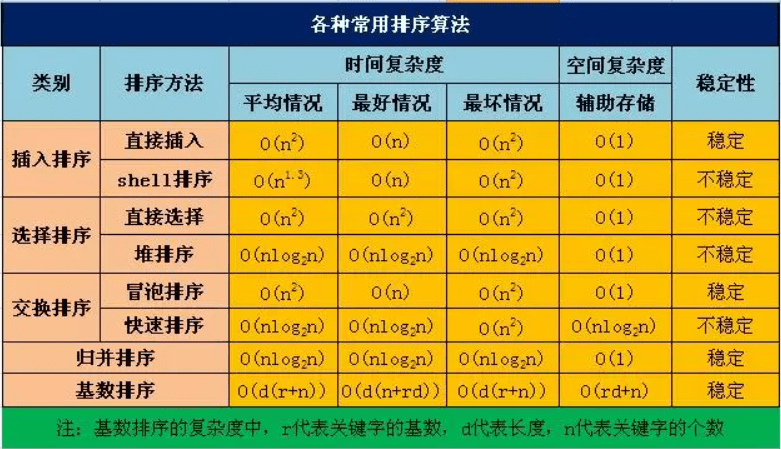

## 排序




### 冒泡排序

```java
/**
 * 冒泡排序算法
 *
 * @author MinChiang
 * @version 1.0.0
 * @date 2020-03-20 9:20
 */
public class BubbleSort<T extends Comparable<T>> extends AbstractSortable<T> {

    /**
     * 冒泡排序
     * 两两交换元素，把较大的元素置换到后面，一轮结束后最大的元素放置到最后一位
     * 比较轮次：arr.length - 1，因为到最后一轮只有一个元素，无需排序
     * 两两交换次数：length - 1 - 当前轮次
     *
     * @param arr 排序的数组
     */
    public void sort(int[] arr) {
        int tmp;
        for (int i = 0; i < arr.length - 1; i++) {
            for (int j = 0; j < arr.length - 1 - i; j++) {
                if (arr[j] > arr[j + 1]) {
                    tmp = arr[j + 1];
                    arr[j + 1] = arr[j];
                    arr[j] = tmp;
                }
            }
        }
    }

}
```


### 插入排序

```java
/**
 * 插入排序算法
 *
 * @author MinChiang
 * @version 1.0.0
 * @date 2020-03-20 9:41
 */
public class InsertSort<T extends Comparable<T>> extends AbstractSortable<T> {

    /**
     * 插入排序
     * 从位置为1开始，如果当前的位置数字小于前面一个的数字，那么就进行交换处理
     * 开始位置：位置为1，因为第一个元素不需要进行和前面的元素比较
     *
     * @param arr 待排序的数组
     */
    public void insertSort(int[] arr) {
        for (int i = 1; i < arr.length; i++) {
            for (int j = i; j > 0; j--) {
                if (arr[j] < arr[j - 1]) {
                    int tmp = arr[j];
                    arr[j] = arr[j - 1];
                    arr[j - 1] = tmp;
                }
            }
        }
    }

}
```


### 选择排序

```java
/**
 * 选择排序算法
 *
 * @author MinChiang
 * @version 1.0.0
 * @date 2020-03-20 8:57
 */
public class SelectSort<T extends Comparable<T>> extends AbstractSortable<T> {

    /**
     * 选择排序（最好写的算法了）
     * 循环遍历数组，开始时候以当前遍历的首个元素为基准
     * 每一轮选择都选择本轮的最小的元素，当一轮结束后，把最小的元素和当前开始的元素进行交换
     * 循环次数：次数为length - 1，最后的一个元素是不用进行遍历处理的
     *
     * @param arr 待排序的数组
     */
    public void sort(int[] arr) {
        // 需要找出最小元素的所需轮次
        for (int i = 0; i < arr.length - 1; i++) {
            int min = i;
            // 因为需要和当前的第一个元素进行交换处理，因此要从i + 1开始
            for (int j = i + 1; j < arr.length; j++) {
                if (arr[j] < arr[min]) {
                    min = j;
                }
            }
            int tmp = arr[min];
            arr[min] = arr[i];
            arr[i] = tmp;
        }
    }

}
```


### 归并排序

```java
/**
 * 归并排序算法
 *
 * @author MinChiang
 * @version 1.0.0
 * @date 2020-03-20 11:24
 */
public class MergeSort<T extends Comparable<T>> extends AbstractSortable<T> {
    
    /**
     * 归并排序
     * 排序思想：分治法（递归）
     * 停止条件：排序区域元素个数小于等于1，即begin >= end的情况
     * 包含几个操作：
     * 1. 分割：把当前的数组分割成为两个部分，直到不可分（begin >= end的情况）
     * 2. 排序：两个数组分别定义left和right指针，分别指向左右两个数组，新建一个大小为end - begin + 1，把两个数组从小到大放入数组中
     * 3. 合并：把临时数组中的内容拷贝回去原始数组中
     *
     * @param arr 待排序的数组
     */
    public void sort(int[] arr) {
        recursion(arr, 0, arr.length - 1);
    }

    /**
     * 递归处理
     *
     * @param arr   待排序的数组
     * @param begin 开始下标（包含）
     * @param end   结束下标（包含）
     */
    private void recursion(int arr[], int begin, int end) {
        if (begin >= end) {
            return;
        }
        // half是表示这个位置前的下标元素都
        int half = (end + begin) / 2;

        // 拆分处理
        recursion(arr, begin, half);
        recursion(arr, half + 1, end);

        // 新建数组进行临时存储，把左右两边的内容进行拷贝到临时数组中
        int left = begin, right = half + 1, current = 0;
        int[] tmp = new int[end - begin + 1];
        while (left <= half && right <= end) {
            if (arr[left] < arr[right]) {
                tmp[current++] = arr[left++];
            } else {
                tmp[current++] = arr[right++];
            }
        }
        while (left <= half) {
            tmp[current++] = arr[left++];
        }
        while (right <= end) {
            tmp[current++] = arr[right++];
        }

        // 把临时数组中的内容拷贝回原来的数组中
        for (int i = 0; i < tmp.length; i++) {
            arr[begin + i] = tmp[i];
        }
    }

}
```


### 快速排序

```java
/**
 * 快速排序算法
 *
 * @author MinChiang
 * @version 1.0.0
 * @date 2020-03-20 8:57
 */
public class QuickSort<T extends Comparable<T>> extends AbstractSortable<T> {

    /**
     * 快速排序（最复杂的算法，但是效率最高）
     * 本质上就是每轮选取一个基准，把所有小于此基准的元素放在基准左边，把大于此基准的元素放到右边
     * 排序思想：分治法（递归）
     * 基准选取：每轮的首元素
     * 停止条件：排序区域元素个数小于等于1，即begin >= end的情况
     * 排序原则：
     * 1. 设置mark标记位，起始位置为pivot的位置，比pivot小的在左，比pivot大的在右
     * 2. 当扫描到的元素比pivot小时，先移动mask（mask++），再交换mask所指元素和当前元素
     * 3. 当轮排序完成后把mask所指元素和pivot交换
     *
     * @param arr 排序的数组
     */
    public void sort(int[] arr) {
        recursion(arr, 0, arr.length - 1);
    }

    /**
     * 递归处理
     *
     * @param arr   排序的数组
     * @param begin 开始下标位置（包含）
     * @param end   结束下标位置（包含）
     */
    private void recursion(int[] arr, int begin, int end) {
        //递归结束条件
        if (begin >= end) {
            return;
        }

        // 设置一个比较的中间基准，小于此基准的都在左边，大于此基准的都在右边
        int pivot = arr[begin], mark = begin;
        for (int i = begin + 1; i <= end; i++) {
            // 若遍历到的元素小于基准，则说明mark要右移一位
            if (arr[i] < pivot) {
                mark++;
                int tmp = arr[i];
                arr[i] = arr[mark];
                arr[mark] = tmp;
            }
        }
        // 最后需要交换mark和基准的位置
        int tmp = arr[mark];
        arr[mark] = pivot;
        arr[begin] = tmp;
        // 递归处理
        recursion(arr, begin, mark - 1);
        recursion(arr, mark + 1, end);
    }

}
```


## BFS

```
result = []
def permute(已经选择的路径, 剩余选择列表):
    if 满足结束条件:
    	// 此时注意路径的可变动方式，若为数组或者列表需要new一个新的
        result.add(已经选择的路径)
        return

    for 选择 in 剩余选择列表:
        做选择（其实就是路径的变动，把剩余选择列表中变为路径）
        permute(路径, 选择列表)
        撤销选择（回滚路径的变动）
```

```java
/**
 * @author MinChiang
 * @version 1.0.0
 * @date 2021-02-20 15:40
 */
public class Permutations {

    public List<List<Integer>> permute(int[] nums) {
        List<List<Integer>> result = new ArrayList<>();
        List<Integer> choice = new ArrayList<>();
        for (int num : nums) {
            choice.add(num);
        }
        permute(new ArrayList<>(), choice, result);
        return result;
    }

    // path表示【已经选择的路径】，choice表示【还未选择的路径】
    public void permute(List<Integer> path, List<Integer> choice, List<List<Integer>> result) {
        // 结束判定
        if (choice.size() == 0) {
            result.add(new ArrayList<>(path));
            return;
        }

        for (int i = 0; i < choice.size(); i++) {
            // 做出选择，把未选择的路径转化为已选择的路径
            int c = choice.remove(i);
            path.add(c);

            // 递归
            permute(path, choice, result);

            // 撤销选择
            path.remove(path.size() - 1);
            choice.add(i, c);
        }
    }

}
```


## 限流

### 计数器法

思路简单，使用方便，会有**临界问题**，即所有流量在临界点前后流入，会导致tps激增为2倍的tps。

```java
public class Counter {

    //初始时间
    private long startTime;
    //流量计数
    private long count;
    //滑窗大小
    private long length;
    //单个滑窗内最大的并发数
    private long limit;

    public Counter(long length, long limit) {
        this.length = length;
        this.limit = limit;
        reset();
    }

    private void reset() {
        this.count = 0;
        this.startTime = System.currentTimeMillis();
    }

    public boolean require() {
        if (System.currentTimeMillis() <= startTime + length) {
            return ++count < limit;
        }

        reset();
        return ++count < limit;
    }

}
```


### 滑动窗口

滑动窗口使用一个固定大小的数组或者链表存放细分后的数据，数组内存放单位时间内的流量计数，流量进入时，若当前的时间戳大于最后一个数组元素的时间戳，则新建元素并推移时间窗口；然后统计流量总数，若大于流量总数，则直接返回超过流量；若小于流量总数，则流量总数加一并且返回成功。本质上来说，滑动窗口的数量越多，颗粒度越高，计算的资源也越多，也会越精确。

```java
public class RollingWindow {

    private static final int DEFAULT_WINDOW_SIZE = 10;

    //窗口大小，窗口越小流量越平滑
    private int windowSize = DEFAULT_WINDOW_SIZE;

    private final long maxTransaction;
    private final long milliseconds;

    private Window head;
    private Window tail;
    private int currentWindowLength;
    private long currentCount;
    private long startTime;

    public RollingWindow(long milliseconds, long maxTransaction, int windowSize) {
        this.windowSize = windowSize;
        this.milliseconds = milliseconds / windowSize;
        this.maxTransaction = maxTransaction;

        Window current = new Window(0);
        head = current;
        tail = current;
        currentWindowLength++;

        startTime = System.currentTimeMillis();
    }

    private void appendWindow() {
        Window current = new Window(0);
        if (currentWindowLength < windowSize) {
            currentWindowLength++;
        } else {
            currentCount -= head.count;
            head = head.next;
        }
        tail.next = current;
        tail = current;
        startTime = System.currentTimeMillis();
    }

    public boolean require() {
        if (System.currentTimeMillis() <= startTime + milliseconds) {
            if (currentCount >= maxTransaction) {
                return false;
            }
            tail.count++;
            currentCount++;
            return true;
        }

        appendWindow();
        if (currentCount >= maxTransaction) {
            return false;
        }
        tail.count++;
        currentCount++;
        return true;
    }

    private static class Window {

        long count;
        Window next;

        public Window(long count) {
            this.count = count;
        }

    }

}
```


### 漏桶算法

```java
public class LeakyBucket {

    private static final int DEFAULT_WINDOW_SIZE = 10;

    private int windowSize = DEFAULT_WINDOW_SIZE;
    private final long maxTransaction;
    private final long milliseconds;
    private final long singlePeriodTransaction;

    //时间执行器
    private final ScheduledExecutorService executor;
    //桶
    private final Queue<Water> queue;

    public LeakyBucket(long milliseconds, long maxTransaction, int windowSize) {
        this.windowSize = windowSize;
        this.milliseconds = milliseconds / windowSize;
        this.maxTransaction = maxTransaction;
        this.singlePeriodTransaction = maxTransaction / windowSize;
        
		//设置桶和桶大小
        queue = new LinkedBlockingQueue<>(new Long(maxTransaction).intValue());
        //单线程的任务执行器
        this.executor = Executors.newSingleThreadScheduledExecutor();
		//启动任务，循环漏水
        executor.scheduleAtFixedRate(() -> {
            int count = 0;
            while (count++ < singlePeriodTransaction) {
                Water water = queue.poll();
                if (water == null) {
                    return;
                }
                water.start();
            }
        }, 0, this.milliseconds, TimeUnit.MILLISECONDS);
    }

    /**
	* 注水
	* @param water 注入的水
	*/
    public void fillWater(Water water) {
        this.queue.add(water);
    }

    public static interface Water {

        void start();

    }

}
```


### 令牌桶算法

```java

```


## 随机算法

### 蓄水池采样算法

```java

```


### 洗牌算法

简单摘自Collections.shuffle

思路：

- 第0张牌随机交换下标为[0, 52)的牌
- 第1张牌随机交换下标为[1, 52)的牌
- 第2张牌随机交换下标为[2, 52)的牌
- ...
- 第50张牌随机交换下标为[51, 52)的牌

以下是Java里面的java.util.Collections#shuffle(java.util.List<?>, java.util.Random)方法实现

```java
    public static void shuffle(List<?> list, Random rnd) {
        int size = list.size();
        if (size < SHUFFLE_THRESHOLD || list instanceof RandomAccess) {
            for (int i=size; i>1; i--)
                swap(list, i-1, rnd.nextInt(i));
        } else {
            Object arr[] = list.toArray();

            // Shuffle array
            for (int i=size; i>1; i--)
                swap(arr, i-1, rnd.nextInt(i));

            // Dump array back into list
            // instead of using a raw type here, it's possible to capture
            // the wildcard but it will require a call to a supplementary
            // private method
            ListIterator it = list.listIterator();
            for (int i=0; i<arr.length; i++) {
                it.next();
                it.set(arr[i]);
            }
        }
    }
```


### Leetcode

#### 必会

1. 快速排序、归并排序、堆排序
2. 二叉树前中后、层序、Z字遍历，迭代+递归
3. 反转链表，各种反，直接反，反一段，K个一组反，
4. 接雨水，单调栈
5. 股票买卖，机器人寻路，动态规划
6. 回溯算法，树
7. 字符串
8. LRU+LFU


#### Hard15题目

- 25
- 23
- 42
- 124
- 72
- 4
- 76
- 239
- 41
- 32
- 297
- 460
- 剑指51
- 224
- 135


#### 中等67

- 3
- 146
- 215
- 15
- 102
- 103
- 236
- 33
- 5
- 200
- 46
- 92
- 142
- 54
- 300
- 143
- 199
- 56
- 19
- 82
- 8
- 148
- 2
- 151
- 93
- 105
- 31
- 1143
- 22
- 129
- 113
- 98
- 43
- 78
- 470
- 322
- 64
- 718
- 48
- 165
- 39
- 34
- 153
- 62
- 128
- 221
- 240
- 24
- 695
- 198
- 498
- 662
- 79
- 145
- 402
- 59
- 230
- 328
- 61
- 50
- 47
- 450
- 74
- 189
- 40
- 11
- 114
