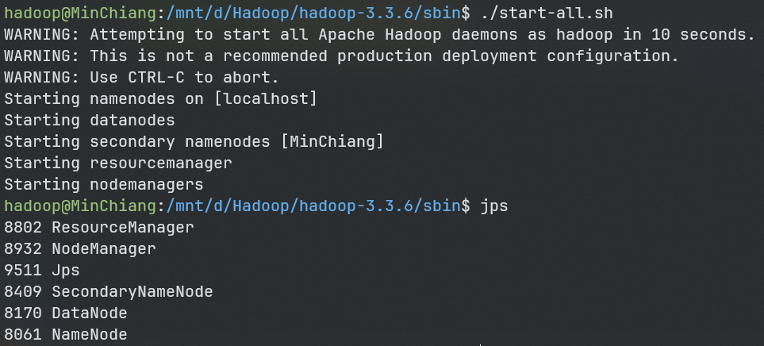
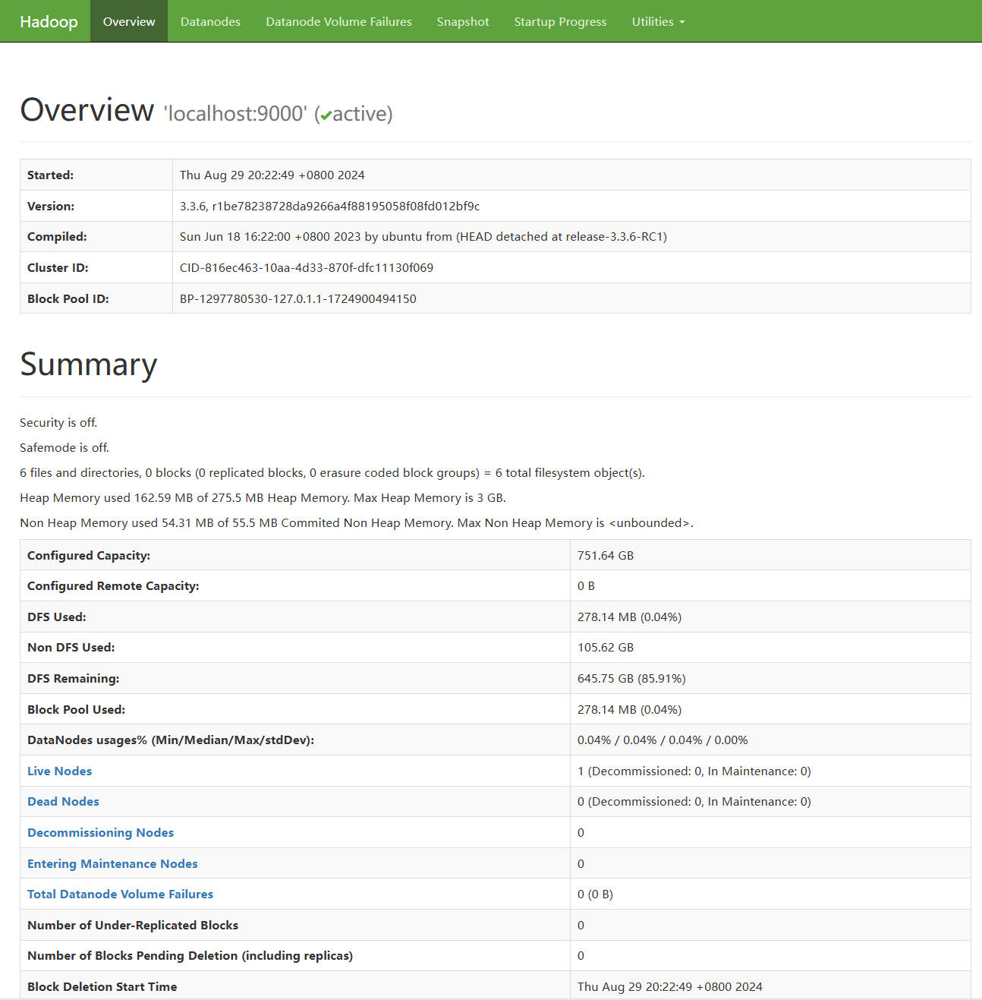
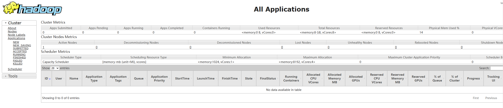
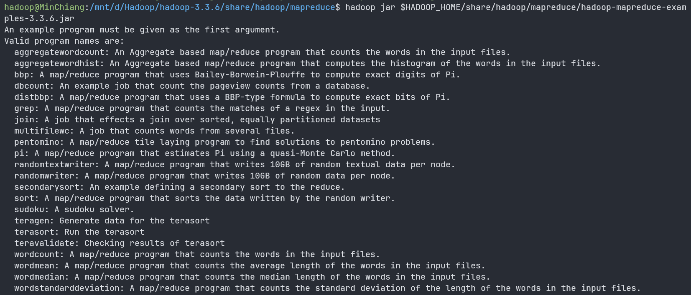

## 大数据

### 环境搭建

- 安装Java环境，配置`apt install openjdk-8-jdk`

- 创建hadoop用户

  ```bash
  groupadd hadoop
  useradd -g hadoop hadoop
  ```

- 到https://downloads.apache.org/hadoop/common/hadoop-3.3.6/中下载对应的版本，我这边选择使用hadoop-3.3.6.tar.gz并且解压到目录中

- 使用root用户修改配置`/etc/profile`，添加下面语句

  ```bash
  export JAVA_HOME=/usr/lib/jvm/java-8-openjdk-amd64
  export HADOOP_HOME=/mnt/d/Hadoop/hadoop-3.3.6
  export PATH=$PATH:${JAVA_HOME}/bin:${HADOOP_HOME}/bin:${HADOOP_HOME}/sbin
  ```

- 切换到hadoop用户，在~/.bashrc配置添加下面内容

  ```bash
  export HADOOP_CLASSPATH=`hadoop classpath`
  ```

  保存后记得使用`source ~/.bashrc`命令重新加载.bashrc配置

- 创建目录

  ```
  cd /mnt/d/Hadoop/data
  mkdir -p data name secondary tmp
  ```

- 修改Hadoop配置

  - 修改`hadoop-3.3.6/etc/hadoop/core-site.xml`配置

    ```xml
      <property>
        <name>hadoop.tmp.dir</name>
        <value>/mnt/d/Hadoop/data/tmp</value>
      </property>
      <property>
        <name>fs.defaultFS</name>
        <value>hdfs://localhost:9000</value>
      </property>
    ```

  - 修改`hadoop-3.3.6/etc/hadoop/hdfs-site.xml`配置

    ```xml
      <property>
        <name>dfs.namenode.name.dir</name>
        <value>/mnt/d/Hadoop/data/name</value>
      </property>
      <property>
        <name>dfs.datanode.data.dir</name>
        <value>/mnt/d/Hadoop/data/data</value>
      </property>
      <property>
        <name>dfs.replication</name>
        <value>1</value>
      </property>
    ```

  - 修改`hadoop-3.3.6/etc/hadoop/mapred-site.xml`配置

    ```xml
      <property>
        <name>mapreduce.framework.name</name>
        <value>yarn</value>
      </property>
    ```

  - 修改`hadoop-3.3.6/etc/hadoop/yarn-site.xml`配置

    ```xml
      <property>
        <name>yarn.nodemanager.aux-services</name>
        <value>mapreduce_shuffle</value>
      </property>
      <property>
        <name>yarn.resourcemanager.hostname</name>
        <value>localhost</value>
      </property>
    ```

- 格式化HDFS，使用命令`hdfs namenode -format`

- 启动Hadoop，执行`/mnt/d/Hadoop/hadoop-3.3.6/sbin/start-all.sh`

- 使用jps观察是否有以下java进程

  ```txt
  ResourceManager
  NodeManager
  SecondaryNameNode
  DataNode
  NameNode
  ```

  

- 验证安装，打开浏览器，输入下面的url以验证Hadoop是否启动成功

  - hdfs健康信息：http://localhost:9870
  - hadoop集群信息：http://127.0.0.1:8088/
  - hadoop ipc地址：http://127.0.0.1:9000

  

  

- 运行一个MapReduce作用以验证是否成功

  ```bash
  hadoop jar $HADOOP_HOME/share/hadoop/mapreduce/hadoop-mapreduce-examples-3.3.6.jar
  ```

  