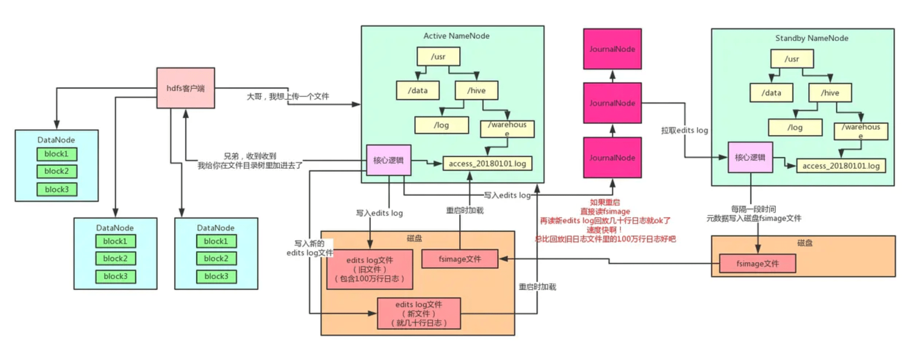

## Hadoop

可以分为3个核心组件：

1. HDFS：分布式文件系统，将文件分布式存储在多个服务器上
2. MapReduce：分布式运算框架，在多个服务器上进行分布式运算
3. Yarn：分布式资源调度平台，帮助用户调度MapReduce，并合理分配上资源

### HDFS架构说明

- NameNode：存储文件系统的**元数据**，主要负责管理文件系统的命名空间，集群配置信息，存储块的复制。信息以**fsimage（HDFS元数据镜像文件）**和**edits log（HDFS文件改动日志）**两个文件形式存放在本地磁盘，HDFS重启时直接把fsimage读取到内存中，再追加对应edits log的内容组成的；每修改一次元数据，生成一条edits log的同时，还会写入JournalNodes集群；
- Secondary NameNode：从JournalNodes集群拉去edits log，应用到自己内存的文件目录树，然后把自己内存文件目录树写一份到磁盘上的fsimage，这个操作叫checkpoint检查点操作，然后把fsimage上传到Active NameNode，清空掉Active NameNode的旧edits log文件。在Active NameNode宕机时，Secondary NameNode作为Active NameNode继续运行，为集群提供了**高可用**保证。
- DataNode：文件存储的基本单元，负责实际数据存储，当一个大文件上传到HDFS上时，该文件会被切割成多个block（64MB）并分别存储到不同的DataNode，同一个block会有多个副本（默认为3个）到不同的DataNode；

## Hive&Hbase

## Spark&Storm

## ELK
