## 渠道投放

### 业务相关

#### 名词解释

- 转化：如果客户完成某个您定义为**有价值**的操作，此类客户操作就称为**转化**，典型转化操作：***激活、注册、付费***

- 归因：关联用户进入本产品的来源广告的操作。举例：张三从**电梯海报**看到某多多的广告，回家看综艺节目看到某多多投放的**广告**，从百度看到某多多的**APP推送**；经过这三个不同推送形式的广告成功下载某多多APP，***把此次下载的原因归属到这3个投放广告的过程，就叫做广义上的归因。***
  
  - 电梯海报：物理实体，无法归因
  - 综艺广告：可根据综艺节目的收看率粗略计算，归因精度较低
  - 百度APP推送：互联网形式的归因，可量化，精度高
  
  以上各种形式的广告都是用户激活APP的因素，但是电梯海报、综艺广告这两个因素的广告不好归因而已

- 转化漏斗：根据不同的转化层次划分隔离，从上至下逐渐递减的漏斗模型，一般互联网产品都有：展示 -> 点击 -> 下载 -> 激活 -> 注册 -> 付费这种形式的转化漏斗

#### 归因模型简介

在完成转化的路径中，客户可能会与同一广告客户的多个广告互动。通过指定归因模型，可以**选择为每次广告互动分配多少转化功劳**。

- **最终点击**：将转化功劳全部归于客户最后点击的那个广告和相应的关键字
- **首次点击**：将转化功劳全部归于客户首次点击的那个广告和相应的关键字
- **线性**：将转化功劳平均分配给转化路径上的所有广告互动
- **时间衰减**：广告互动越接近转化发生时间，分配的功劳就越多。广告互动每相隔七天，所分配的功劳就会相差一半。换言之，转化发生 8 天前的广告互动所获功劳是转化发生 1 天前的广告互动所获功劳的一半
- **根据位置**：为客户首次广告互动及相应关键字以及最终广告互动及相应关键字分别分配 40% 的功劳，将其余 20% 的功劳平均分配给转化路径上的其他广告互动
- **以数据为依据**：根据转化操作的过往数据来分配转化功劳。该归因模型不同于其他归因模型，它使用帐号数据来计算每次互动在转化路径中的实际功劳

具体示例（按照上面的例子）：

- **最终**：给百度APP打钱
- **首次**：给电梯运营商打钱
- **线性**：电梯运营商、综艺节目、百度APP均分钱
- **时间衰减**：百度APP得到最多，综艺节目其次，电梯运营商最少
- **根据位置**：电梯运营商、百度APP各40%，综艺节目20%
- **以数据为依据**：依据以往的经验记录来分钱

**国内的互联网APP都是以最终点击进行统计计算的**。

#### 漏斗模型

- 曝光
- 激活
- 注册/次留
- 付费

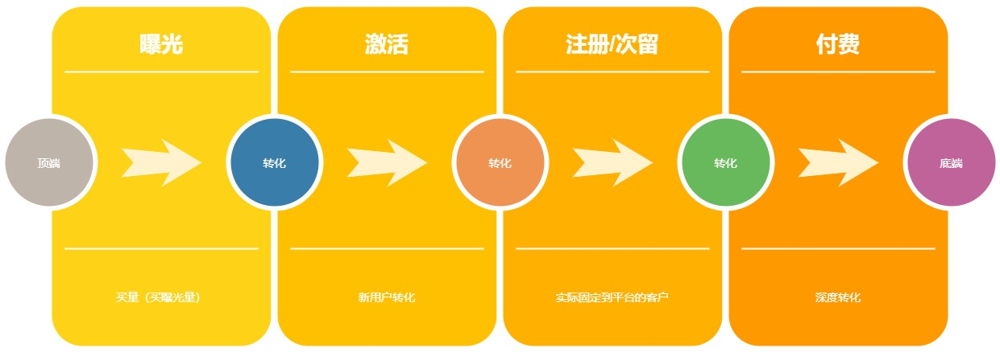

### 技术分享

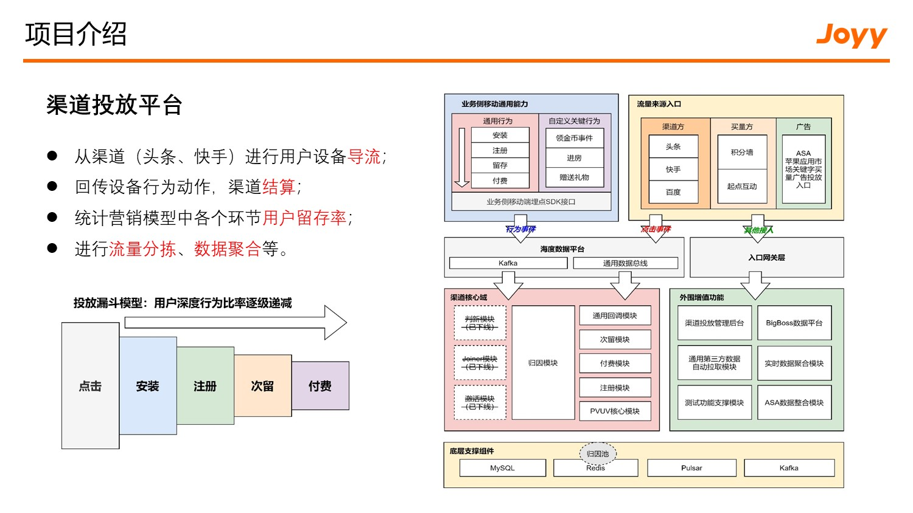

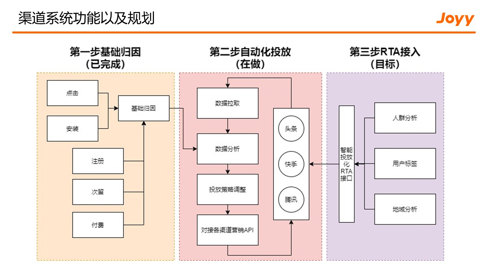

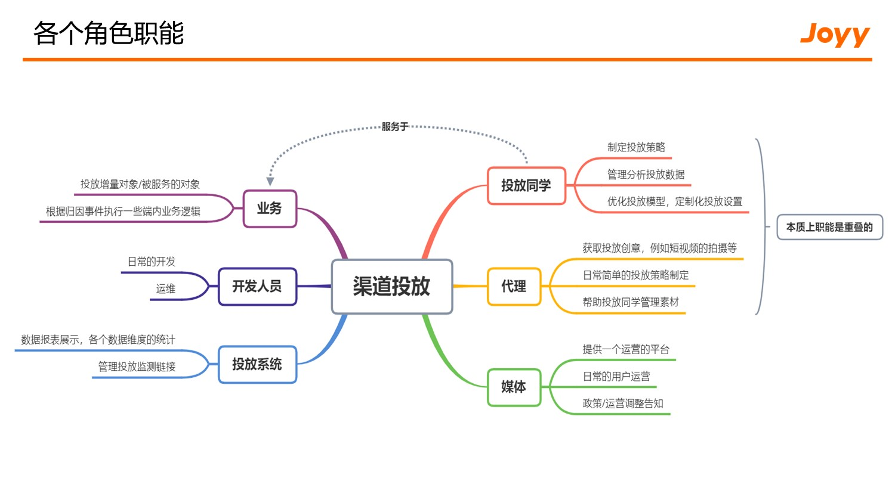

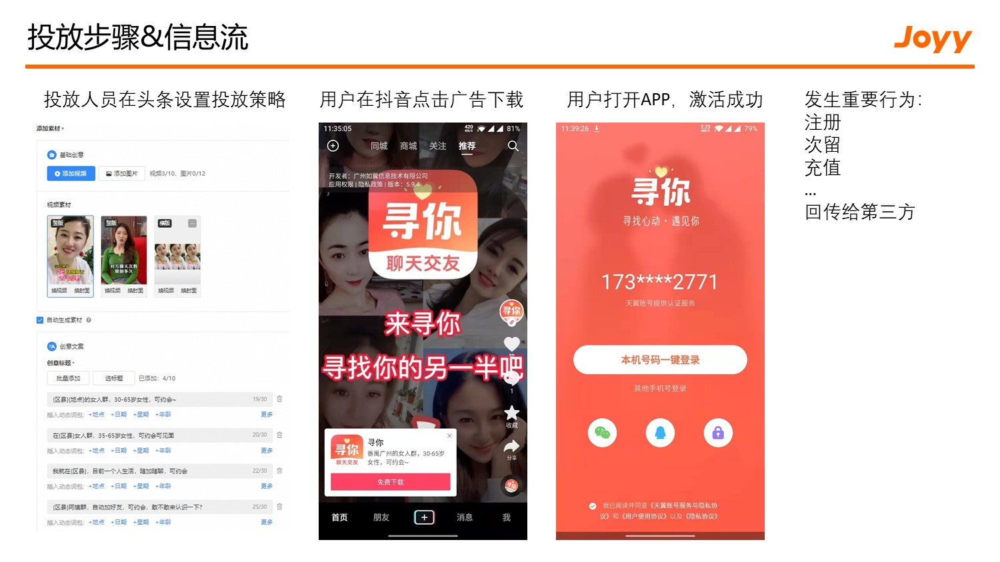

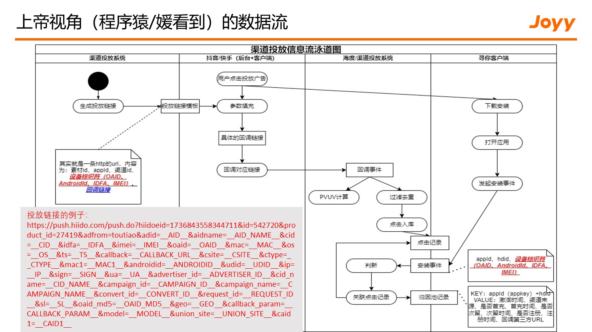

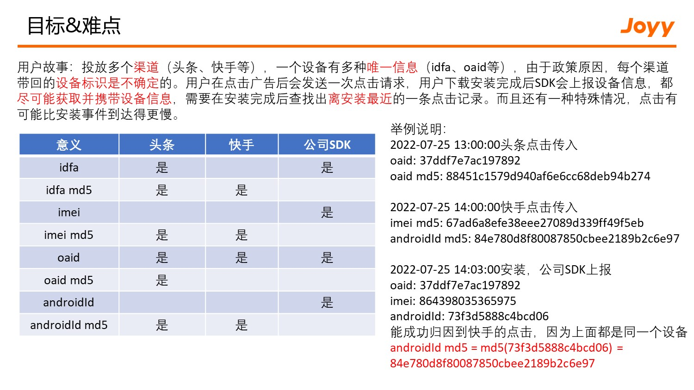

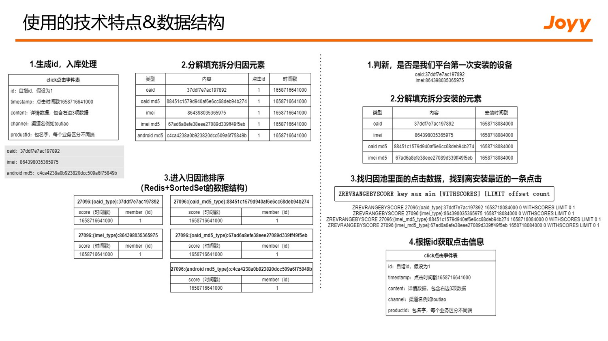

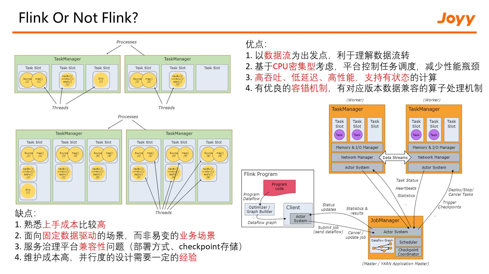

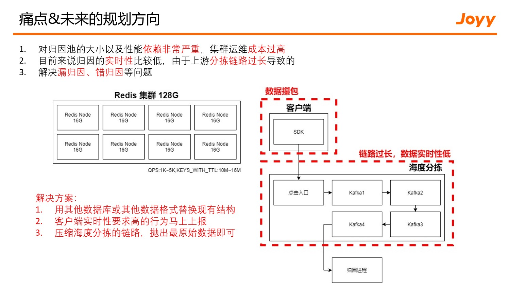

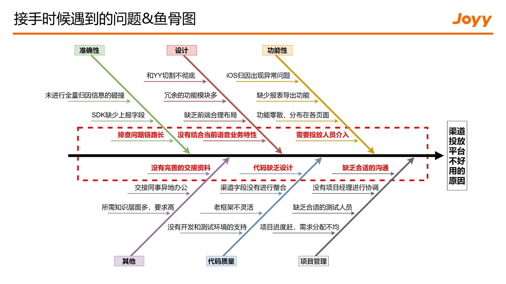

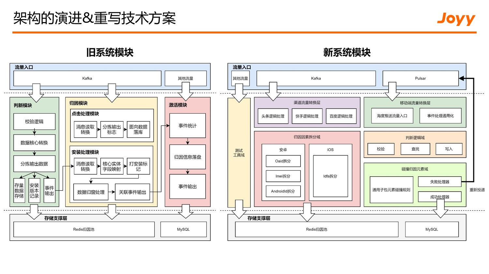

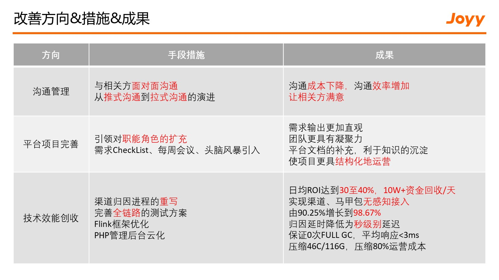

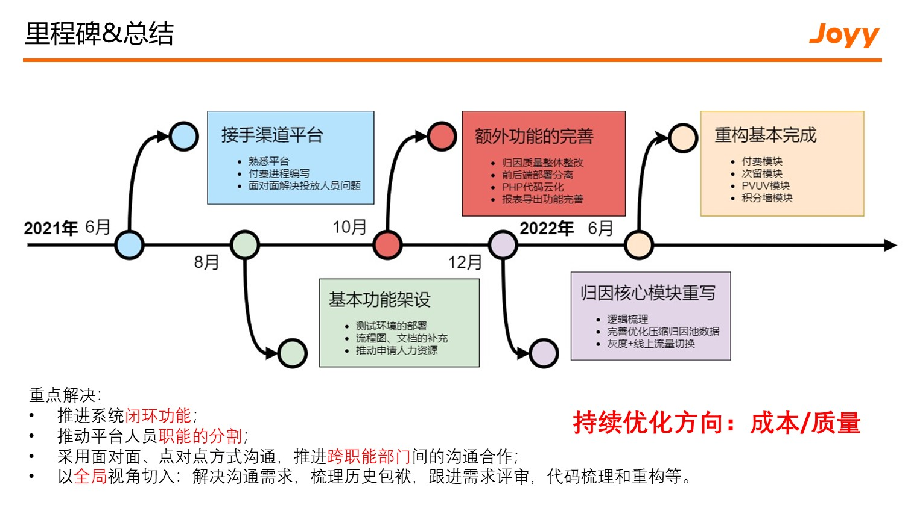
