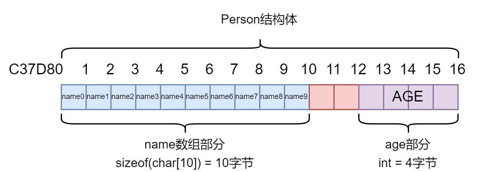

## c

### 内存对齐以及指针计算问题

```c
#include <stdio.h>
#include <stdlib.h>
#include <stddef.h>

typedef struct {
    char name[10];
    int age;
} Person;

typedef struct {
    char name[10];
    int age;
} __attribute__((packed)) Person2;

int main() {
    Person *person = malloc(sizeof(Person));
    if (person == NULL) {
        return 1;
    }
    person->age = 10;
    printf("person内存地址: %p\n", person);
    printf("person age的值: %d\n", person->age);

    Person2 *person2 = malloc(sizeof(Person2));
    if (person2 == NULL) {
        return 1;
    }
    person2->age = 10;
    printf("person2内存地址: %p\n", person2);
    printf("person2 age的值: %d\n", person2->age);

    // 正确的地址值1
    int *agePointer1 = (int *) ((char *) person + offsetof(Person, age));
    printf("【正确】指向person age的指针: %p\n", agePointer1);
    printf("【正确】person age的值: %d\n", *agePointer1);

    // 正确的地址值2
    int *agePointer2 = (int *) ((char *) person2 + sizeof(char[10]));
    printf("【正确】指向person2 age的指针: %p\n", agePointer2);
    printf("【正确】person2 age的值: %d\n", *agePointer2);

    // 正确的地址值3
    int *agePointer3 = (int *) ((char *) person + 2 + sizeof(char[10]));
    printf("【正确】指向person age的指针: %p\n", agePointer3);
    printf("【正确】person age的值: %d\n", *agePointer3);

    // 错误的地址值1
    int *agePointerError1 = (int *) (person + offsetof(Person, age));
    printf("【错误】指向person age的指针: %p\n", agePointerError1);
    printf("【错误】person age的值: %d\n", *agePointerError1);

    return 0;
}
```

```
person内存地址: 0000000000C37D80
person age的值: 10
person2内存地址: 0000000000C37DA0
person2 age的值: 10
【正确】指向person age的指针: 0000000000C37D8C
【正确】person age的值: 10
【正确】指向person2 age的指针: 0000000000C37DAA
【正确】person2 age的值: 10
【正确】指向person age的指针: 0000000000C37D8C
【正确】person age的值: 10
【错误】指向person age的指针: 0000000000C37E40
【错误】person age的值: 0
```

这里面的知识点：

Person的内存布局是由：长度10个字节，类型为char[10]的name，以及4个字节，类型为int的age组成，**由编译器自动进行内存对齐优化**；

Person2的内存布局是由：长度10个字节，类型为char[10]的name，以及4个字节，类型为int的age组成，**不进行内存对齐优化**；

一般而言，由于默认的内存对齐为**4个字节，填充后是4的整数倍**，而name的长度是10个字节，4的整数倍是12，因此Person的在name的后面会有2个字节的填充，因此age的位置是person的起始位置 + name的字节长度 + 2字节padding；而Person2是**取消了内存对齐**，因此age的位置是person的起始位置 + name的字节长度；

而后面的错误是因为：**对指针的加减操作的单位是指针指向对象类型的字节数，而不是1个字节**，person + offsetof(Person, age) = person起始位置 + person的大小 * offsetof(Person, age) = person起始位置 + (16 * 12) = person起始位置 + 192字节 = 0000000000C37D80 + C0 =  0000000000C37E40；

而转为(char*)后，由于char的字节数刚好是1，因此(char *) person + offsetof(Person, age)是以单位1个字节进行移动。

