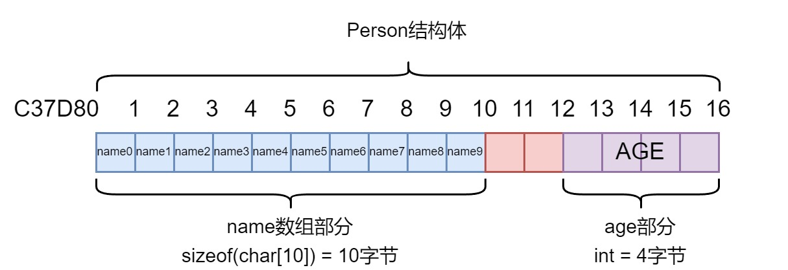

# c

## C语言的编译过程

| **步骤**   | **处理工具** | **输入文件** | **输出文件** | **主要作用**                   |
| ---------- | ------------ | ------------ | ------------ | ------------------------------ |
| **预处理** | `cpp`        | `.c`         | `.i`         | 宏展开、头文件包含、去注释     |
| **编译**   | `gcc -S`     | `.i`         | `.s`         | 语法检查、生成汇编代码         |
| **汇编**   | `as`         | `.s`         | `.o`         | 生成机器码（二进制目标文件）   |
| **链接**   | `ld`         | `.o` + 库    | `exe`        | 符号解析、地址重定向、生成程序 |


## 基础语法

### 宏定义

宏定义的本质只有四个字：**文本替换**。它发生在**预处理阶段**，也就是说，在编译器真正开始分析语法之前，宏就已经被替换完成了。

- 基础宏定义

  ```c
  #define MAX_LED_COUNT 8
  #define DEVICE_NAME "My_NAS_LED"
  ```

- 带参数的宏（伪装成函数）

  ```c
  #define SQUARE(x) ((x) * (x))
  ```

  **注意这里**如果写成`#define SQUARE(x) (x * x)`，如果调用`SQUARE(1 + 2)`，会导致变成`SQUARE(1 + 2 * 1 + 2) = 5`，而不是`SQUARE((1 + 2) * (1 + 2)) = 9`

- 多行逻辑宏

  ```c
  #define INIT_LED(led_ptr, p) do { \
      (led_ptr)->pin = (p); \
      (led_ptr)->status = off; \
      printf("LED on pin %d initialized.\n", (p)); \
  } while(0)
  ```

  **注意do {} while(0)是多行逻辑宏的固定写法**，

  - 假设没有使用`do while`，而是写成

    ```c
    #define INIT_LED(p) \
        set_pin(p);     \
        printf("LED %d init done\n", p)
    ```

    如果在这段逻辑里面

    ```c
    if (is_ready)
        INIT_LED(12);
    else
        handle_error();
    ```

    预处理展开后，就变成了

    ```c
    if (is_ready)
        set_pin(12);
        printf("LED 12 init done\n"); // 👈 这一行不再属于 if！它变成了无条件执行。
    ; // 👈 这是一个多余的空分号
    else // 💥 编译器报错：'else' without a previous 'if'
        handle_error();
    ```

  - 如果是用`{}`进行囊括

    ```c
    #define INIT_LED(p) { set_pin(p); printf("done\n"); }
    
    if (condition)
        INIT_LED(12); // 这里展开后会变成 { ... };
    else
        handle_error();
    ```

    展开后变成了：

    ```c
    if (condition) {
        set_pin(12);
        printf("done\n");
    }; // 👈 麻烦就在这个分号！
    else // 💥 还是会报错，因为分号把 if 语句强行结束了。
    ```


## 内存对齐以及指针计算问题

```c
#include <stdio.h>
#include <stdlib.h>
#include <stddef.h>

typedef struct {
    char name[10];
    int age;
} Person;

typedef struct {
    char name[10];
    int age;
} __attribute__((packed)) Person2;

int main() {
    Person *person = malloc(sizeof(Person));
    if (person == NULL) {
        return 1;
    }
    person->age = 10;
    printf("person内存地址: %p\n", person);
    printf("person age的值: %d\n", person->age);

    Person2 *person2 = malloc(sizeof(Person2));
    if (person2 == NULL) {
        return 1;
    }
    person2->age = 10;
    printf("person2内存地址: %p\n", person2);
    printf("person2 age的值: %d\n", person2->age);

    // 正确的地址值1
    int *agePointer1 = (int *) ((char *) person + offsetof(Person, age));
    printf("【正确】指向person age的指针: %p\n", agePointer1);
    printf("【正确】person age的值: %d\n", *agePointer1);

    // 正确的地址值2
    int *agePointer2 = (int *) ((char *) person2 + sizeof(char[10]));
    printf("【正确】指向person2 age的指针: %p\n", agePointer2);
    printf("【正确】person2 age的值: %d\n", *agePointer2);

    // 正确的地址值3
    int *agePointer3 = (int *) ((char *) person + 2 + sizeof(char[10]));
    printf("【正确】指向person age的指针: %p\n", agePointer3);
    printf("【正确】person age的值: %d\n", *agePointer3);

    // 错误的地址值1
    int *agePointerError1 = (int *) (person + offsetof(Person, age));
    printf("【错误】指向person age的指针: %p\n", agePointerError1);
    printf("【错误】person age的值: %d\n", *agePointerError1);

    free(person);
    free(person2);
    return 0;
}
```

```txt
person内存地址: 0000000000C37D80
person age的值: 10
person2内存地址: 0000000000C37DA0
person2 age的值: 10
【正确】指向person age的指针: 0000000000C37D8C
【正确】person age的值: 10
【正确】指向person2 age的指针: 0000000000C37DAA
【正确】person2 age的值: 10
【正确】指向person age的指针: 0000000000C37D8C
【正确】person age的值: 10
【错误】指向person age的指针: 0000000000C37E40
【错误】person age的值: 0
```

这里面的知识点：

Person的内存布局是由：长度10个字节，类型为char[10]的name，以及4个字节，类型为int的age组成，**由编译器自动进行内存对齐优化**；

Person2的内存布局是由：长度10个字节，类型为char[10]的name，以及4个字节，类型为int的age组成，**不进行内存对齐优化**；

一般而言，由于age的类型是int，默认的内存对齐为**4个字节，填充后是4的整数倍**，而name的长度是10个字节，4的整数倍是12，因此Person的在name的后面会有2个字节的padding填充，因此age的位置是person的起始位置 + name的字节长度 + 2字节padding；而Person2是**取消了内存对齐**，因此age的位置是person的起始位置 + name的字节长度；

而后面的错误是因为：**对指针的加减操作的单位是指针指向对象类型的字节数，而不是1个字节**，person + offsetof(Person, age) = person起始位置 + person的大小 *offsetof(Person, age) = person起始位置 + (16* 12) = person起始位置 + 192字节 = 0000000000C37D80 + C0 =  0000000000C37E40；

而转为(char*)后，由于char的字节数刚好是1，因此(char*) person + offsetof(Person, age)是以单位1个字节进行移动。



以下是不同类型的对齐规则（64位系统）：

- **`char`**：1 字节
- **`short`**：2 字节
- **`int`**：4 字节
- **`float`**：4 字节
- **`double`**：8 字节
- **指针类型**：8字节

对齐的规则：

- 偏移量必须是该成员类型对齐值的 **整数倍**
- 结构体的总大小必须是其 **最大成员对齐值** 的整数倍
- 若结构体包含嵌套结构体，外层结构体的对齐值取所有成员（包括嵌套结构体）中的最大对齐值

对齐的最佳规则：**变量排列的最佳策略一般是从大到小**

```c
`1#include <stdio.h>
#include <stddef.h>

struct Example {
    char a;      // 1 字节 [0]
    int b;       // 4 字节对齐 → 填充 3 字节后，位于 [4~7]
    double c;    // 8 字节对齐 → 位于 [8~15]
    short d;     // 2 字节对齐 → 位于 [16~17]
};

struct ExampleOptimized {
    double c;    // 8 字节 → 偏移 0 [0~7]（对齐到 8）
    int b;       // 4 字节 → 偏移 8 [8~11]（对齐到 4）
    short d;     // 2 字节 → 偏移 12 [12~13]（对齐到 2）
    char a;      // 1 字节 → 偏移 14 [14]（对齐到 1）
};

int main() {
    printf("Example对应的大小：%llu\n", sizeof(struct Example));
    printf("Example.a对应的偏移量：%llu\n", offsetof(struct Example, a));
    printf("Example.b对应的偏移量：%llu\n", offsetof(struct Example, b));
    printf("Example.c对应的偏移量：%llu\n", offsetof(struct Example, c));
    printf("Example.d对应的偏移量：%llu\n", offsetof(struct Example, d));

    printf("ExampleOptimized对应的大小：%llu\n", sizeof(struct ExampleOptimized));
    printf("ExampleOptimized.c对应的偏移量：%llu\n", offsetof(struct ExampleOptimized, c));
    printf("ExampleOptimized.b对应的偏移量：%llu\n", offsetof(struct ExampleOptimized, b));
    printf("ExampleOptimized.d对应的偏移量：%llu\n", offsetof(struct ExampleOptimized, d));
    printf("ExampleOptimized.a对应的偏移量：%llu\n", offsetof(struct ExampleOptimized, a));

    return 0;
}
```

```txt
Example对应的大小：24
Example.a对应的偏移量：0
Example.b对应的偏移量：4
Example.c对应的偏移量：8
Example.d对应的偏移量：16
ExampleOptimized对应的大小：16
ExampleOptimized.c对应的偏移量：0
ExampleOptimized.b对应的偏移量：8
ExampleOptimized.d对应的偏移量：12
ExampleOptimized.a对应的偏移量：14
```
