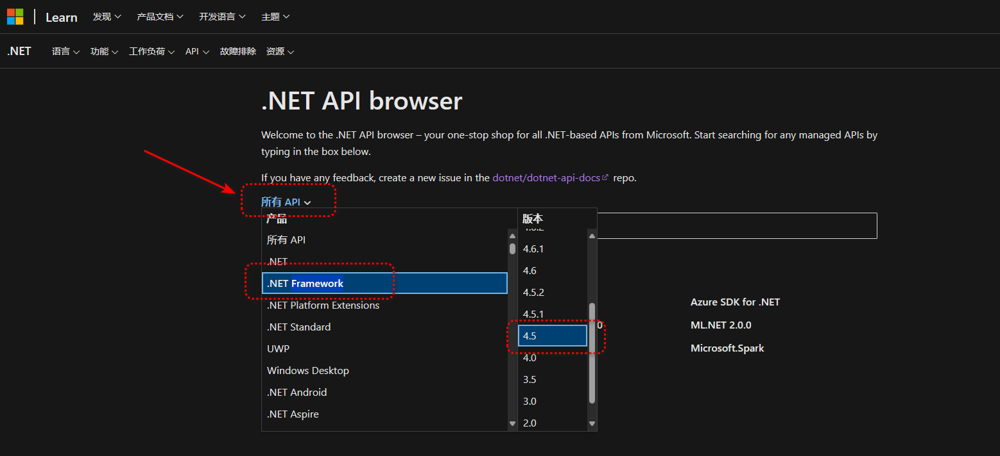

## C#

### .NET Standard、.NET以及.NET Framework的区别

- **.NET Standard**：是针对多个 .NET 实现推出的一套正式的.NET API 规范。 推出.NET Standard 的背后动机是要提高.NET 生态系统中的一致性。
- **.NET（以前称为 .NET Core）**：是 .NET 的跨平台实现，专用于大规模处理服务器和云工作负载。 它还支持其他工作负载，包括桌面应用。 可在 Windows、macOS 和 Linux 上运行。 它可实现 .NET Standard，因此面向 .NET Standard 的代码都可在 .NET 上运行。
- **.NET Framework**：是一种技术，支持生成和运行Windows应用及Web服务。

总结：

1. .NET（在.NET5前叫.NET Core）是跨平台的
2. .NET Framework是面向Windows平台的，从代码层面可以理解为闭源的
3. .NET Standard是上面两者的超集，是API规范

##  Api文档以及手册

api对应的网页：[对应的链接文档](https://learn.microsoft.com/zh-cn/dotnet/api/)

