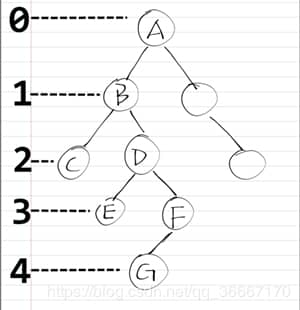
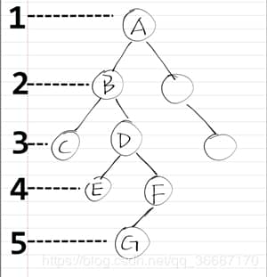
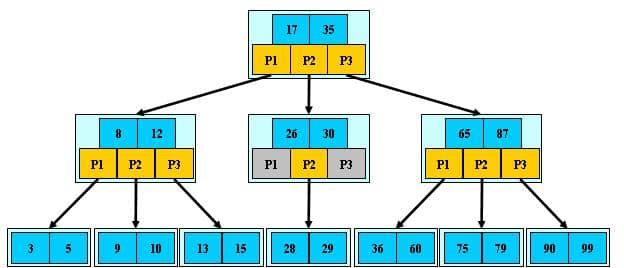
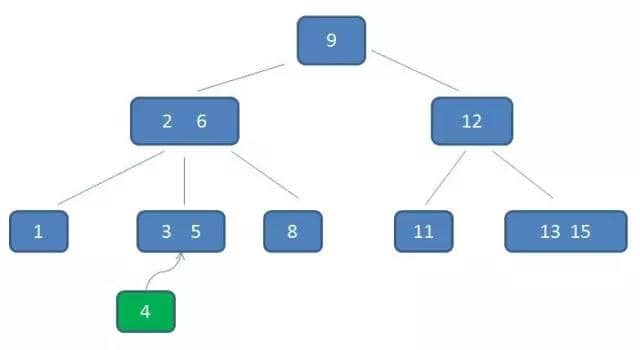
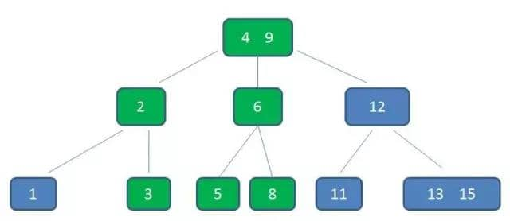
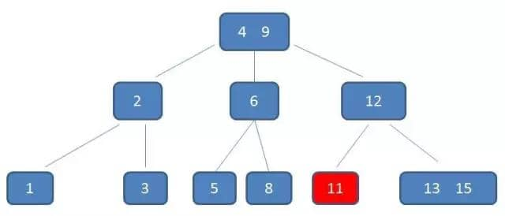
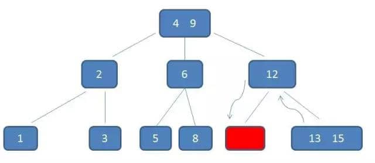
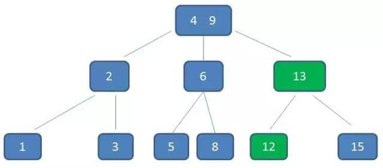
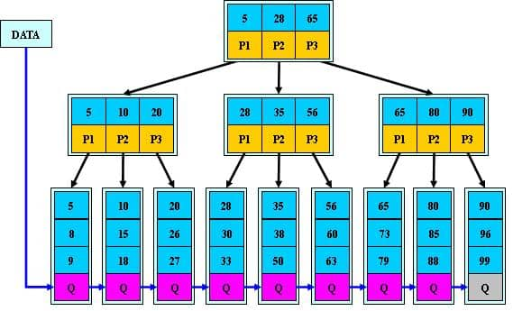
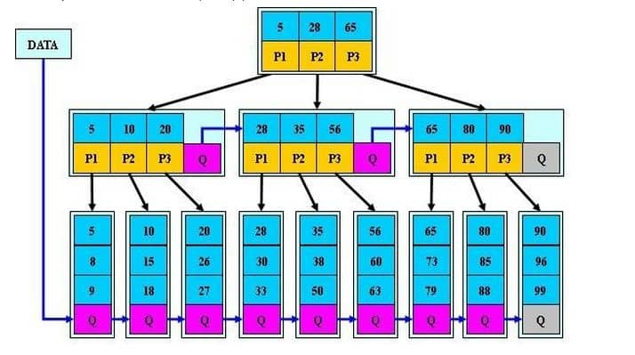

# 数据结构

## 链表

- 解决问题：
  - 不确定元素的数量
  - 稀疏存储数据
  - 非线性
- 构造方法：定义Node和LinkedList的数据结构，建议保留size和尾节点
  - Node[T]：
    - value：T，用于保留当前节点的数据
    - next：Node，用于找到下个节点
  - LinkedList[T]:
    - head：Node[T]
    - tail: Node[T]
    - size: int
- 方法：
  - add_first(value: T)
    - 不用是否判断列表为空，直接加入头就行了
    - 注意维护size
  - add_last(value： T)
    - 循环找到最后一个节点，因此需要注意判断列表是否为空
    - 注意维护size
  - get(index: int)
    - 判断index是否小于0或者大于等于size，如果是则要报错
    - 然后循环遍历，直到到达下标为index的节点
  - remove(index: int)
    - 一般来说，remove需要找到被删除节点的前驱节点，这样在循环中维护的节点数量很少
    - 因为维护的是被删除节点的前驱节点，因此需要考虑列表中只有一个节点的情况
    - 由于维护的前驱节点，且前驱节点直接只指向头节点，因此遍历的时候需要考虑移动多少步的问题
  - contains(value: T)
    - 直接从头节点到最后的节点遍历，如果找到就直接返回
  - reverse()
    - 重点掌握，需要维护**当前节点，前驱节点**，从头往后进行遍历操作
    - 遍历的结束条件：当前节点已经是空
    - 注意指针的**交换顺序**
      - next_node = current.next
      - current.next = pre
      - pre = current
      - current = next_node
    - **头节点最后要设置对**
  - middle() -> T
    - 重点掌握，**快慢指针的问题**，维护一个slow一个fast，fast每次走两步，slow每次走一步
    - **结束条件**，快指针的next或者next.next是空的
    - 重点考虑什么时候才有slow和fast两个指针的情况，排除其他情况

### 栈

- 解决问题：
  - LIFO
  - **需要回头处理最近一个未完成状态的问题**

### 队列

- 解决问题：
  - FIFO

### Hash表

- 解决问题：
  - 快速查找元素
- 构造方法：定义Node和HashMap的数据结构
  - Node[K,V]：
    - key：K，用于存储key
    - value：V，用于存储value
  - HashMap[K,V]:
    - capacity：定义HashMap的容量，如果
    - size: 当前hash表的大
    - data：存储数据的表，其中数据的结构是一张维护Node的表
- 方法：
  - put(key: K, value: V) -> V | None
    - 先计算key所在data数组中的下标，用hash(key) % capacity进行计算，获得一个list[Node[K,V]]
    - 遍历list[Node[K,V]]，判定对应的Node.key是否与目标值key相等，如果相等则把value改为新的value
    - 遍历后，如果没有对应相等的key，则先进行resize
    - resize后，要重新获取对应的链表位置，再进行值的设定
    - 注意维护对应的size
  - get(self, key: K) -> V | None
    - 先计算key所在data数组中的下标，用hash(key) % capacity进行计算，获得一个list[Node[K,V]]
    - 遍历list[Node[K,V]]，判定对应的Node.key是否与目标值key相等
  - remove(self, key: K) -> V | None
    - 先计算key所在data数组中的下标，用hash(key) % capacity进行计算，获得一个list[Node[K,V]]
    - 遍历list[Node[K,V]]，判定对应的Node.key是否与目标值key相等
    - 相等则在list中删除对应的元素，然后返回删除元素的value
    - 未删除则返回None
  - resize(self)
    - 判定是否已经超过了预制大小，计算公式：(size + 1) / capacity > 0.75，其中0.75是认为定义的容量值，经典值为0.75
    - 新的capacity为原来大小的2倍，新建对应data表
    - 遍历原来的data表，重新hash表里面的所有元素，重新放入新的data表里面
    - 设置新的data与capacity

```python
class Node[K, V]:
    def __init__(self, key: K, value: V):
        self.key = key
        self.value = value

    def __repr__(self) -> str:
        return f"({self.key}, {self.value})"


class HashMap[K, V]:
    def __init__(self, capacity: int = 8):
        if capacity <= 0:
            raise ValueError()
        self.capacity: int = capacity
        self.data: list[list[Node[K, V]]] = [[] for _ in range(capacity)]
        self._size = 0

    def put(self, key: K, value: V) -> V | None:
        index: int = hash(key) % self.capacity
        chain: list[Node[K, V]] = self.data[index]
        for item in chain:
            if item.key == key:
                old = item.value
                item.value = value
                return old

        self._resize()

        index: int = hash(key) % self.capacity
        chain: list[Node[K, V]] = self.data[index]
        chain.append(Node(key, value))
        self._size += 1
        return None

    def get(self, key: K) -> V | None:
        index: int = hash(key) % self.capacity
        chain: list[Node[K, V]] = self.data[index]
        for item in chain:
            if item.key == key:
                return item.value
        return None

    def remove(self, key: K) -> V | None:
        index: int = hash(key) % self.capacity
        chain: list[Node[K, V]] = self.data[index]
        for i, item in enumerate(chain):
            if item.key == key:
                node = chain.pop(i)
                self._size -= 1
                return node.value
        return None

    def size(self) -> int:
        return self._size

    def contains_key(self, key: K):
        index: int = hash(key) % self.capacity
        chain: list[Node[K, V]] = self.data[index]
        for item in chain:
            if item.key == key:
                return True
        return False

    def _resize(self):
        if (self._size + 1) / self.capacity <= 0.75:
            return
        new_capacity = self.capacity * 2
        new_data: list[list[Node[K, V]]] = [[] for _ in range(new_capacity)]
        for nodes in self.data:
            for node in nodes:
                new_index = hash(node.key) % new_capacity
                new_chain = new_data[new_index]
                new_chain.append(node)
        self.capacity = new_capacity
        self.data = new_data

    def __repr__(self) -> str:
        data_str = []
        for i, da in enumerate(self.data):
            data_str.append(f"{i}: {','.join([repr(d) for d in da])}")

        return (
            f"HashMap(capacity={self.capacity}\n"
            f"size={self._size}\n"
            f"data=\n{'\n'.join(data_str)}\n"
            f")"
        )

    def __contains__(self, value: K) -> bool:
        return self.contains_key(value)
```

## B-树、B树、B+树、B\*树

### 基本概念

- 节点的度：结点拥有的子树数目称为结点的度，叶子结点的度为0；
- 树的度：树内各个节点的度的最大值；
- 节点的深度：从根节点（0层或者1层）开始，到该节点层数，自上而下；
- 节点的高度：从其最下面的叶子节点（0层或者1层）开始，到该节点的层数，自下而上；
- 树的高度和深度：是相等的，就是树所拥有层的数量。



| 图                | 左          | 右          |
| ----------------- | ----------- | ----------- |
| 层数              | 从第0层开始 | 从第1层开始 |
| 最大层数          | 4           | 5           |
| 深度              | 4           | 5           |
| 高度（高度=深度） | 4           | 5           |
| 高度（数层数）    | 5           | 5           |

### B-树与B树

- B-树和B树是**同一**个概念；
- 根结点至少有两个子女；
- 每个中间节点都包含k-1个元素和k个孩子，其中 m/2 <= k <= m；
- 每一个叶子节点都包含k-1个元素，其中 m/2 <= k <= m；
- 所有的叶子结点都位于**同一层**；
- 每个节点中的元素**有序排列**；
- **每个节点（非节点和子节点）**都包含**关键字（以及其他数据内容）**以及对应的各个子树的指针；
- B树检索时，由于每个节点都存放数据信息，因此不用搜索到叶子节点，搜索速度很快，但不稳定；
- B树顺序读取时，需要用到中序遍历。

B树示例图：

B树插入示例图：


B树删除示例图：




### B+树特征

- 就是在B树的基础上，在叶子节点加入指针连接；
- **所有关键字（含数据）**都出现在**叶子节**点中（密集索引）；
- B+树比B树更加矮胖，因为B+树的非叶子节点仅存储**关键字和对应子节点的指针**，不存对应额外的数据内容，因此理论上来说，相同容量的空间可以存储更多的索引数据；
- B+树查询更加稳定，但是查询相比B树会慢；
- B+树具备排序功能，叶子节点构成**有序链表**，有利于做顺序扫描。
  

### B\*树特征

- B\*树在非叶子节点中加入兄弟节点的指针；
- B\*树初始化关键字数量更多，使节点空间利用率更高；
- 分裂时，B\*树先检查兄弟节点是否满，未满时会向兄弟节点转移。
  

## 二叉搜索树

```java
public class BinaryTree {

    TreeNode root;

    public BinaryTree(int[] arr) {
        this.create(arr);
    }

    public void create(int[] arr) {
        if (arr == null || arr.length == 0) {
            return;
        }
        root = new TreeNode(arr[0]);
        for (int i : arr) {
            insert(i);
        }
    }

    public TreeNode search(int e) {
        TreeNode now = root;
        while (now != null) {
            if (now.val == e) {
                return now;
            } else if (now.val > e) {
                now = now.left;
            } else {
                now = now.right;
            }
        }
        return null;
    }

    public TreeNode insert(int e) {
        if (root == null) {
            root = new TreeNode(e);
            return root;
        }

        TreeNode now = root, result = new TreeNode(e);
        while (true) {
            if (e > now.val) {
                if (now.right == null) {
                    now.right = result;
                    return result;
                } else {
                    now = now.right;
                }
            } else if (e < now.val) {
                if (now.left == null) {
                    now.left = result;
                    return result;
                } else {
                    now = now.left;
                }
            } else {
                return now;
            }
        }
    }

    public TreeNode delete(int e) {
        TreeNode now = root, pre = null;
        while (now != null) {
            if (now.val == e) {
                break;
            } else if (now.val > e) {
                pre = now;
                now = now.left;
            } else {
                pre = now;
                now = now.right;
            }
        }

        if (now == null) {
            return null;
        }

        if (now == root) {
            root = null;
            return now;
        }

        boolean leftEmpty = (now.left == null);
        boolean rightEmpty = (now.right == null);
        if (leftEmpty && rightEmpty) {
            pre.left = null;
            pre.right = null;
        } else if (!leftEmpty && !rightEmpty) {
            if (now.val < pre.val) {
                pre.left = now.right;
            } else {
                pre.right = now.right;
            }
            TreeNode min = now.right;
            while (min.left != null) {
                min = min.left;
            }
            min.left = now.left;
            now.left = null;
        } else {
            TreeNode sub = (leftEmpty ? now.right : now.left);
            if (now.val < pre.val) {
                pre.left = sub;
            } else {
                pre.right = sub;
            }
        }
        return now;
    }

    public void preOrder(TreeNode node) {
//        if (node == null) {
//            return;
//        }
//
//        System.out.println(node.val);
//        preOrder(node.left);
//        preOrder(node.right);
        Stack<TreeNode> stack = new Stack<TreeNode>();
        while (node != null || !stack.empty()) {
            if (node != null) {
                System.out.println(node.val);
                stack.push(node);
                node = node.left;
            } else {
                node = stack.pop();
                node = node.right;
            }
        }
    }

    public void midOrder(TreeNode node) {
//        if (node == null) {
//            return;
//        }
//        midOrder(node.left);
//        System.out.println(node.val);
//        midOrder(node.right);
        Stack<TreeNode> stack = new Stack<TreeNode>();
        while (node != null || !stack.empty()) {
            if (node != null) {
                stack.push(node);
                node = node.left;
            } else {
                node = stack.pop();
                System.out.println(node.val);
                node = node.right;
            }
        }
    }

    public void posOrder(TreeNode node) {
//        if (node == null) {
//            return;
//        }
//        posOrder(node.left);
//        posOrder(node.right);
//        System.out.println(node.val);
        Deque<TreeNode> deque = new ArrayDeque<>();
        TreeNode r = null;
        while (node != null || !deque.isEmpty()) {
            if (node != null) {
                deque.push(node);
                node = node.left;
            } else {
                node = deque.peek();
                if (node.right == null || node.right == r) {
                    System.out.println(node.val);
                    r = node;
                    deque.pop();
                    node = null;
                } else {
                    node = node.right;
                }
            }
        }
    }

    public TreeNode getMin() {
        TreeNode now = root;
        while (now.left != null) {
            now = now.left;
        }
        return now;
    }

    public TreeNode getMax() {
        TreeNode now = root;
        while (now.right != null) {
            now = now.right;
        }
        return now;
    }

    public static class TreeNode {

        int val;
        TreeNode left;
        TreeNode right;

        public TreeNode(int val) {
            this.val = val;
        }

        public TreeNode() {
        }

    }

}
```

## 二叉堆

```java
public class HeapSort<T extends Comparable<T>> {

    private T[] arr;

    public HeapSort(T[] arr) {
        this.arr = Arrays.copyOfRange(arr, 0, arr.length);
        adjust();
    }

    /**
     * 初始化调整节点
     */
    private void adjust() {
        //遍历非叶子节点
        int mid = arr.length / 2 - 1;
        int left, right;
        while (mid >= 0) {
            down(mid);
            mid--;
        }
    }

    /**
     * 数据下沉操作
     *
     * @param mid 需要下沉的元素
     */
    private void down(int mid) {
        //判断是否为叶子节点
        if (mid > arr.length / 2 - 1) {
            return;
        }

        int right = (mid + 1) * 2, left = right - 1;
        if (arr.length > right) {
            int point = arr[left].compareTo(arr[right]) < 0 ? left : right;
            if (arr[point].compareTo(arr[mid]) < 0) {
                T tmp = arr[point];
                arr[point] = arr[mid];
                arr[mid] = tmp;
                //下沉操作
                down(point);
            }
        } else {
            if (arr[left].compareTo(arr[mid]) < 0) {
                T tmp = arr[left];
                arr[left] = arr[mid];
                arr[mid] = tmp;
                //下沉操作
                down(left);
            }
        }
    }

    /**
     * 数据上浮操作
     *
     * @param index 需要下沉的元素
     */
    private void up(int index) {
        if (index == 0) {
            return;
        }
        //获取父节点
        int mid = (index + 1) / 2 - 1;
        if (arr[index].compareTo(arr[mid]) < 0) {
            T tmp = arr[index];
            arr[index] = arr[mid];
            arr[mid] = tmp;
            up(mid);
        }
    }

    /**
     * 获取最大元素
     *
     * @return 最大元素
     */
    public T peek() {
        return arr[0];
    }

    /**
     * 获取并删除最大元素
     *
     * @return 最大元素
     */
    public T pop() {
        T result = peek();
        arr[0] = arr[arr.length - 1];
        arr = Arrays.copyOfRange(arr, 0, arr.length - 1);
        down(0);
        return result;
    }

    /**
     * 插入数据
     *
     * @param t 待插入的数据
     */
    public void push(T t) {
        arr = Arrays.copyOf(arr, arr.length + 1);
        arr[arr.length - 1] = t;
        up(arr.length - 1);
    }

    @Override
    public String toString() {
        return "HeapSort{" +
                "arr=" + Arrays.toString(arr) +
                '}';
    }

}
```
