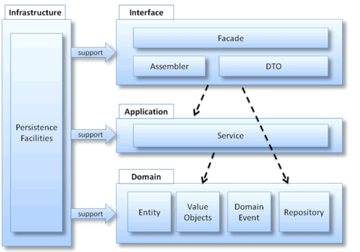
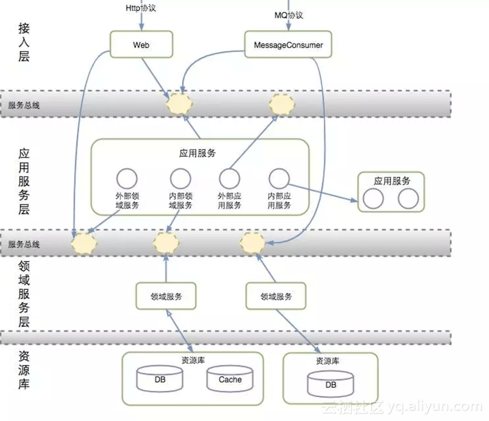
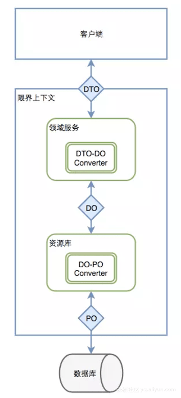

## 总览分析

项目结构

- interfaces：用户表示层，最顶层；负责向用户显示信息和解释用户命令，请求应用层以获取用户所需要展现的数据，发送命令给应用层要求其执行某个用户命令；
  - facade：门面，为远程客户端提供粗粒度的调用接口，将一个用户请求委派给一个或多个Service进行处理；
  - DTO：数据传输对象，是与外部通讯的载体，是一个纯粹的POJO，内部不应该包含任何的业务逻辑；
  - assembler：装配器，实现DTO与领域对象之间的相互转换，与DTO同时出现；
  - 各种协议入口：如servlet、controller、mq协议，这种分层直接调用facade门面的入口；
- application：应用层，回答微服务应用要完成的任务内容，要求尽量的简单，不包含任何的业务逻辑或者知识，事务均放在应用层做处理；
  - 各种service：为一个接口，就是应用层接口
  - serviceImpl：为应用层接口的具体实现
  - event：为对应的事件接口
- domain：领域层，主要负责表达业务概念，业务状态信息和业务规则，几乎所有的业务逻辑均在该层实现
  - entity：实体，具有为已标志的对象
  - vo（value object）：值对象，无需唯一标志的对象
  - service（domain service）：领域服务，一些行为无法归类到实体对象或值对象上，本质是一些操作而非事物
  - aggregate：聚合根，一组具有内聚关系的相关对象或者集合
  - factory：工厂，创建复杂对象时，隐藏创建的细节
  - repository：仓储，提供查找和持久化对象的方法
- infrastructure：基础设施层，与所有层相交互，为用户表示层提供组件配置，为应用层提供传递消息的能力，为领域层提供持久化机制
  - eventImpl：应用层的event实现
  - persistence：持久化实现，为对应领域层中repository的实现

## 资料参考

- 结合《领域驱动设计》的工程：[领域驱动工程样例](https://github.com/citerus/dddsample-core)
- 阿里DDD技术讲解：
  - [阿里技术专家详解DDD系列 第一讲：Domain Primitive](https://mp.weixin.qq.com/s?__biz=MzAxNDEwNjk5OQ==&mid=2650403892&idx=1&sn=a91fa477392e80f9420a8ca4d26bcace&chksm=83953c2cb4e2b53a6af3b5a82c3b7d7ed932bfe83f59877a935445ae89edd0ff4ee1c4e82fba&scene=21#wechat_redirect)
  - [阿里技术专家详解DDD系列 第二讲：应用架构](https://mp.weixin.qq.com/s?__biz=MzAxNDEwNjk5OQ==&mid=2650404060&idx=1&sn=cacf40d19528f6c2d9fd165151d6e8b4&chksm=83953cc4b4e2b5d2bd4426e0d2103f2e95715b682f3b7ff333dbb123eaa79d3e5ad24f64beac&scene=21#wechat_redirect)
  - [阿里技术专家详解DDD系列 第三讲：Repository模式](https://mp.weixin.qq.com/s?__biz=MzAxNDEwNjk5OQ==&mid=2650406692&idx=1&sn=4a4ac4168299d8ca1905a4f457ae4c59&chksm=8395373cb4e2be2a2d066a5ea4e631fd6270e969ce61883b488f61c1ce33fbc0b362ec9cbf7b&scene=21#wechat_redirect)
  - [阿里技术专家详解DDD系列 第四讲：领域层设计规范](https://mp.weixin.qq.com/s?__biz=MzAxNDEwNjk5OQ==&mid=2650414919&idx=1&sn=0ad1df1a1b0e2488f7faa21008fdbdd0&chksm=8396d75fb4e15e49341b07022780dcb8dca66a0efb7f129d4de86a5ef5d8a890f6e0d2fd6432&scene=21#wechat_redirect)
  - [阿里技术专家详解DDD系列 第五讲：聊聊如何避免写流水账代码](https://mp.weixin.qq.com/s?__biz=MzAxNDEwNjk5OQ==&mid=2650427571&idx=1&sn=bfc3c1c6f189965a1a4c7f3918012405&chksm=839698abb4e111bd5e02344f27d86c928ccfe4d3da1649817b02924c07f681fc1a7ea818f442&scene=178&cur_album_id=1452661944472977409#rd)
  - 对应工程代码：[工程代码](https://github.com/Air433/dddbook)
- vivo技术讲解：
  - [领域驱动设计(DDD)实践之路(一)](https://juejin.cn/post/6844904071174815752)
  - [领域驱动设计(DDD)实践之路(二)：事件驱动与CQRS](https://juejin.cn/post/6844904122659913735)
  - [领域驱动设计(DDD)实践之路(三)：如何设计聚合](https://juejin.cn/post/6844904158449893389)
- [美团DDD技术讲解](https://developer.aliyun.com/article/319159)
- [后端开发实践系列——领域驱动设计(DDD)编码实践](https://juejin.cn/post/6844903903104860174)
- [COLA技术架构](https://github.com/alibaba/COLA)
- [为什么域服务必须使用域对象作为参数和返回值？](https://stackoverflow.com/questions/14326230/why-must-domain-services-use-domain-objects-as-parameters-and-return-values)
- [如何发布和处理领域事件](http://www.kamilgrzybek.com/design/how-to-publish-and-handle-domain-events/)
- [DDD 限界上下文和 Java 模块](https://www.baeldung.com/java-modules-ddd-bounded-contexts)
- [工厂的入参是原始对象还是value object](https://stackoverflow.com/questions/11395031/ddd-factory-entity-value-object?rq=1)

## 要点

- application层只是做服务的编排，不做任何的计算逻辑
- domain service只是对象状态的变更，不做save的操作，不能注入repository
- domain service入参和出参都返回领域内的对象
- CQE对象入参全为细颗粒度

## 概述

#### Interface层：

- 承接消息的入口，转化入口参数
- interface层的表达不止为http协议，也有dubbo、soap、websocket、kafka等
- 每种协议独立一套的表达方式，避免同一表达；需要注意出参要有同一的格式，例如http协议同一返回StandardReposese对象
- 应该捕捉所有异常，避免异常信息的泄漏
- 不应意识到domain层的内部对象
- 用Bean Validation做对CQE对象的校验

#### Application层：

- application层做的是**服务的编排**，**不做任何的计算逻辑**；一般包含下面的操作
  - 数据校验
  - 通过Repository查询Entity
  - 操作Entity，对Entity进行状态的变更
  - 通过Repository保存Entity
  - 发送领域事件
- Command、Query、Event统称为CQE，他们三者作为application的入参，根据单ID查询的场景下可以直入；统一返回DTO对象，不能暴露domain的Entity和Value Object，使用DTO Assemble进行转换
- 不同方法使用不同的CQE，因为不同方法的语义是不一样的，如果复用同一CQE对象，其中一个方法入参的变动会导致全体的参数变动
- application层需要做简单的参数校验，例如：判空、字符串合法化判断，可以用Bean Validation解决
- 有异常信息可以直接抛出，因为在上层的interface层已经捕获所有异常
- 接收domain或者domain service里面抛出的领域事件，发布对应的领域事件

#### Domain层：

- Entity：
  - 有对应的id，一个Entity对应有一个唯一的id
  - 判断两个Entity是否相等应该直接判断id
  - id需要用一个对象进行包裹，防止id的唯一性变更
  - 一个Entity对应有一个Repository
  - 封装业务的参数校验以及业务逻辑
  - 写方法一般来说返回是void，可以直接扔出领域事件，让application层进行事件抛出
- Value Object：
  - 没有id，参数都是**不可变**的，若改变里面的信息需要直接new一个实体
  - 没有对应的Repository
  - 有对应的业务操作函数，非纯POJO
- Domain Service：
  - 操作复杂的业务逻辑，往往含有两个以上的Entity的操作，如果只有操作一个Entity，可以把这些业务逻辑挪到这唯一的Entity里面
  - Domain Service不应该依赖Repository，只做对Entity的状态的变更
  - 注意和Application的区别，domain service是一个不必要的妥协，应该越少越好
- Repository：
  - 保存Entity的状态
  - 本质上只有save和find两种的方法
  - 实现类完成数据库存储的细节
- Factory：
  - 创建Entity对象，从0到1的过程
  - 入参是领域对象，非基本类型
  - 复杂构造的时候可能会依赖Repository

#### Infrastructure层：

- 用ACL防腐层将外部依赖转化为内部代码，隔离外部的影响

## 使用ACL的好处

- 适配器：便于适配其他服务接口
- 缓存：可以缓存频繁请求的数据
- 兜底：防止其他服务不可用导致核心功能的不可用
- 易于测试：可以方便地通过mock和stub进行单元测试
- 功能开关：控制功能的实现

## CQE的概念与使用

|        | Command            | Query           | Event            |
| ------ | ------------------ | --------------- | ---------------- |
| 语义   | "希望"能触发的操作 | 各种查询条件    | 已经发生过的事情 |
| 读/写  | 写                 | 只读            | 写               |
| 返回值 | DTO或Boolean       | DTO或Collection | Void             |

- CQE在interfaces层做校验，推荐使用Bean Validation实现
- 不要复用CQE对象，因为不同行为后续的差异会越来越大

