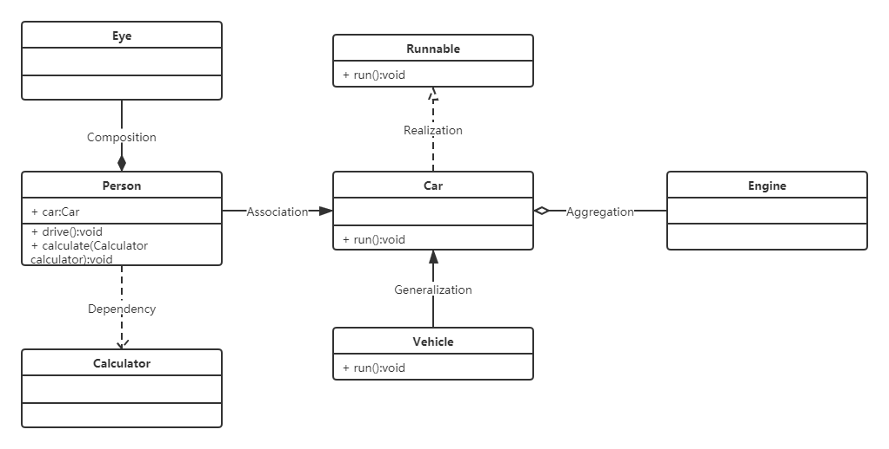
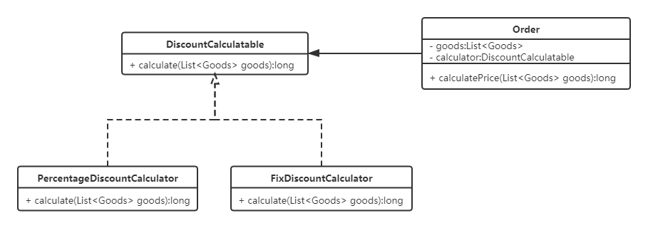
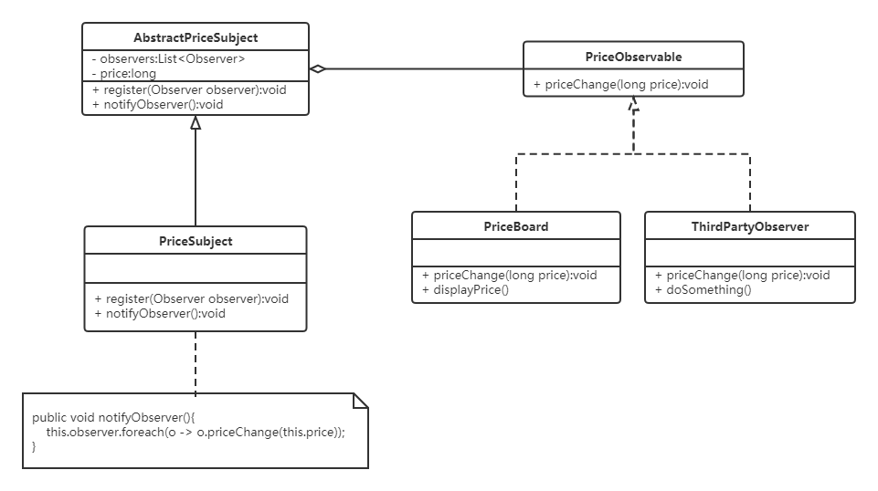
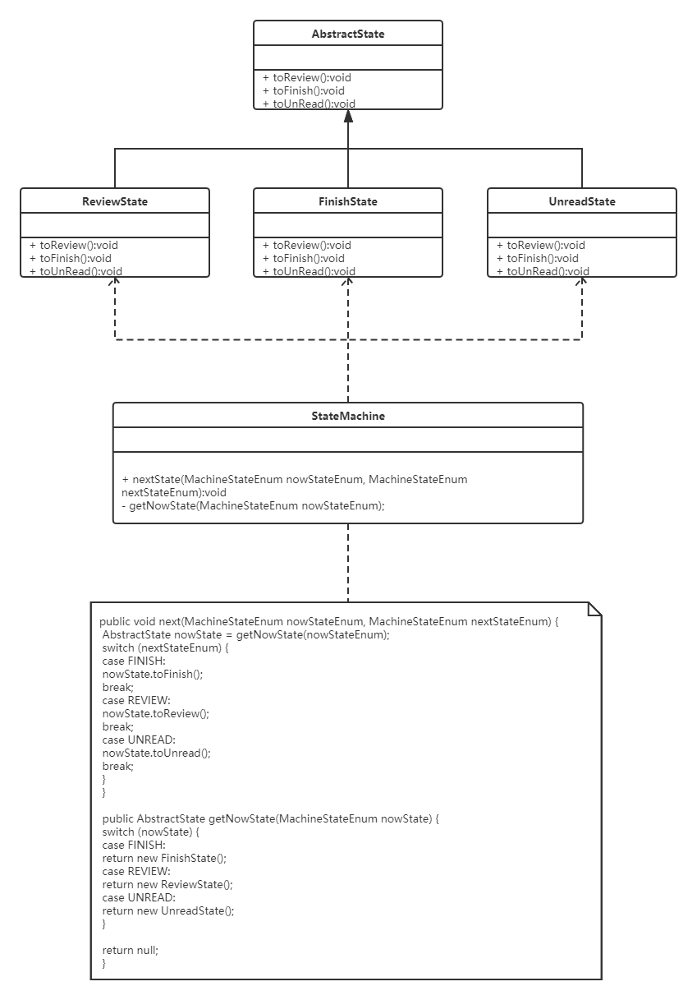

## UML关联关系

参考文章：[UML 类之间的关系](https://www.zhihu.com/question/268467998/answer/728020600)

**实现**关系（Realization）：表现为实现接口，语义为like-a，虚线+空心箭头表示

**泛化**关系（Generalization）：表现为继承，语义为is-a，实线+空心箭头表示

**依赖**关系（Dependency）：是一种使用的关系，基于临时的关联，通过局部变量、方法参数或者静态方法调用另外一个类完成某些职责，虚线+箭头表示

**关联**关系（Association）：是对象之间一种引用的关系，对象之间并无严格的上下级以及包含的关系，实线+实心箭头表示

**聚合**关系（Aggregation）：强关联关系，是整体和部分的关系，部分能够超越整体的生命周期，语义为has-a，实线+空心菱形箭头，**注意菱形在聚合方**

**组合**关系（Composition）：最强的关联关系，是整体和部分的关系，部分不能脱离整体存在，语义为cxmatins-a关系，实线+实心菱形箭头，**注意菱形在组合方**

## 设计模式的使用场景

- 策略模式：电商订单，优惠计算器，不同类型的订单使用不同类型的优惠计算器；

- 观察者模式：电商商品价格变动，推送通知给第三方平台和数据展示面板；

- 装饰者模式：电商收银自动使用优惠，满减、使用积分扣减；
- 工厂模式：
- 单例模式：大部分使用在程序的公共包，以及一些全局的配置管理类中；
- 命令模式：
- 适配器模式：
- 模板方法模式：
- 迭代器与组合模式：
- 状态模式：在合同管理平台运用到，分为审核中、待审核、未审核、审核完成，四个状态会进行相互跳转；

- 代理模式：