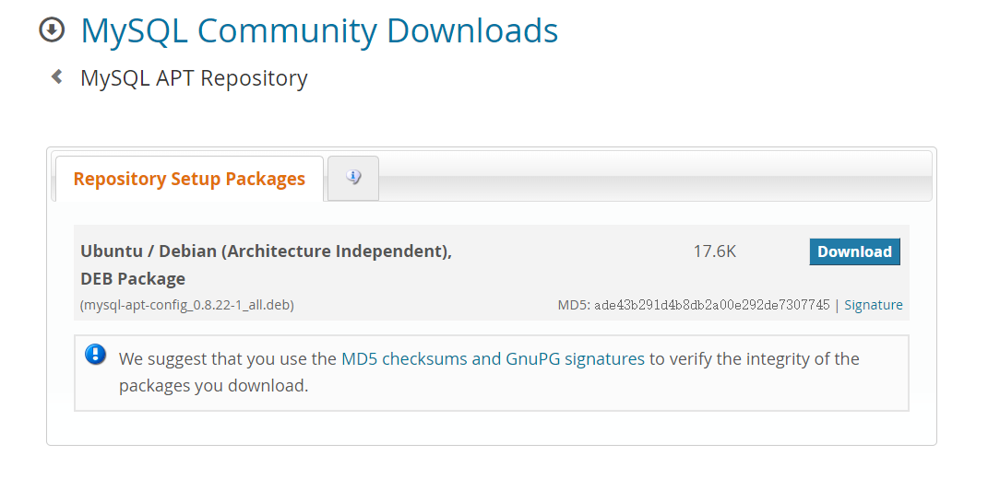

## 虚拟机环境搭建
### MySQL
- 选择下载[地址源](https://dev.mysql.com/downloads/)
这里选择APT Repository安装方式

- 安装期间设置root密码为root
```
sudo dpkg -i mysql-apt-config_0.8.22-1_all.deb
sudo apt-get update
sudo apt-get install mysql-server
```
- 配置监听地址字符集编码等
```
vim /etc/mysql/my.cnf

最下面加入
[client]
default-character-set = utf8mb4

[mysql]
default-character-set = utf8mb4

[mysqld]
bind-address            = 0.0.0.0
character-set-server = utf8mb4

需要重启mysql
```
- 配置root远程登陆和密码
```
mysql -u root -proot
use mysql
update user set host = '%' where user = 'root';
flush privileges;
```
- 启动调整
```
禁止开机自启 update-rc.d mysql remove
开机自启 update-rc.d mysql defaults
启动 /etc/init.d/mysql start
关闭 /etc/init.d/mysql stop
```

### Redis
- 安装redis
```
sudo apt-get install redis-server
```
- 修改监听地址
```
把bind 127.0.0.1
修改为bind 0.0.0.0
```

### Elaseticsearch
```
wget -qO - https://artifacts.elastic.co/GPG-KEY-elasticsearch | sudo apt-key add -
sudo apt-get install apt-transport-https
echo "deb https://artifacts.elastic.co/packages/7.x/apt stable main" | sudo tee /etc/apt/sources.list.d/elastic-7.x.list
sudo apt-get update && sudo apt-get install elasticsearch
```

### 启动命令
```
systemctl start postgresql
systemctl start mysql
systemctl start nginx
systemctl start postgresql
systemctl start redis-server.service
```