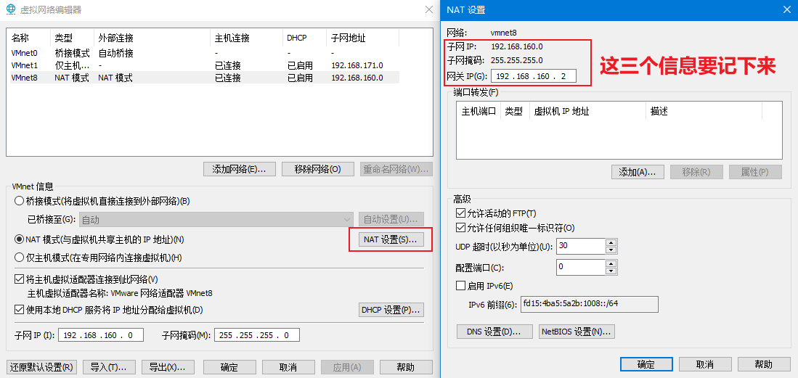
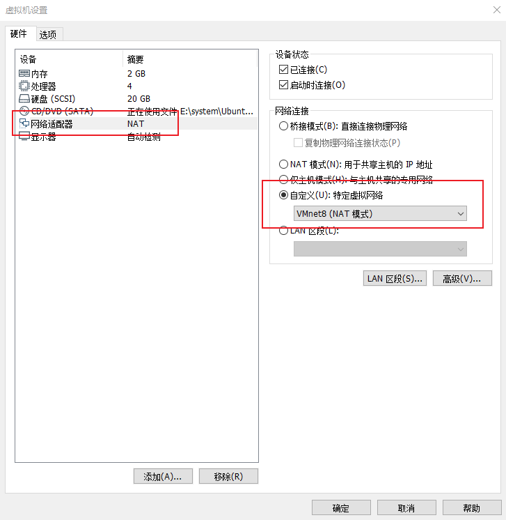
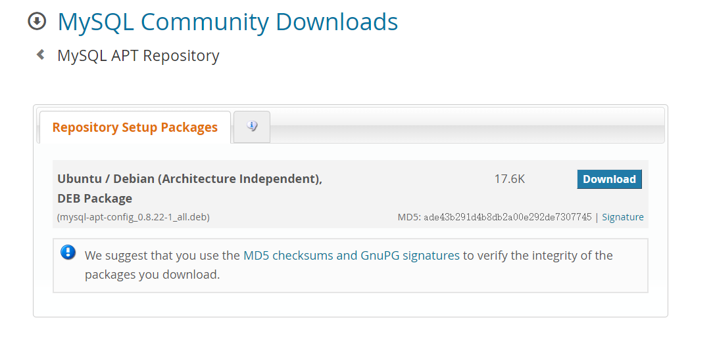

## 虚拟机环境搭建

### Ubuntu Server系统安装

- 安装完成VMware workstation后，在编辑->虚拟网络编辑器->更改设置->NAT设置，查看NAT模式的子网IP、网络掩码、网关IP等信息
  如下图所示
  子网IP：192.168.160.0
  子网掩码：255.255.255.0
  网关IP：192.168.160.2
  

- 创建虚拟机
  打开VMware，文件->新建虚拟机
  类型配置：自定义（高级）
  硬件兼容性：默认
  安装来源：稍后安装操作系统
  客户机操作系统：Linux，下拉框选择Ubunut 64位
  虚拟机名称：自定义，位置：自定义
  处理器配置：按照宿主机的配置，选择处理器数量2，内核数量2
  内存量：2048MB
  网络类型：使用网络地址转换(NAT)
  I/O控制器类型：LSI Logic
  虚拟磁盘类型：SCSI
  磁盘：创建新虚拟磁盘
  磁盘容量：最大磁盘大小：20G，拆分成多个文件，名字为Ubuntu_Dev.vmdk
  自定义硬件：去除USB控制器、声卡、打印机，在新CD/DVD中选择使用ISO，打开ubuntu-16.04.6-server-amd64.iso
  

- 打开虚拟机，进入安装流程
  **语言选项：English**
  选择：Install Ubuntu Server
  **Language：English**
  区域：China
  国家locale设置：United States
  选择键盘布局：No，再选择Chinese
  机器名hostname：ubuntu
  用户名和account：你自己的名字，密码：自己定
  加密文件夹：No
  时区：Asia/Chongqing
  **分区方法：Guided - use entire disk and set up LVM，选择磁盘，写入LVM点击Yes，容量默认，确认写入磁盘Yes**
  代理：置空即可
  管理更新：No automatic updates
  安装包：选择Standard System utilities和OpenSSH server
  GRUB boot loader安装：Yes

- 重启Ubunut后，可以进入登录界面，此时输入用户名和密码进行登录

- 修改网卡配置
  
  ```
  sudo vi /etc/network/interfaces
  把iface ens32 inet dhcp改为
  把iface ens32 static
  address 192.168.42.100
  netmask 255.255.255.0
  gateway 192.168.42.2
  dns-nameserver 114.114.114.114
  dns-nameserver 8.8.8.8
  ```

- 配置root的ssh登录
  
  ```
  sudo vi /etc/ssh/sshd_config
  把PermitRootLogin prohibit-password改为
  PermitRootLogin yes
  ```

- 配置root的密码
  
  ```
  sudo su - root
  passwd
  ```

- 修改apt源为阿里源
  
  ```
  sudo cp /etc/apt/sources.list /etc/apt/sources_bak.list
  sudo vi /etc/apt/sources.list
  
  将整个文件修改为下面内容：
  deb http://mirrors.aliyun.com/ubuntu/ xenial main
  deb-src http://mirrors.aliyun.com/ubuntu/ xenial main
  
  deb http://mirrors.aliyun.com/ubuntu/ xenial-updates main
  deb-src http://mirrors.aliyun.com/ubuntu/ xenial-updates main
  
  deb http://mirrors.aliyun.com/ubuntu/ xenial universe
  deb-src http://mirrors.aliyun.com/ubuntu/ xenial universe
  deb http://mirrors.aliyun.com/ubuntu/ xenial-updates universe
  deb-src http://mirrors.aliyun.com/ubuntu/ xenial-updates universe
  
  deb http://mirrors.aliyun.com/ubuntu/ xenial-security main
  deb-src http://mirrors.aliyun.com/ubuntu/ xenial-security main
  deb http://mirrors.aliyun.com/ubuntu/ xenial-security universe
  deb-src http://mirrors.aliyun.com/ubuntu/ xenial-security universe
  ```

  - 执行命令

    ```
    sudo apt-get update
    sudo apt-get upgrade
    ```

  - 最后重启电脑，即可用ssh进行登录

### MySQL

- 选择下载[地址源](https://dev.mysql.com/downloads/)

  这里选择APT Repository安装方式
  

- 安装期间设置root密码为root

  ```
  sudo dpkg -i mysql-apt-config_0.8.22-1_all.deb
  sudo apt-get update
  sudo apt-get install mysql-server
  ```

- 配置监听地址字符集编码等（需要重启mysql）

  ```
  vim /etc/mysql/my.cnf
  
  最下面加入
  [client]
  default-character-set = utf8mb4
  
  [mysql]
  default-character-set = utf8mb4
  
  [mysqld]
  bind-address            = 0.0.0.0
  character-set-server = utf8mb4
  ```

- 配置root远程登陆和密码

  ```
  mysql -u root -proot
  use mysql
  update user set host = '%' where user = 'root';
  flush privileges;
  ```

- 启动调整

  - 禁止开机自启 update-rc.d mysql remove
  - 开机自启 update-rc.d mysql defaults
  - 启动 /etc/init.d/mysql start
  - 关闭 /etc/init.d/mysql stop

### Redis
- 安装redis

  ```
  sudo apt-get install redis-server
  ```

- 修改监听地址

  ```
  把bind 127.0.0.1
  修改为bind 0.0.0.0
  ```

### Elasetcsearch

安装Elaasticsearch

```
wget -qO - https://artifacts.elastic.co/GPG-KEY-elasticsearch | sudo apt-key add -
sudo apt-get install apt-transport-https
echo "deb https://artifacts.elastic.co/packages/7.x/apt stable main" | sudo tee /etc/apt/sources.list.d/elastic-7.x.list
sudo apt-get update && sudo apt-get install elasticsearch
```

### 启动命令

```
systemctl start postgresql
systemctl start mysql
systemctl start nginx
systemctl start postgresql
systemctl start redis-server.service
```
