## Spring

### Spring主要包

- core：核心工具包，ioc的主要实现；
- beans：关于类的配置以及初始化等；
- aop：面向切面编程的包；
- web：web开发时所用到的包；
- mvc：mvc开发时所用到的包；
- test：进行单元测试所用的包；
- orm：整合orm的实现。


### Spring的优点

- 通过DI和IOC降低类之间的耦合度；
- 将业务调用流程划分为更细的层级（MVC）；
- 可以将对象的生命周期给容器进行托管（Singleton和Prototype）；
- 与其他常见业务框架进行无缝整合；
- 提供了常见的工具类。


### DI和IOC机制的理解

依赖注入（Dependecy Injection）和控制反转（Inversion of Control）是同一个概念。

当一个类需要另外一个类进行协助时：

- 在传统的编程中：调用类直接创建被调用类的实例；

- 在IOC中：实例的创建时不再由调用者进行创建，而是交给spring进行创建，然后注入调用者。

优点：

- 去除了调用类与被调用类的耦合关系；
- 当被调用类派生出很多子类时，可以进行快速替换处理。


### AOP的理解

- 通过**反射**和**代理**的手段可以做到进行业务代码的分层与代码无入侵式的织入；

- OOP（面向对象编程）是静态的抽象，而AOP是动态的抽象；

- 是面向对象编程OOP的增强与补充，把代码拆分成几个层次，在层次中进行**额外代码的补充与增强**。


### ORM的理解

- 通过描述对象和数据库之间的映射关系，将对象自动持久化到关系数据库中；
- 可以去除写SQL的繁杂过程。


### Spring如何解决循环依赖的问题

```java
@Component
public class A {
    @Autowired
    private B b;
    public void setB(B b) {
        this.b = b;
    }
}

@Component
public class B {
    @Autowired
    private A a;
    public void setA(A a) {
        this.a = a;
    }
}
```

> **重点：类的创建的初始步骤是先实例化，再初始化成员变量属性。**

1. 通过ApplicationContext.getBean()获取A类的实例对象时，由于容器找不到对应类型的对象，因此去创建A类型对象；
2. 实例化A类的目标对象后，把该实例对象放入ApplicationContext中（此时该实例对象被标记为**半成品**），然后发现A类中需要注入B类的实例对象，因此spring在ApplicationContext中查找B类；
3. 在ApplicationContext中没有发现B类，因此容器会去实例化B类的实体，实例化B类实体后，发现需要注入A类的实例对象，因此在ApplicationContext中寻找；
4. 此时B类可以在ApplicationContext发现A类的实例对象（那个**半成品**对象），B类成功进行实例化和初始化；
5. 后续进行反递归调用，寻找A类中的B类实例对象，进行注入处理。


### SpringMVC

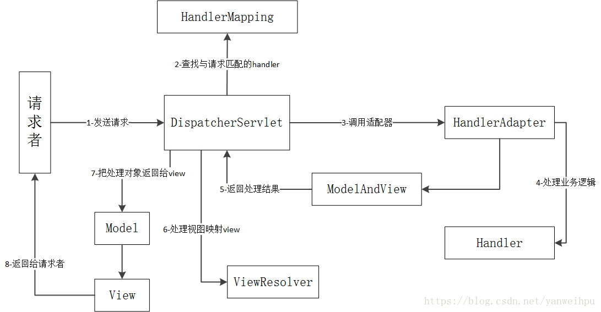

DispatcherServlet部分源码：

```java
protected void doDispatch(HttpServletRequest request, HttpServletResponse response) throws Exception {
    HttpServletRequest processedRequest = request;
    HandlerExecutionChain mappedHandler = null;
    boolean multipartRequestParsed = false;

    WebAsyncManager asyncManager = WebAsyncUtils.getAsyncManager(request);

    try {
        ModelAndView mv = null;
        Exception dispatchException = null;

        try {
            processedRequest = checkMultipart(request);
            multipartRequestParsed = (processedRequest != request);

            mappedHandler = getHandler(processedRequest);
            if (mappedHandler == null || mappedHandler.getHandler() == null) {
                noHandlerFound(processedRequest, response);
                return;
            }

            //获取handler
            HandlerAdapter ha = getHandlerAdapter(mappedHandler.getHandler());

            String method = request.getMethod();
            boolean isGet = "GET".equals(method);
            if (isGet || "HEAD".equals(method)) {
                long lastModified = ha.getLastModified(request, mappedHandler.getHandler());
                if (logger.isDebugEnabled()) {
                    logger.debug("Last-Modified value for [" + getRequestUri(request) + "] is: " + lastModified);
                }
                if (new ServletWebRequest(request, response).checkNotModified(lastModified) && isGet) {
                    return;
                }
            }

            //前置处理
            if (!mappedHandler.applyPreHandle(processedRequest, response)) {
                return;
            }

            //根据handle处理请求对象，此方法包括了查找Controller或者Servlet的步骤
            mv = ha.handle(processedRequest, response, mappedHandler.getHandler());

            if (asyncManager.isConcurrentHandlingStarted()) {
                return;
            }

            applyDefaultViewName(processedRequest, mv);
            //后置处理
            mappedHandler.applyPostHandle(processedRequest, response, mv);
        }
        catch (Exception ex) {
            dispatchException = ex;
        }
        catch (Throwable err) {
            dispatchException = new NestedServletException("Handler dispatch failed", err);
        }
        //处理后续的对象与视图
        processDispatchResult(processedRequest, response, mappedHandler, mv, dispatchException);
    }
    catch (Exception ex) {
        triggerAfterCompletion(processedRequest, response, mappedHandler, ex);
    }
    catch (Throwable err) {
        triggerAfterCompletion(processedRequest, response, mappedHandler,
                               new NestedServletException("Handler processing failed", err));
    }
    finally {
        if (asyncManager.isConcurrentHandlingStarted()) {
            if (mappedHandler != null) {
                mappedHandler.applyAfterConcurrentHandlingStarted(processedRequest, response);
            }
        }
        else {
            if (multipartRequestParsed) {
                cleanupMultipart(processedRequest);
            }
        }
    }
}

private void processDispatchResult(HttpServletRequest request, HttpServletResponse response,
                                   HandlerExecutionChain mappedHandler, ModelAndView mv, Exception exception) throws Exception {

    boolean errorView = false;

    if (exception != null) {
        if (exception instanceof ModelAndViewDefiningException) {
            logger.debug("ModelAndViewDefiningException encountered", exception);
            mv = ((ModelAndViewDefiningException) exception).getModelAndView();
        }
        else {
            Object handler = (mappedHandler != null ? mappedHandler.getHandler() : null);
            mv = processHandlerException(request, response, handler, exception);
            errorView = (mv != null);
        }
    }

    if (mv != null && !mv.wasCleared()) {
        //根据ModelAndView渲染页面
        render(mv, request, response);
        if (errorView) {
            WebUtils.clearErrorRequestAttributes(request);
        }
    }
    else {
        if (logger.isDebugEnabled()) {
            logger.debug("Null ModelAndView returned to DispatcherServlet with name '" + getServletName() +
                         "': assuming HandlerAdapter completed request handling");
        }
    }

    if (WebAsyncUtils.getAsyncManager(request).isConcurrentHandlingStarted()) {
        return;
    }

    if (mappedHandler != null) {
        mappedHandler.triggerAfterCompletion(request, response, null);
    }
}
```

SimpleControllerHandlerAdapter部分源码：

```java
@Override
public ModelAndView handle(HttpServletRequest request, HttpServletResponse response, Object handler)
    throws Exception {

    return ((Controller) handler).handleRequest(request, response);
}
```


### Spring Cloud组件

- eureka和consul：注册中心；

  功能对比与组件选型：

  - eureka：已经闭源，基于AP，没有对应的配置中心，没有主从节点，一个节点挂了自动切换到其他节点使用，去中心化；
  - consul：保证一致性，基于CP，需要进行集群搭建，某个节点失效首先需要选择新的leader，半数以上的节点不可用，则服务继续提供正常服务。

- ribbon：负载均衡；

- zuul/gateway：网关；

- feign：关于interfact的http远程调用；

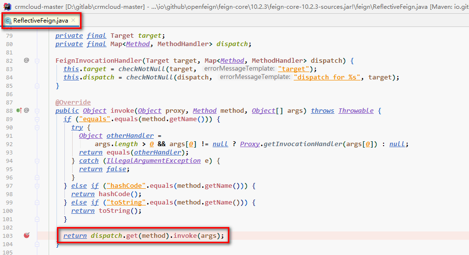

- hystrix：熔断器。

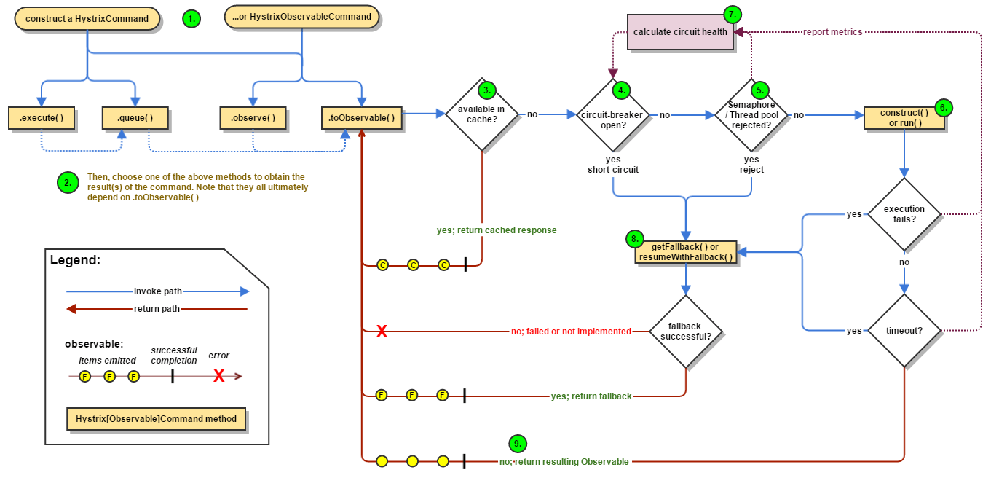


### Spring、Spring Boot、Spring Cloud区别

- Spring是最基础的实现，基础依赖包都囊括在spring，颗粒度最细；
- Spring Boot就是集成好默认的Spring配置，约定大于配置；
- Spring Cloud旨在解决微服务架构问题，提供服务注册发现、服务消费、熔断保护、网关和分布式调用链和分布式配置等。


### Spring事务

#### 事务的传播属性

| 级别                      | 详解                                                         |
| ------------------------- | ------------------------------------------------------------ |
| PROPAGATION_REQUIRED      | 支持当前运行的事务，如果不存在事务则创建一个新的事务，为Spring的默认传播级别 |
| PROPAGATION_SUPPORTS      | 支持当前运行的事务，如果不存在事务则以非事务模式运行         |
| PROPAGATION_MANDATORY     | 支持当前运行的事务，如果不存在事务则抛出异常                 |
| PROPAGATION_REQUIRES_NEW  | 创建新事务运行，如果存在事务则挂起当前事务                   |
| PROPAGATION_NOT_SUPPORTED | 不持支当前事务，总是以非事务方式执行                         |
| PROPAGATION_NEVER         | 不支持当前事务，如果当前存在事务则抛出异常                   |
| PROPAGATION_NESTED        | 以嵌套方式执行事务；外层事务失败会回滚内层事务，内层事务不会回滚外层事务。在A中执行B，A报错B会回滚，但B报错仅B回滚，A不会回滚 |


#### Spring事务不生效的场景

- 数据库引擎本身不支持事务
- 对应的Service没有被Spring管理
- @Transactional注解所在方法不是public修饰
- 自身调用的情况
- 数据源没有配置事务管理器
- @Transactional中传播方式为不支持事务
- 出现异常但是被方法内部捕获了，又没有向框架抛出异常
- @Transactional抛出非RuntimeException或者Error异常，需要使用rollbackFor支持其他异常的回滚


## MyBatis

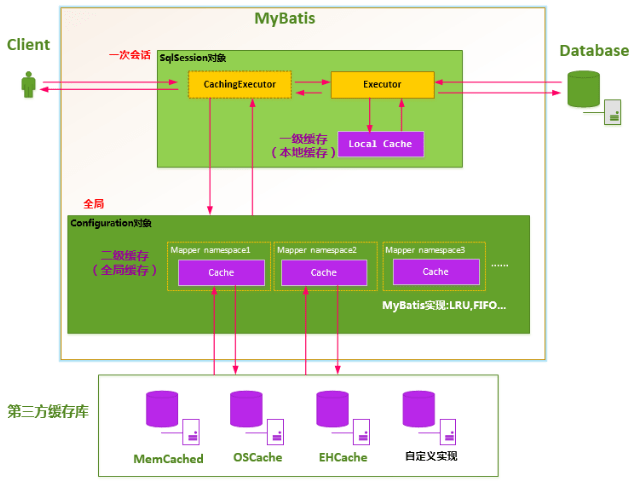

- 一级缓存：在开启一个数据库会话时，会新建一个SqlSession对象（含Executor），Executor在执行对应的SQL语句时，会去PerpetualCache对象中寻找对应的缓存，该缓存对象随着SqlSession对象死亡而释放；如果SqlSession调用了clearCache()、update()、delete()、insert()任意一个方法，都会**清空PerpetualCache的数据**；一级缓存默认为**开启**状态；
- 二级缓存：默认是不开启二级缓存，默认原生二级缓存需要返回的POJO必须是可序列化的，一般通过LRU的算法来回收。


## Dubbo

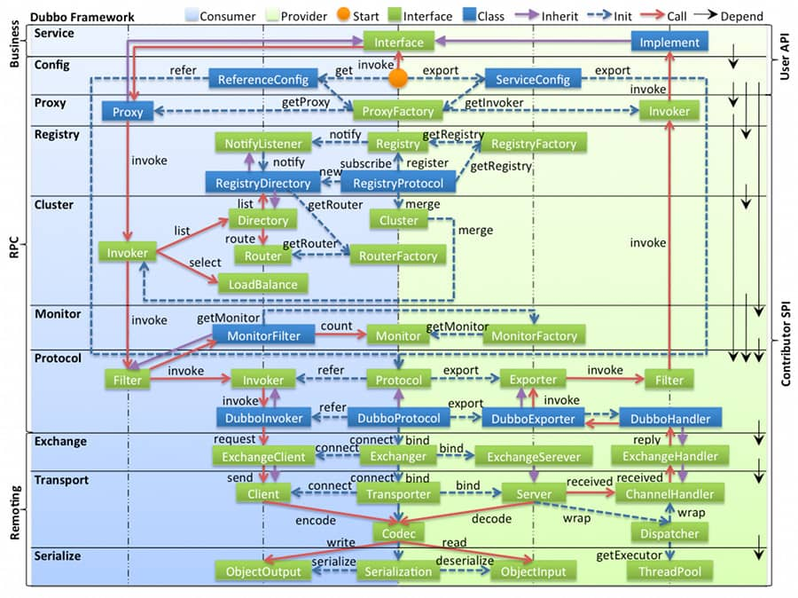

- 图中左边淡蓝背景的为服务消费方使用的接口，右边淡绿色背景的为服务提供方使用的接口，位于中轴线上的为双方都用到的接口。
- 图中从下至上分为十层，各层均为单向依赖，右边的黑色箭头代表层之间的依赖关系，每一层都可以剥离上层被复用，其中，Service 和 Config 层为 API，其它各层均为 SPI。
- 图中绿色小块的为扩展接口，蓝色小块为实现类，图中只显示用于关联各层的实现类。
- 图中蓝色虚线为初始化过程，即启动时组装链，红色实线为方法调用过程，即运行时调时链，紫色三角箭头为继承，可以把子类看作父类的同一个节点，线上的文字为调用的方法。

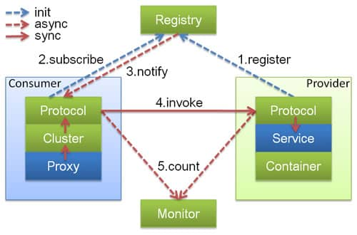

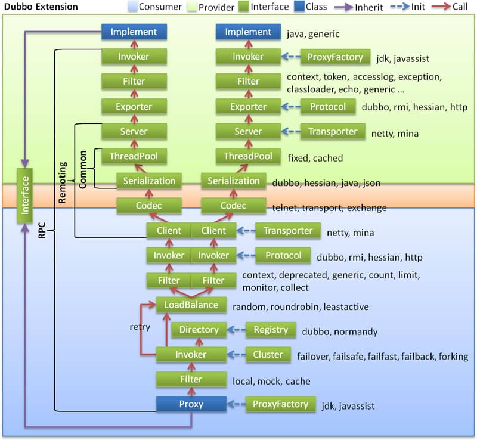

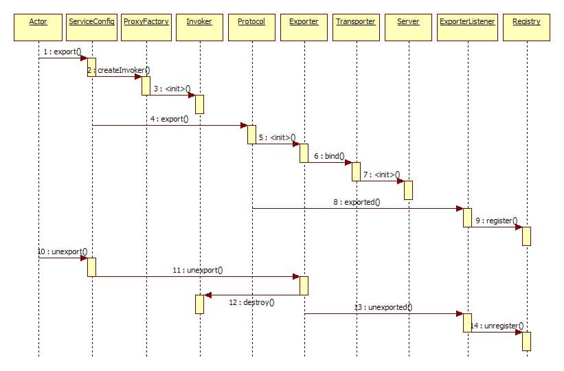

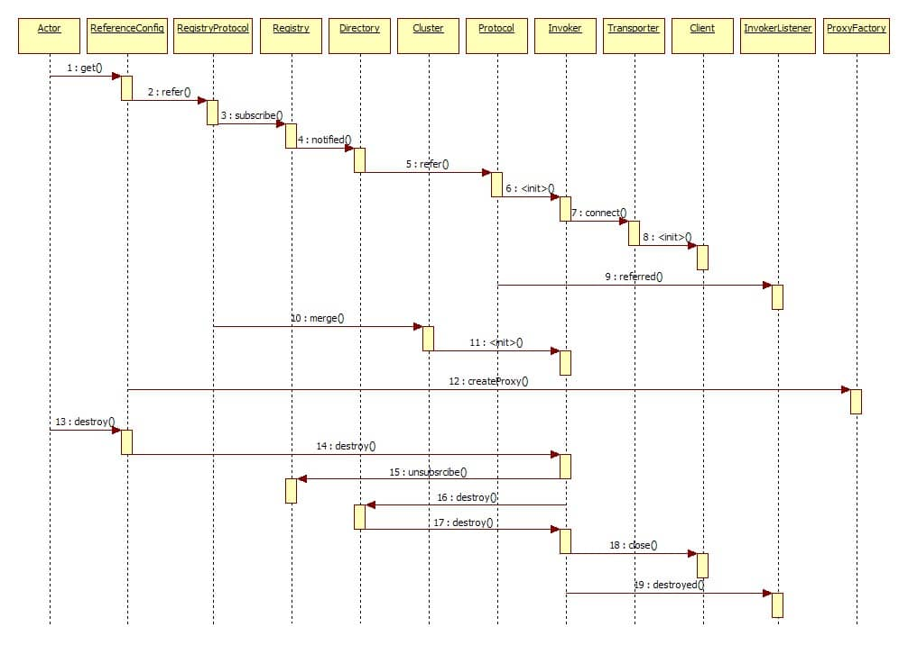


## Redis

### 数据类型&数据结构

数据类型：仅支持**byte数组**类型。

数据结构：

- String：一个key对应一个value的简单映射；
- List：一个key对应多个value，value值可以重复；
- Hash：一个key对应多个key-value键值对；
- Set：一个key对应多个value，value不可以重复，value之间没有顺序关系；
- Sorted Set：一个key对应多个value，value不可以重复，有顺序关系，先按照score排序，再按照value排序。


### 持久化

- RDB：生成数据库的快照，相当于直接dump出数据文件。分为手动触发和自动触发（设定x秒内存在y次数据变更时自动触发）

  - 优点：加载恢复时很快；
  - 缺点：不能做到命令级别或者秒级的。

- AOF：通过记录执行的命令进行记录，所有写命令直接追加到文件中，随着命令不断增加，AOF的文件逐渐变大，可以通过重写机制进行AOF文件的压缩。


### 键过期策略

- 惰性过期：访问一个key时才会判断是否已经过期，过期清除；
  - 优点：使用才进行计算，节省CPU资源；
  - 缺点：占用内存。
- 定期过期：每隔一段时间扫描expires字典中的key；
  - 优点：平衡CPU和内存资源。


### 内存淘汰策略

- volatile-lru：从已设置过期时间的数据集中挑选最近最少使用的数据淘汰；

- volatile-ttl：从已设置过期时间的数据集中挑选将要过期的数据淘汰；

- volatile-random：从已设置过期时间的数据集中任意选择数据淘汰；

- volatile-lfu：从已设置过期时间的数据集挑选使用频率最低的数据淘汰；

- allkeys-lru：从数据集中挑选最近最少使用的数据淘汰；

- allkeys-lfu：从数据集中挑选使用频率最低的数据淘汰；

- allkeys-random：从数据集中任意选择数据淘汰；
- no-enviction：禁止驱逐数据，这也是**默认策略**。意思是当内存不足以容纳新入数据时，新写入操作就会报错，请求可以继续进行，线上任务也不能持续进行，采用no-enviction策略可以保证数据不被丢失。


### 内存&线程模型

> Redis基于Reactor模式开发了网络事件处理器，该处理器被称为文件时间处理器，由套接字、IO多路复用程序、文件事件分派器和事件处理器组成。文件事件分派器队列是单线程的，所以才成为单线程模型，但是其他模块仍用了多个线程处理。

- 绝大部分请求是存粹的内存操作；
- 采用了单线程，避免了上下文切换和竞争条件；注意是处理网络请求的时候只有一个线程来处理；
- 采用了非阻塞IO：IO多路复用。

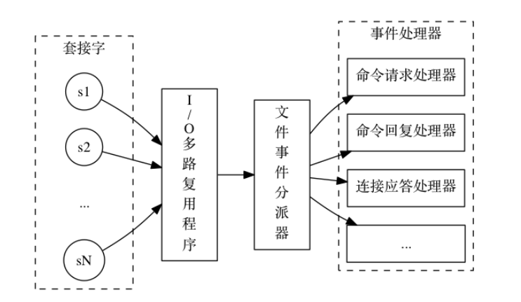


### 集群方案

#### 哨兵模式

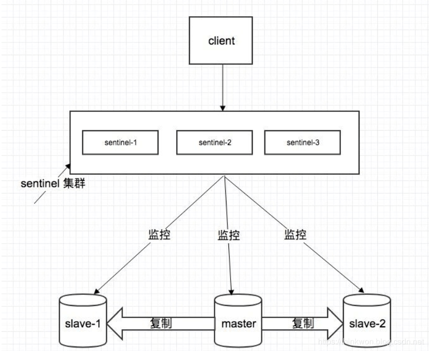

- 集群监控：负责监控 redis master 和 slave 进程是否正常工作；
- 消息通知：如果某个 redis 实例有故障，那么哨兵负责发送消息作为报警通知给管理员；
- 故障转移：如果 master node 挂掉了，会自动转移到 slave node 上；
- 配置中心：如果故障转移发生了，通知 client 客户端新的 master 地址。


#### 基于客户端分配模式

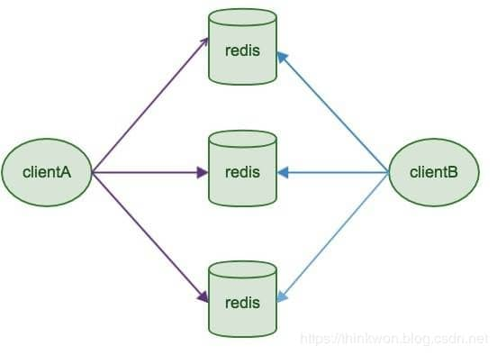

- 配置简单，结构简单，容易搭建，不需要第三方的组件；
- 本质上通过key映射到某Redis中的某个节点，**不适合动态扩容（最重要缺点）**；
- 客户端决定数据存储到哪个Redis节点或者决定从哪个Redis节点读取数据，通过hash算法实现；
- 代表为Redis Sharding，是在Redis Cluster出来前普遍使用的集群方法。


#### Redis Cluster

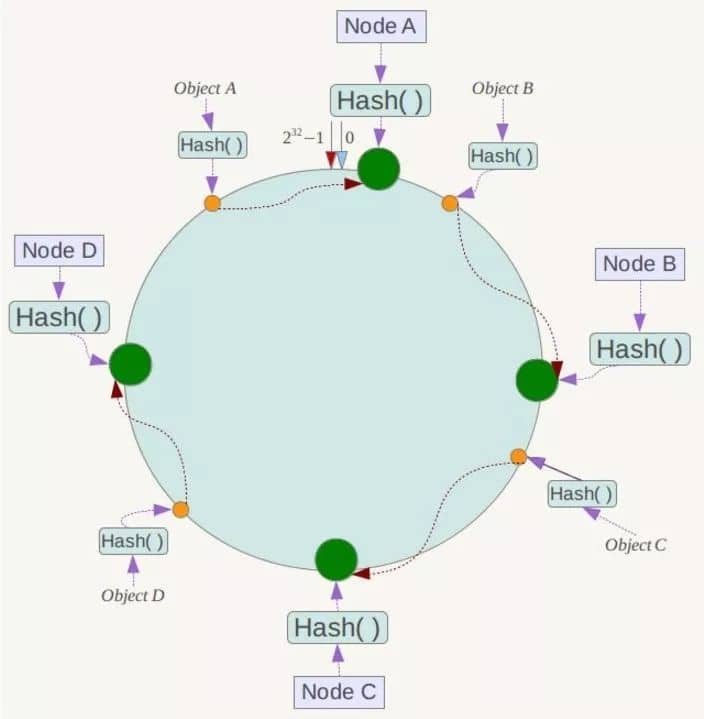

- 没有使用一致性hash（会有hash倾斜等问题）的方式，而是采用slot槽的概念；
- 可以动态扩容，仅仅需要迁移**一部分**数据到新的节点；
- key寻址时，先进行hash，然后按照一定的方向落到对应的槽点中进行数据处理。


### Redis-cluster使用案例

在目录中创建6个文件夹，对应为7000-7005，分别对应redis的占用端口，并将redis.conf复制到对应的文件夹中，并且修改为以下内容

```
bind 0.0.0.0
port [7000-7005]
pidfile /var/run/redis_[7000-7005].pid
cluster-enabled yes
cluster-config-file nodes-[7000-7005].conf
appendonly yes
```

分别进入对应的目录，运行redis

```
cd [7000-7005]
../redis-server ./redis.conf
```

使用redis-cli创建对应的集群，`--cluster-replicas 1`意味为每个创建的主机都提供一个从机

```
redis-cli --cluster create 127.0.0.1:7000 127.0.0.1:7001 127.0.0.1:7002 127.0.0.1:7003 127.0.0.1:7004 127.0.0.1:7005 --cluster-replicas 1
```

使用命令查看集群信息

```
./redis-cli --cluster check 127.0.0.1:7000
M: b16acaeab7e93f8a3f78fb78554d45036dca9ead 127.0.0.1:7001
   slots:[5461-10922] (5462 slots) master
   1 additional replica(s)
S: a24b06a6dd5d7257ac9a53b498fa054c02cbb304 127.0.0.1:7003
   slots: (0 slots) slave
   replicates ae4b63663e1a7659281457b7348dbd8a7b25286d
M: ae4b63663e1a7659281457b7348dbd8a7b25286d 127.0.0.1:7000
   slots:[0-5460] (5461 slots) master
   1 additional replica(s)
S: 46bc4e483d547db2b2b3545400a7b76029af3422 127.0.0.1:7004
   slots: (0 slots) slave
   replicates b16acaeab7e93f8a3f78fb78554d45036dca9ead
S: 4e2e94ac889c18c408af5c047b73063e1e671386 127.0.0.1:7002
   slots: (0 slots) slave
   replicates b843d2a4d24f0c0d758863433f9c918c7527dc0f
M: b843d2a4d24f0c0d758863433f9c918c7527dc0f 127.0.0.1:7005
   slots:[10923-16383] (5461 slots) master
   1 additional replica(s)
```

先要创建配置运行的文件

```
cd [7006-7007]
../redis-server ./redis.conf
```

使用`add-node`命令为集群添加节点（主节点），注意添加完成后，主节点并不会自动地进行rehash处理，需要手动进行rehash

```
redis-cli --cluster add-node 127.0.0.1:7006 127.0.0.1:7000
```

添加从节点`--cluster-slave`，注意从节点在加入时，会自动寻找集群中备份最少的节点并作为其从节点

```
redis-cli --cluster add-node 127.0.0.1:7007 127.0.0.1:7000 --cluster-slave
```

要删除一个从节点，只需使用`del-node`redis-cli命令

```
redis-cli --cluster del-node 127.0.0.1:7000 `<node-id>`
```

重新分簇（Rehash）

```
redis-cli --cluster reshard 127.0.0.1:7000
```


### redis命令

scan：

- 可以控制返回的数量，使用count指定返回数据量，使用match来进行数据匹配SCAN cursor [MATCH pattern] [COUNT count]

- SCAN命令用于迭代当前数据库中的数据库键；
- SSCAN 命令用于迭代集合键中的元素；
- HSCAN命令用于迭代哈希键中的键值对；
- ZSCAN命令用于迭代有序集合中的元素（包括元素成员和元素分值）；

keys和scan的区别：

- keys处理拥有大量数据的场景时，由于redis是单线程的，可能阻塞服务器长达数秒；
- scan是基于增量式迭代的，默认返回有限条数据，在scan返回数据的过程中，键值可能会被修改；


## RocketMQ


## Kafka

### 架构模型

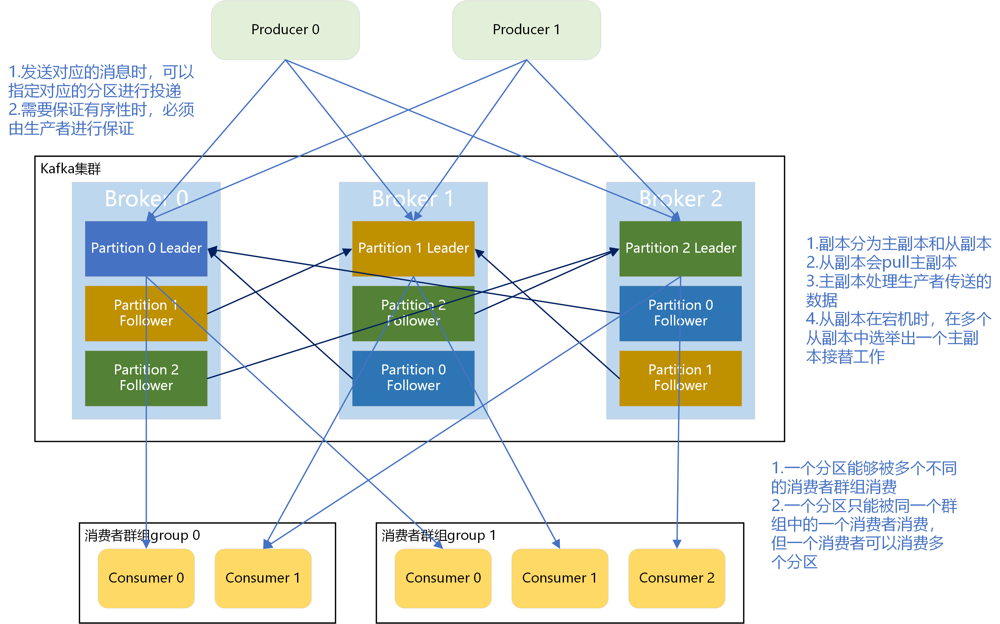

正常情况下，kafka里的数据都不能只有一份。假设我们保存了N个副本，即topic每个partition都有N个副本（Replica）。并且**副本的个数一定小于broker个数**（因为每份数据的副本必须保存在不同的broker，否则没有意义，因为如果一份数据的副本保存在同一个broker，那么这个broker挂了，则数据依然丢）。所以对于每个partition而言，每个broker上最多**只有一个**副本，因此我们常常使用broker-id表示副本。kafka还有个机制，就是会默认将副本均匀分布到所有的broker上。当replication-factor为N时，Partition会有N个副本，其中N为leader和follower的**总和**。

分区的副本是通过follower副本向leader副本发送pull命令进行请求同步的；

分区的同步可以分为**同步复制**、**异步复制**和**commit**：

- 同步复制：所有follower拉完数据后才commit，一致性好，可用性不高；
- 异步复制：只要leader拿到数据后立即commit，再等follower进行复制，一致性差，可用性高；
- ISR机制：不是完全同步异步的方式，leader副本会位置一个ISR（in-sync replicas）列表，当一个消息发送给leader的时候，leader会等待ISR中所有的副本告诉它已经接收了这个消息，如果一个副本失败了，那么它会被移除ISR。


### 详细用例

在目录中创建3个文件夹，对应为9092-9094，分别对应kafka的占用端口，并将server.properties复制到对应的文件夹中，并且修改为以下内容

```
broker.id=[0-2]
listeners=PLAINTEXT://:[9092-9094]
log.dirs=/tmp/kafka-logs-[9092-9094]
```

启动zookeeper，`-daemon`命令表示使用后台运行

```
bin/zookeeper-server-start.sh -daemon ./config/zookeeper.properties
```

进入对应的[9092-9094]文件夹中，执行以下命令，`-daemon`命令表示使用后台运行

```
../kafka_2.12-2.4.1/bin/kafka-server-start.sh -daemon server.properties
```

创建主题， `--partitions`表示创建的分区数量，`--replication-factor`表示副本因子（对应一个节点上单个分区的数量）

```
bin/kafka-topics.sh --bootstrap-server localhost:9092 --create --topic test --partitions 3 --replication-factor 3
```

查看对应的主题列表

```
bin/kafka-topics.sh --bootstrap-server localhost:9092 --list
__consumer_offsets
test
```

查看主题详细信息

```
bin/kafka-topics.sh --bootstrap-server localhost:9092 --describe --topic test
Topic: test	PartitionCount: 3	ReplicationFactor: 3	Configs: segment.bytes=1073741824
	Topic: test	Partition: 0	Leader: 2	Replicas: 2,0,1	Isr: 2,0,1
	Topic: test	Partition: 1	Leader: 1	Replicas: 1,2,0	Isr: 1,2,0
	Topic: test	Partition: 2	Leader: 0	Replicas: 0,1,2	Isr: 0,1,2
```

创建2个消费者，`--group`指定对应的消费者群组，注意需要指定消费群组，若不指定，则终端会默认自己创建一个默认的消费者群组，这样结果会导致生产者发送消息后，所有的消费者都会**消费到同一条信息**

```
bin/kafka-console-consumer.sh --bootstrap-server localhost:9092 --topic test --group test
```

创建1个消费者

```
bin/kafka-console-producer.sh --broker-list localhost:9092 --topic test
>0
>1
>2
>3
>4
```

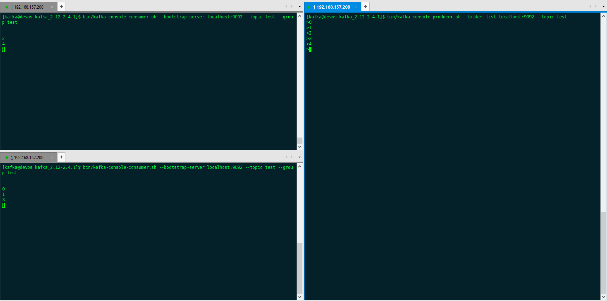

在test群组中多加入一个消费者时，消费者也可以继续消费。但是再加入一个后，test群组中的consumer数量为4，比分区数量3还多，因此有一个消费者**无法消费**信息。


### Kafka如何保证消息有序性

- Kafka topic只设置一个partition分区：kafka默认保证同一个partition分区内的消息是有序的，设置全局一个分区这样就保证全局有序，但缺点是只能被consumer group里的一个消费者消费，不适合高并发的情况；
- producer将消息发送到指定分区：
  - 指定分区
  - 不指定分区，由指定key，根据key的hash规则确定发送到哪个分区
  - 不指定分区，不指定key，轮询发送


## Zookeeper

#### 角色分类

- Leader：维护各个follower以及心跳，所有写操作通过leader进行写操作并广播给其他服务器，只要超过半数节点写入，写请求就会被提交；
- Follower：响应leader的心跳请求，响应客户端的读请求，并将写请求转发给leader处理；
- Observer：与follower类似，不参与投票，响应读请求，把写请求转发给leader。

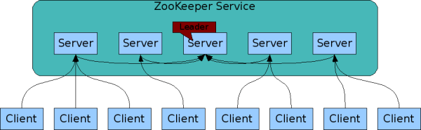


#### 数据模型

类似数据结构中的树模型，类似文件系统中的目录。zookeeper中对应节点名字叫znode，使用方式是**路径引用**。znode中包含以下的信息：

- data：存储的数据信息；
- ACL：访问权限；
- stat：元数据，比如事务zxid、版本号、时间戳、大小等；
- child：当前节点的子节点引用，类似树的各种孩子。

可以分为4种形式的目录节点：

- persistent：持久节点；
- ephemeral：暂时节点；
- persistent_sequential：持久化顺序编号目录节点；
- ephemeral_sequential：暂时化顺序编号目录节点。


#### Zab协议

事务编号Zxid：共64位，低32位是单调递增的计数器，针对客户端每一个事务请求，计数器加1；高32位代表leader周期epoch的编号，每个当选的leader会从所有节点本地日志中选出最大的zxid，并读取其epoch值，然后加1，以此作为新的epoch，并将低32位从0开始计数。zxid是保持**单调递增**的。

- 恢复模式：机器启动、leader崩溃、leader失去大部分follower支持都会进入该阶段

  - Leader election（选举阶段）：***选出准leader***，集群节点处于looing状态，带上自己**服务器id和本地最新的zxid**，与其他节点进行通讯投票，当收到请求后，节点会用自身的zxid和其他节点的zxid做比较，如果发现其他节点的zxid比自己大（说明数据比自己新），那么重新发起投票，投票给目前**已知最大的zxid**所属节点。当一个节点得到超过半数节点的票数，那么可以当选**准leader**；
  - Discovery（发现阶段）：***接受提议、生成epoch、接受epoch***，follower和准leader进行通讯，准leader同步各个follower最新接收到的事务提议。在所有follower各自发来的**最新epoch值**中选出最大的epoch值加1，并以这个值作为最新的epoch，通知给所有follower；
  - Synchronization（同步阶段）：***同步follower副本***，利用上一个阶段获得的最新历史提议，同步到集群中的所有副本。只有大多数节点同步完成，准leader才会成为真诚的leader，**follower只会接受zxid比自己的最大zxid还大的提议**，此时leader的状态改为leading，follower的状态改为following。

- 广播模式：zookeeper集群对外正式开始提供服务，并且leader可以进行消息广播，如果有新的节点计入，还需要对新节点进行同步。

  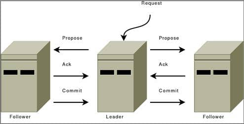

  1. 客户端发送写入请求到任意的follower；
  2. server把写入数据请求转发给leader；
  3. leader采用二段提交方式，发送propose广播给follower；
  4. follower接收到propose消息，写入日志成功后，返回ack消息给leader；
  5. leader接收到半数以上ack消息，返回成功给客户端，并且广播commit请求给follower。


## Nginx

目前Nginx集群没有好的解决方案，下面对应的技术方案可以简单实现：

1. 构建DNS+CDN服务器
2. 在多个公网IP中搭建多台Nginx服务器
3. 通过DNS进行域名的动态切换，通过CDN进行动态流量输入


## Activiti

- ProcessEngineConfiguration：加载activiti.cfg.xml配置文件
- ProcessEngine：快速获得各个service接口，生成activiti的工作环境以及25张表
- Service接口：
  - RepositoryService：对流程定义和部署的存储库的访问路径
  - RuntimeService：实例流程相关
  - TaskService：与正在执行的任务管理相关
  - HistroyService：查询历史服务接口


## Consul

技术架构实现


## 用户埋点

技术实现


### ElasticSearch

| ElasticSearch | 关系数据库      |
| ------------- | --------------- |
| Indices索引   | Databases数据库 |
| Types类型     | Tables表        |
| Documents文档 | Rows行          |
| Fields域      | Columns列       |


| 内容               | 语法                                                         |
| ------------------ | ------------------------------------------------------------ |
| 查看所有索引       | GET _cat/indices                                             |
| 查看索引结构       | GET /local_es_order/_mapping                                 |
| 新建索引           | PUT /local_my_test<br/>{"mappings":{"properties":{"gender":{"type":"integer"},"name":{"type":"keyword"},"age":{"type":"integer"}}}} |
| 获取索引详细信息   | GET /local_my_test                                           |
| 删除索引           | DELETE /local_my_test                                        |
| 插入索引           | PUT /local_my_test/_doc/1<br/>{"gender":1,"name":"test","age":30} |
| 根据id查找索引内容 | GET /local_my_test/_doc/1                                    |

