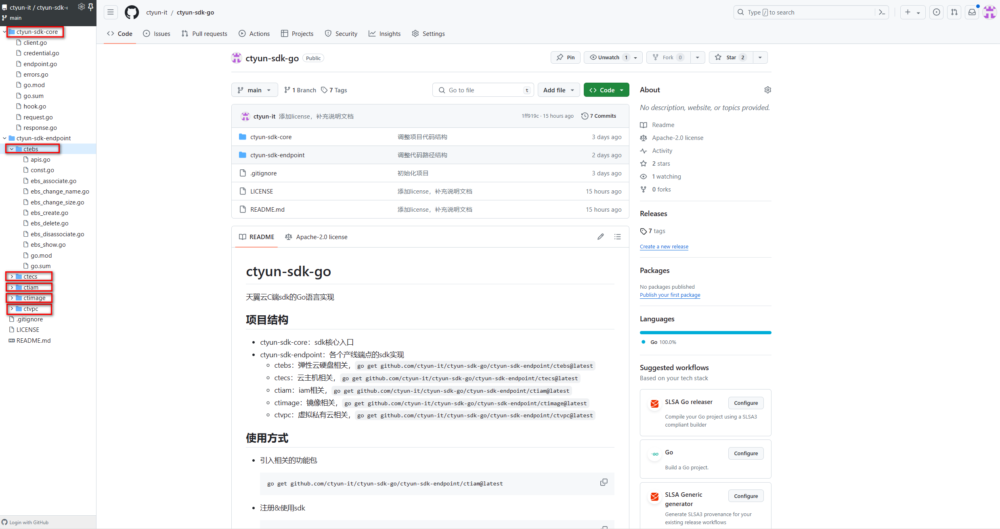

## Go包发布流程

- 把代码上传到Github中
- 给对应的分支打上tag，即可完成发布


## 如果在一个仓库中有多个Go Module想要发布怎么办

例如有以下的工程目录：



```
ctyun-sdk-go
├─ctyun-sdk-core
│      go.mod
└─ctyun-sdk-endpoint
    ├─ctebs
    │      go.mod
    ├─ctecs
    │      go.mod
    ├─ctiam
    │      go.mod
    ├─ctimage
    │      go.mod
    └─ctvpc
            go.mod
```

需要发布ctyun-sdk-core、ctebs、ctecs、ctiam、ctimage、ctvpc

以ctyun-sdk-core举例，其go.mod文件内容如下：

```go
module github.com/ctyun-it/ctyun-sdk-go/ctyun-sdk-core

go 1.14

require github.com/google/uuid v1.6.0 // indirect
```

以ctebs举例，其go.mod文件内容如下：

```go
module github.com/ctyun-it/ctyun-sdk-go/ctyun-sdk-endpoint/ctebs

go 1.14

require github.com/ctyun-it/ctyun-sdk-go/ctyun-sdk-core v1.0.2 // indirect
```

推送tag，例如发布ctyun-sdk-core版本，那么需要打tag：[ctyun-sdk-core/v1.0.2](https://github.com/ctyun-it/ctyun-sdk-go/releases/tag/ctyun-sdk-core%2Fv1.0.2)，如果发布ctebs版本，那么需要打tag：[ctyun-sdk-endpoint/ctebs/v1.0.2](https://github.com/ctyun-it/ctyun-sdk-go/releases/tag/ctyun-sdk-endpoint%2Fctebs%2Fv1.0.2)


