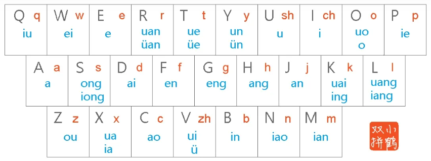
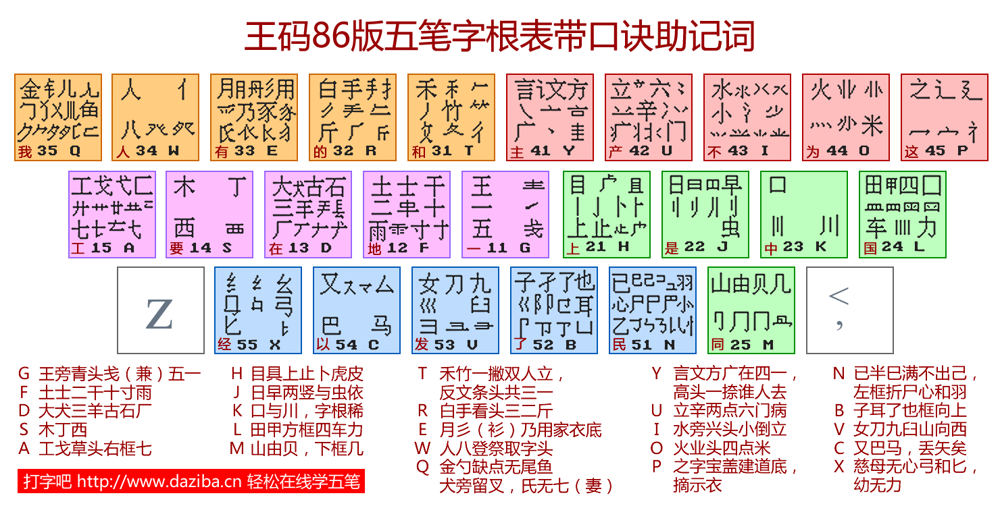

## 小鹤双拼



小鹤双拼的windows设置，将以下文件保存为**双击本文件设置win10微软拼音小鹤双拼.reg**

```
Windows Registry Editor Version 5.00

[HKEY_CURRENT_USER\SOFTWARE\Microsoft\InputMethod\Settings\CHS]
"EnableExtraDomainType"=dword:00000001
"EnableSmartSelfLearning"=dword:00000000
"EnableVMode"=dword:00000000
"EnableHap"=dword:00000000
"EnablePeopleName"=dword:00000000
"DoublePinyinScheme"=dword:0000000a
"EnableUMode"=dword:00000000
"EnableSmartFuzzyPinyin"=dword:00000000
"UserDefinedDoublePinyinScheme0"="小鹤双拼*2*^*iuvdjhcwfg^xmlnpbksqszxkrltvyovt"
"Enable Dynamic Candidate Ranking"=dword:00000000
"Enable self-learning"=dword:00000000
"Expand Double Pinyin"=dword:00000000
"Enable Double Pinyin"=dword:00000001
"LangBar Force On"=dword:00000000
"PinyinMixEnable"=dword:00000000
"ToolBarEnabled"=dword:00000000
```


## 五笔输入法

