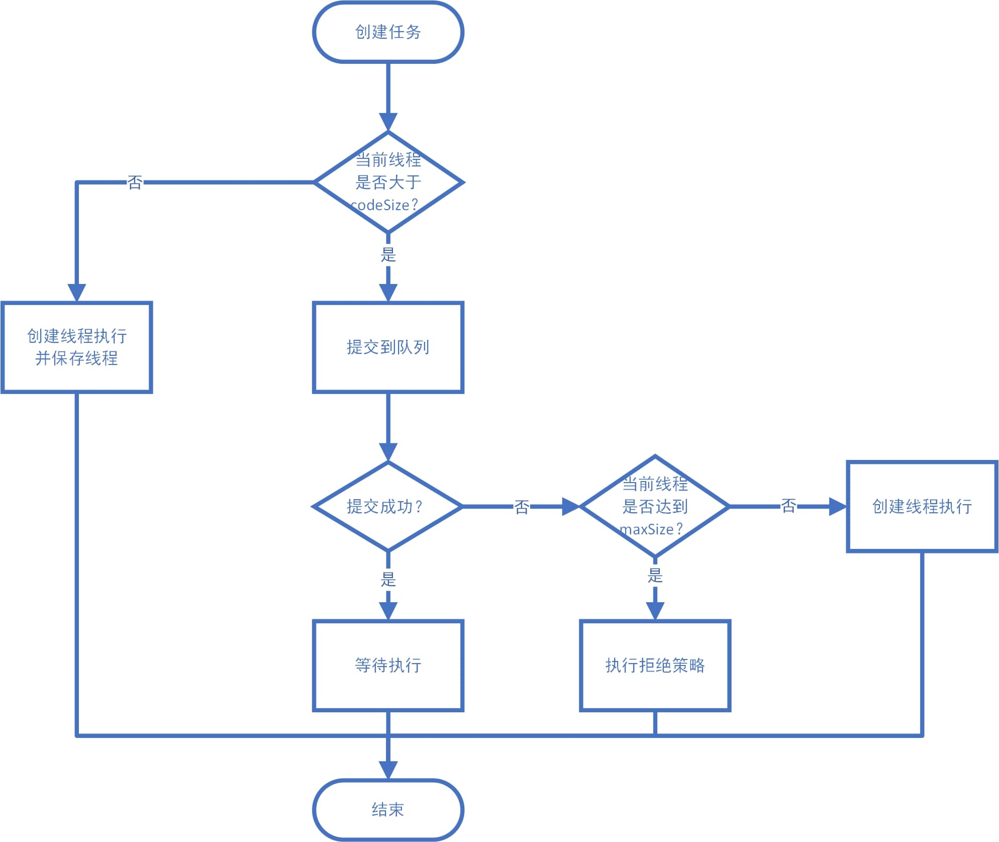

## 线程池

常用的线程池：

```java
    public static ExecutorService newFixedThreadPool(int nThreads) {
        return new ThreadPoolExecutor(nThreads, nThreads,
                                      0L, TimeUnit.MILLISECONDS,
                                      new LinkedBlockingQueue<Runnable>());
    }

    public static ExecutorService newSingleThreadExecutor() {
        return new FinalizableDelegatedExecutorService
            (new ThreadPoolExecutor(1, 1,
                                    0L, TimeUnit.MILLISECONDS,
                                    new LinkedBlockingQueue<Runnable>()));
    }

    public static ExecutorService newCachedThreadPool() {
        return new ThreadPoolExecutor(0, Integer.MAX_VALUE,
                                      60L, TimeUnit.SECONDS,
                                      new SynchronousQueue<Runnable>());
    }
```

内部ThreadPoolExecutor的全量入参构造：

```java
    public ThreadPoolExecutor(int corePoolSize,
                              int maximumPoolSize,
                              long keepAliveTime,
                              TimeUnit unit,
                              BlockingQueue<Runnable> workQueue,
                              ThreadFactory threadFactory,
                              RejectedExecutionHandler handler)
```

- corePoolSize：核心线程数；
- maximumPoolSize：最大线程数；
- keepAliveTime：超过corePoolSize时，多余部分的存活时间；
- unit：存活时间单位；
- workQueue：任务队列，保存提交但未执行的任务；
- threadFactory：线程工厂；
- handler：拒绝策略。


三种常见的线程池：

| 方法名称             | 使用的队列          | 队列类型     | 功能                                                         |
| -------------------- | ------------------- | ------------ | ------------------------------------------------------------ |
| FixedThreadPool      | LinkedBlockingQueue | 无界队列     | 创建固定大小的线程池，corePoolSize和maximumPoolSize相等，使用无界队列LinkedBlockingQueue，过多的任务将会**导致队列Runnable元素过多而造成内存溢出** |
| SingleThreadExecutor | LinkedBlockingQueue | 无界队列     | 创建只有一个线程的线程池，corePoolSize和maximumPoolSize都为1 |
| CachedThreadPool     | SynchronousQueue    | 直接提交队列 | 创建一个没有容量的线程池，任何**提交的任务都会立即执行**（复用线程或者创建线程），corePoolSize为0，maximumPoolSize为无穷，容易**创建线程过多导致内存溢出** |

队列类型：

- **直接提交队列**：SynchronousQueue，没有容量，无缓冲等待队列，不存储元素，会将任务交给消费者，容易达到线程最大值和执行拒绝策略，没有存放元素的能力，针对每一个take操作都会阻塞到put的执行；
- **有界队列**：ArrayBlockingQueue和有capality的LinkedBlockingQueue，能够容纳队列容量的峰值线程；
- **无界队列**：无capality（即Integer.MAX_VALUE）的LinkedBlockingQueue，没有容量，永远不会执行拒绝策略，任务很多时会造成内存溢出。

内部源码实现：



```java
	public Future<?> submit(Runnable task) {
        if (task == null) throw new NullPointerException();
        RunnableFuture<Void> ftask = newTaskFor(task, null);
        execute(ftask);
        return ftask;
    }

	public void execute(Runnable command) {
        if (command == null)
            throw new NullPointerException();
        int c = ctl.get();
        //如果当前线程数量小于核心线程数
        if (workerCountOf(c) < corePoolSize) {
            //添加worker并执行对应的任务
            if (addWorker(command, true))
                return;
            c = ctl.get();
        }
        //把当前任务扔入队列中
        if (isRunning(c) && workQueue.offer(command)) {
            int recheck = ctl.get();
            //如果当前threadpool不在运行中，删除对应的任务
            if (!isRunning(recheck) && remove(command))
                //执行拒绝策略
                reject(command);
            else if (workerCountOf(recheck) == 0)
                //增加至少一个执行器
                addWorker(null, false);
        }
        //如果入队失败，则尝试新增执行器直接执行任务
        else if (!addWorker(command, false))
            //添加执行器失败，执行拒绝策略
            reject(command);
    }

	private boolean addWorker(Runnable firstTask, boolean core) {
        retry:
        for (;;) {
            int c = ctl.get();
            int rs = runStateOf(c);

            if (rs >= SHUTDOWN &&
                ! (rs == SHUTDOWN &&
                   firstTask == null &&
                   ! workQueue.isEmpty()))
                return false;

            for (;;) {
                int wc = workerCountOf(c);
                if (wc >= CAPACITY ||
                    wc >= (core ? corePoolSize : maximumPoolSize))
                    return false;
                if (compareAndIncrementWorkerCount(c))
                    break retry;
                c = ctl.get();
                if (runStateOf(c) != rs)
                    continue retry;
            }
        }

        boolean workerStarted = false;
        boolean workerAdded = false;
        Worker w = null;
        try {
            //新建执行器
            w = new Worker(firstTask);
            final Thread t = w.thread;
            if (t != null) {
                final ReentrantLock mainLock = this.mainLock;
                mainLock.lock();
                try {
                    int rs = runStateOf(ctl.get());

                    if (rs < SHUTDOWN ||
                        (rs == SHUTDOWN && firstTask == null)) {
                        if (t.isAlive())
                            throw new IllegalThreadStateException();
                        workers.add(w);
                        int s = workers.size();
                        if (s > largestPoolSize)
                            largestPoolSize = s;
                        workerAdded = true;
                    }
                } finally {
                    mainLock.unlock();
                }
                if (workerAdded) {
                    //执行器运行
                    t.start();
                    workerStarted = true;
                }
            }
        } finally {
            if (! workerStarted)
                addWorkerFailed(w);
        }
        return workerStarted;
    }
```

```java
	private final class Worker
        extends AbstractQueuedSynchronizer
        implements Runnable
    {

        private static final long serialVersionUID = 6138294804551838833L;

        final Thread thread;
        Runnable firstTask;
        volatile long completedTasks;

        Worker(Runnable firstTask) {
            setState(-1);
            this.firstTask = firstTask;
            //在threadpool中的threadfactory中创建执行的线程
            this.thread = getThreadFactory().newThread(this);
        }

        public void run() {
            //本质上调用runWorker方法执行
            runWorker(this);
        }

        protected boolean isHeldExclusively() {
            return getState() != 0;
        }

        protected boolean tryAcquire(int unused) {
            if (compareAndSetState(0, 1)) {
                setExclusiveOwnerThread(Thread.currentThread());
                return true;
            }
            return false;
        }

        protected boolean tryRelease(int unused) {
            setExclusiveOwnerThread(null);
            setState(0);
            return true;
        }

        public void lock()        { acquire(1); }
        public boolean tryLock()  { return tryAcquire(1); }
        public void unlock()      { release(1); }
        public boolean isLocked() { return isHeldExclusively(); }

        void interruptIfStarted() {
            Thread t;
            if (getState() >= 0 && (t = thread) != null && !t.isInterrupted()) {
                try {
                    t.interrupt();
                } catch (SecurityException ignore) {
                }
            }
        }
    }
```

```java
    final void runWorker(Worker w) {
        Thread wt = Thread.currentThread();
        Runnable task = w.firstTask;
        w.firstTask = null;
        w.unlock();
        boolean completedAbruptly = true;
        try {
            //注意此处循环调用getTask方法，按照getTask的结果判断下次是否需要继续执行
            while (task != null || (task = getTask()) != null) {
                w.lock();
                if ((runStateAtLeast(ctl.get(), STOP) ||
                     (Thread.interrupted() &&
                      runStateAtLeast(ctl.get(), STOP))) &&
                    !wt.isInterrupted())
                    wt.interrupt();
                try {
                    beforeExecute(wt, task);
                    Throwable thrown = null;
                    try {
                        task.run();
                    } catch (RuntimeException x) {
                        thrown = x; throw x;
                    } catch (Error x) {
                        thrown = x; throw x;
                    } catch (Throwable x) {
                        thrown = x; throw new Error(x);
                    } finally {
                        afterExecute(task, thrown);
                    }
                } finally {
                    task = null;
                    w.completedTasks++;
                    w.unlock();
                }
            }
            completedAbruptly = false;
        } finally {
            processWorkerExit(w, completedAbruptly);
        }
    }

	private Runnable getTask() {
        boolean timedOut = false;

        //进行CAS操作
        for (;;) {
            int c = ctl.get();
            int rs = runStateOf(c);

            if (rs >= SHUTDOWN && (rs >= STOP || workQueue.isEmpty())) {
                decrementWorkerCount();
                return null;
            }

            int wc = workerCountOf(c);

            //判断是否需要跳出
            boolean timed = allowCoreThreadTimeOut || wc > corePoolSize;

            //如果当前线程数比核心线程数还大
            if ((wc > maximumPoolSize || (timed && timedOut))
                && (wc > 1 || workQueue.isEmpty())) {
                if (compareAndDecrementWorkerCount(c))
                    return null;
                continue;
            }

            try {
                //此处控制worker是否需要继续存活，按照队列的超时获取功能或者阻塞功能实现
                Runnable r = timed ?
                    workQueue.poll(keepAliveTime, TimeUnit.NANOSECONDS) :
                    workQueue.take();
                if (r != null)
                    return r;
                timedOut = true;
            } catch (InterruptedException retry) {
                timedOut = false;
            }
        }
    }
```

常用的提交方法：

- execute：会抛出异常，抛出异常后线程线程直接死亡，不会存放到线程池中；
- submit：内部捕获异常，异常保存在成员变量中，在FutureTask.get阻塞获取时候把异常抛回来，抛出异常后线程仍然进入线程池。

拒绝策略：

```java
    public static class CallerRunsPolicy implements RejectedExecutionHandler {
        public void rejectedExecution(Runnable r, ThreadPoolExecutor e) {
            if (!e.isShutdown()) {
                r.run();
            }
        }
    }

    public static class AbortPolicy implements RejectedExecutionHandler {
        public void rejectedExecution(Runnable r, ThreadPoolExecutor e) {
            throw new RejectedExecutionException();
        }
    }

    public static class DiscardPolicy implements RejectedExecutionHandler {
        public void rejectedExecution(Runnable r, ThreadPoolExecutor e) {
        }
    }

    public static class DiscardOldestPolicy implements RejectedExecutionHandler {
        public void rejectedExecution(Runnable r, ThreadPoolExecutor e) {
            if (!e.isShutdown()) {
                e.getQueue().poll();
                e.execute(r);
            }
        }
    }
```

- CallerRunsPolicy：直接在提交任务的线程中执行任务；
- AbortPolicy：直接报错处理；
- DiscardPolicy：静默处理；
- DiscardOldestPolicy：抛弃最旧（准备执行）的任务并且再次提交任务。

常用的计划任务线程池：

```java
    public static ScheduledExecutorService newSingleThreadScheduledExecutor() {
        return new DelegatedScheduledExecutorService
            (new ScheduledThreadPoolExecutor(1));
    }

    public static ScheduledExecutorService newScheduledThreadPool(int corePoolSize){
        return new ScheduledThreadPoolExecutor(corePoolSize);
    }
```

常用的执行计划任务接口：

```java
    public ScheduledFuture<?> scheduleAtFixedRate(Runnable command,
						  long initialDelay,
						  long period,
						  TimeUnit unit);

    public ScheduledFuture<?> scheduleWithFixedDelay(Runnable command,
						     long initialDelay,
						     long delay,
						     TimeUnit unit);
```

- scheduleAtFixedRate：以一定的速率执行，不管上一个任务有没有执行完毕；
- scheduleWithFixedDelay：以固定的延时执行，上一个任务执行完后x秒再执行。

线程的状态（6种）：

```java
public class Thread implements Runnable {
    public enum State {
        //新建
        NEW,
        //就绪，可执行
        RUNNABLE,
        //阻塞
        BLOCKED,
        //等待（无时限）
        WAITING,
        //等待（有时限）
        TIMED_WAITING,
        //结束
        TERMINATED;
    }
}
```


RUNNABLE是指**等待运行和运行中**的集合状态：在Thread.start()执行后，线程就可以被CPU接纳执行；

WAITING指无时限的等待，TIMED_WAITING指无时限的等待；

yield()操作指CPU**放弃对当前线程**的执行权，重新让线程进行资源争夺；

join()指当前线程等待某个线程执行完成才能继续执行；

sleep()让指定时间内暂停执行，但**不会释放锁**；

wait()在使用时需要对监视对象进行synchronized。


## 线程

### CountDownLatch和CycleBarrier

```java
    public static void main(String[] args) throws InterruptedException {
        ExecutorService executorService = Executors.newFixedThreadPool(3, new ThreadFactory() {
            private AtomicInteger ai = new AtomicInteger();

            @Override
            public Thread newThread(Runnable r) {
                return new Thread(r, "线程" + ai.getAndIncrement());
            }
        });
        CountDownLatch countDownLatch = new CountDownLatch(3);
        for (int i = 0; i < 3; i++) {
            executorService.execute(() -> {
                System.out.println(Thread.currentThread().getName() + "正在执行中");
                try {
                    Thread.sleep(3000L);
                    countDownLatch.countDown();
                } catch (InterruptedException e) {
                    e.printStackTrace();
                }
            });
        }

        countDownLatch.await();
        System.out.println("主线程执行完毕");
    }
```

```
线程0正在执行中
线程1正在执行中
线程2正在执行中
主线程执行完毕
```


```java
	public static void main(String[] args) throws InterruptedException {
        ExecutorService executorService = Executors.newCachedThreadPool(new ThreadFactory() {
            private AtomicInteger ai = new AtomicInteger();

            @Override
            public Thread newThread(Runnable r) {
                return new Thread(r, "线程" + ai.getAndIncrement());
            }
        });
        CyclicBarrier cyclicBarrier = new CyclicBarrier(2, new Runnable() {
            private AtomicInteger ai = new AtomicInteger();

            @Override
            public void run() {
                System.out.println("=====我现在是在" + Thread.currentThread().getName() + "执行=====");
                System.out.println("第" + ai.getAndIncrement() + "次开始");
            }
        });

        for (int i = 0; i < 5; i++) {
            executorService.execute(() -> {
                System.out.println(Thread.currentThread().getName() + "正在执行中");
                try {
                    cyclicBarrier.await();
                    Thread.sleep(3000L);
                    System.out.println(Thread.currentThread().getName() + "执行完毕");
                } catch (InterruptedException | BrokenBarrierException e) {
                    e.printStackTrace();
                }
            });
        }
    }
```

```
线程0正在执行中
线程1正在执行中
=====我现在是在线程1执行=====
第0次开始
线程2正在执行中
线程3正在执行中
=====我现在是在线程3执行=====
第1次开始
线程4正在执行中
线程2执行完毕
线程0执行完毕
线程1执行完毕
线程3执行完毕
```

CountDownLatch

- 主线程调用await方法睡眠，子线程调用countDown方法减少计数值，当计数值到达0，则自动唤醒主线程继续执行；
- 不可以重复使用，仅使用一次
- 本质上是使主线程继续执行

CycleBarrier

- 子线程调用await减少计数值，当计数值到达0，则触发对应的Runnable的动作
- 可以重复使用
- 本质上是在使计数变为0的线程中执行Runnable动作


### LockSupport

```java
    public static void main(String[] args) throws InterruptedException {

        Thread thread = new Thread(() -> {
            DateTimeFormatter dateTimeFormatter = DateTimeFormatter.ofPattern("yyyy-MM-dd HH:mm:ss");

            System.out.println(LocalDateTime.now().format(dateTimeFormatter) + "子线程准备执行");
            LockSupport.park();
            System.out.println(LocalDateTime.now().format(dateTimeFormatter) + "子线程执行完毕");
        });

        thread.start();
        Thread.sleep(3000L);

        LockSupport.unpark(thread);

    }
```

```
2020-06-05 16:11:35子线程准备执行
2020-06-05 16:11:38子线程执行完毕
```


## 序列化与反序列化

- 原生的JVM进行序列化和反序列化对象时需要实现Serializale接口，若被序列化的对象没有实现该接口，或者成员变量中含有引用类型但没实现该接口，则抛出NotSerializableException异常；
- Serializale本质上来说是个空接口，需要开发人员覆盖serialVersionUID字段，JVM在反序列化的时候校验这个字段是否一致；
- 使用时机：想把一个对象保存在一个文件或者数据库中，或者想通过RMI传输对象的时候。


## 基础

### equals()、==、hashCode()和System.identityHashCode区别

- equals比较的是程序员自定义的两个对象比较的方法，相不相等自己实现，约定重写equals必须重写hashcode；
- ==比较的是两个对象的内存地址是否相等；
- hashCode可以通过重写自定义对象的哈希值计算方式，而System.identityHashCode则是判断两个对象原生的hashcode（和内存地址相关的计算方式），无论这个对象hashCode是否被重写，因此System.identityHashCode可以直接判断两个对象是否内存相等（例如判断String是否内存相等）。


### String

#### String、StringBuilder、StringBuffer的联系与区别

- String天生是不可变的，因此是线程安全的；
- StringBuilder是可以变的，但线程不安全；
- StringBuffer是可以变的，线程安全。


#### intern()方法以及各种String方式引用易错点

Jdk1.6以前

- 如果常量池存在该字面量的字符串，返回这个常量池对象的引用；
- 在常量池不存在，则**创建与字面量一样的字符串，返回常量池（新建）对象的引用**；

Jdk1.7及以后

- 如果常量池存在该字面量的字符串，返回这个常量池对象的引用（同1.6）；
- 在常量池不存在，在常量池中**记录首次出现的实例引用，并返回这个引用**；

```java
    public static void main(String[] args) {
        String s1 = new String("a") + new String("bc");
        String s2 = "abc";
        String s3 = new String("ab") + new String("c");

        System.out.println("s1:" + System.identityHashCode(s1));
        System.out.println("s1.intern():" + System.identityHashCode(s1.intern()));
        System.out.println("s2:" + System.identityHashCode(s2));
        System.out.println("s3:" + System.identityHashCode(s3));
        System.out.println("s3.intern():" + System.identityHashCode(s3.intern()));
    }
```

```
s1:1956725890
s1.intern():356573597
s2:356573597
s3:1735600054
s3.intern():356573597
```

- String s = "test"，直接使用字符串常量创建字符串，则在常量池中创建；
- String s = new String("test")，先在常量池中创建test字符串常量，并返回在堆上的new String("test")的实例引用；
- String s = "te" + "st"，在常量池中创建"te"、"st"和"test"，并返回"test"在常量池中的引用；
- String s = new String("te") + new String("st")，在常量池中创建"te"，"st"，并在堆上创建字面量为"test"的对象并返回堆上引用。


#### 为什么使用字符数组保存密码比使用String保存密码更好

- String在java中是不可变的，字符串放在常量池中，直到执行GC才会被清除，任何能够访问内存的人都能直接看到密码，非常不安全；
- 使用字符串在进行文本输出时，会存在风险，能够直接打印出来，但是字符数组打印的是对应的内存数组。


## 锁

### wait、notify和notifyAll的使用

- 使用前必须获取锁对象的监视器，即需要进行synchronized上锁；
- notify和notifyAll的区别是，notify去随机唤醒监视器队列中的一个等待线程，而notifyAll是唤醒全部线程，但是仍然需要进行等待处理（等待获取锁）。


### volatile关键字的作用

- 保证可见性：保证对所有的线程可见，标记volatile的字段，在**写**操作时，会强制**刷新cpu缓存**，标记volatile的字段，每次读取都是**直接读内存**；
- 保证有序性：在volatile写操作前插入StoreStore屏障，在写操作后插入StoreLoad屏障；在volatile读操作前插入LoadLoad屏障，在读操作后插入LoadStore屏障，**禁止了指令的重排**。


### Lock、tryLock和lockInterruptibly有什么区别

- lock：线程一直在等待锁，不然一直都会在block的状态，不响应interrupt中断；
- tryLock：马上返回，拿到锁就返回true，否则返回false；
- lockInterruptibly：**响应interrupt中断**，并要求处理InterruptExcetpion。


### ReentrantLock和AQS实现原理

ReentrantLock主要使用AQS（AbstractQueuedSynchronizer）进行实现，其中可以分为**公平锁**和**非公平锁**。

- 公平锁：严格按照加锁的顺序执行，先获取锁的线程先处理，不会出现AQS队列内部出现饥饿的情况；
- 非公平锁：AQS内部维护了一个双端队列，AQS每次唤醒队列头的thread进行处理；在唤醒表头的thread之后，如果有另外一个线程A进行竞争，也有可能A线程先获取到锁。但是，AQS中的双端队列**一定是按照严格的FIFO方式获取锁的**。

```java
public class ReentrantLock implements Lock, java.io.Serializable {
    private final Sync sync;
    
    abstract static class Sync extends AbstractQueuedSynchronizer {
        final boolean nonfairTryAcquire(int acquires) {
            //获取当前线程
            final Thread current = Thread.currentThread();
            //获取当前状态
            int c = getState();
            if (c == 0) {
                //先以轻量级的方式锁定
                if (compareAndSetState(0, acquires)) {
                    setExclusiveOwnerThread(current);
                    return true;
                }
            }
            //如果同一个线程多次加锁
            else if (current == getExclusiveOwnerThread()) {
                //锁定次数增加
                int nextc = c + acquires;
                if (nextc < 0)
                    throw new Error("Maximum lock count exceeded");
                //因为此时为当前线程，安全状态，直接修改加锁次数即可
                setState(nextc);
                return true;
            }
            return false;
        }

        protected final boolean tryRelease(int releases) {
            int c = getState() - releases;
            if (Thread.currentThread() != getExclusiveOwnerThread())
                throw new IllegalMonitorStateException();
            boolean free = false;
            //当前状态为0，说明此时已经释放完所有的锁
            if (c == 0) {
                free = true;
                setExclusiveOwnerThread(null);
            }
            setState(c);
            return free;
        }
    }
    
    static final class NonfairSync extends Sync {
        final void lock() {
            //单次的比较交换操作，无竞争时候性能最佳
            if (compareAndSetState(0, 1))
                //当前线程为占用线程
                setExclusiveOwnerThread(Thread.currentThread());
            else
                //调用AQS获取执行权操作
                acquire(1);
        }

        protected final boolean tryAcquire(int acquires) {
            //本质调用sync中的nonfairTryAcquire方法
            return nonfairTryAcquire(acquires);
        }
    }
    
    static final class FairSync extends Sync {

        final void lock() {
            //不让当前线程进行竞争，直接进入AQS双端队列
            acquire(1);
        }

        protected final boolean tryAcquire(int acquires) {
            final Thread current = Thread.currentThread();
            int c = getState();
            if (c == 0) {
                if (!hasQueuedPredecessors() &&
                    compareAndSetState(0, acquires)) {
                    setExclusiveOwnerThread(current);
                    return true;
                }
            }
            else if (current == getExclusiveOwnerThread()) {
                int nextc = c + acquires;
                if (nextc < 0)
                    throw new Error("Maximum lock count exceeded");
                setState(nextc);
                return true;
            }
            return false;
        }
    }
    
    public void lock() {
        sync.lock();
    }
    
    public void unlock() {
        sync.release(1);
    }
}
```

```java
public abstract class AbstractQueuedSynchronizer
    extends AbstractOwnableSynchronizer
    implements java.io.Serializable {

	static final class Node {
        //共享方式
        static final Node SHARED = new Node();
        //排他方式
        static final Node EXCLUSIVE = null;

        static final int CANCELLED =  1;
        static final int SIGNAL    = -1;
        static final int CONDITION = -2;
        static final int PROPAGATE = -3;

        /**
         * Status field, taking on only the values:
         *   SIGNAL:     The successor of this node is (or will soon be)
         *               blocked (via park), so the current node must
         *               unpark its successor when it releases or
         *               cancels. To avoid races, acquire methods must
         *               first indicate they need a signal,
         *               then retry the atomic acquire, and then,
         *               on failure, block.
         *   CANCELLED:  This node is cancelled due to timeout or interrupt.
         *               Nodes never leave this state. In particular,
         *               a thread with cancelled node never again blocks.
         *   CONDITION:  This node is currently on a condition queue.
         *               It will not be used as a sync queue node
         *               until transferred, at which time the status
         *               will be set to 0. (Use of this value here has
         *               nothing to do with the other uses of the
         *               field, but simplifies mechanics.)
         *   PROPAGATE:  A releaseShared should be propagated to other
         *               nodes. This is set (for head node only) in
         *               doReleaseShared to ensure propagation
         *               continues, even if other operations have
         *               since intervened.
         *   0:          None of the above
         */
        //节点状态
        volatile int waitStatus;
        //前驱节点
        volatile Node prev;
        //后驱节点
        volatile Node next;
        //保存的线程
        volatile Thread thread;
        //下个节点的执行模式（共享或排他）
        Node nextWaiter;
    }
    
    //头节点
    private transient volatile Node head;
    //尾节点
    private transient volatile Node tail;
    //当前AQS状态
    private volatile int state;

    public final void acquire(int arg) {
        //尝试获取锁并且进入AQS队列
        if (!tryAcquire(arg) &&
            acquireQueued(addWaiter(Node.EXCLUSIVE), arg))
            selfInterrupt();
    }
   
    private Node addWaiter(Node mode) {
        Node node = new Node(Thread.currentThread(), mode);
        Node pred = tail;
        //增加头节点，方便后续操作
        if (pred != null) {
            node.prev = pred;
            if (compareAndSetTail(pred, node)) {
                pred.next = node;
                return node;
            }
        }
        //使用CAS操作入队
        enq(node);
        return node;
    }
    
    private Node enq(final Node node) {
        for (;;) {
            Node t = tail;
            //增加头节点，方便后续操作
            if (t == null) {
                if (compareAndSetHead(new Node()))
                    tail = head;
            } else {
                node.prev = t;
                if (compareAndSetTail(t, node)) {
                    t.next = node;
                    return t;
                }
            }
        }
    }
    
    final boolean acquireQueued(final Node node, int arg) {
        boolean failed = true;
        try {
            boolean interrupted = false;
            for (;;) {
                //查找前驱节点
                final Node p = node.predecessor();
                //在被唤醒线程中执行，当前节点为头节点，并且能够取得执行权
                if (p == head && tryAcquire(arg)) {
                    //把当前节点设置为头节点
                    setHead(node);
                    //断开前驱节点->当前节点的指向，帮助垃圾回收
                    p.next = null;
                    failed = false;
                    return interrupted;
                }
                if (shouldParkAfterFailedAcquire(p, node) &&
                    parkAndCheckInterrupt())
                    interrupted = true;
            }
        } finally {
            if (failed)
                cancelAcquire(node);
        }
    }
    
    private static boolean shouldParkAfterFailedAcquire(Node pred, Node node) {
        int ws = pred.waitStatus;
        if (ws == Node.SIGNAL)
            return true;
        if (ws > 0) {
            do {
                node.prev = pred = pred.prev;
            } while (pred.waitStatus > 0);
            pred.next = node;
        } else {
            //将节点改为待触发的模式
            compareAndSetWaitStatus(pred, ws, Node.SIGNAL);
        }
        return false;
    }
    
    //线程阻塞的核心代码
    private final boolean parkAndCheckInterrupt() {
        LockSupport.park(this);
        return Thread.interrupted();
    }
}
```


### Lock和Synchronized区别

共同点：

- 协调资源临界区；
- 都是重入锁，同一个线程可以多次获取同一个锁；
- 保证了可见性和互斥性；

不同点：

- lock可以在申请锁时候**限时等待**，但synchronized不行；
- lock可以实现**公平锁**，但synchronized是非公平的；
- lock可以**响应线程中断**，但synchronized不行；
- lock是一个接口，synchronized是关键字，synchronized的实现原理是通过底层虚拟机以及内核实现的；
- synchronized会自动释放锁，lock手动释放；
- synchronized能锁住类、方法和代码块，但是lock只能锁范围的；
- synchronized本质上调用底层mutex执行操作，需要使用monitorenter和monitorexit对代码块进行加锁，而lock是使用AQS实现的（AbstractQueuedSynchronizer）。


### 互斥锁和自旋锁

自旋锁：自旋锁在执行单元在获取锁之前，如果发现有其他执行单元正在占用锁，则会不停的**循环判断锁状态**，直到锁被释放，期间并**不会阻塞**自己。所以自旋锁使用时，是非常**消耗CPU**资源的。

互斥锁：会把自己**阻塞并放入到队列**中。当锁被释放时，会唤醒队列上执行单元把其放入就绪队列中，并由调度算法进行调度并执行。所以互斥锁使用时会有**线程的上下文切换**，这可能是非常耗时的一个操作，但是等待锁期间不会浪费CPU资源。

- 如果是**多核**CPU，上下文切换的时间开销比预计获取锁的等待时间要短，使用**互斥锁**更好；
- 如果是**多核**CPU，上下文切换的时间开销比预计获取锁的等待时间要长，使用**自旋锁**更好；
- 如果是**单核**CPU，使用**互斥锁**。


### CAS和对应的问题

CAS操作需要3个变量：

- 需要读写的内存位置V
- 预期值A
- 新值B

CAS操作时，需要判断V位置的值与预期值A是否相等，如果不相等，则不更改V位置的值，后续进行重新读取，重新进行计算操作；如果相等，则把该位置的值改变为B。

有以下缺点：

- ABA问题：有一个栈，其结构为A->B，线程1从堆顶读取A，希望将堆顶替换为B，此时线程2介入，线程2也从表头读取到A，将A和B出栈，将D、C、A分别入栈，成为A->C->D这种结构，而B则是游离状态；而此时线程1执行CAS操作，发现堆顶仍然是A，则把B改为堆顶，此时会导致把C和D元素丢弃了；解决方案：使用AtomicStampedReference（带时间戳）或者AtomicMarkableReference（单纯带状态）进行处理；
- 循环时间开销大：如果自旋CAS长时间不成功，会给CPU带来非常大的开销；
- 只能保证一个共享的原子变量：当只有一个共享变量时，可以使用CAS进行原子操作，但对于多个变量操作时，循环CAS无法保证操作的原子性。


### 锁优化

- 自旋锁与自适应自旋：

  自旋锁：在JDK1.4时候引入，默认为关闭状态，JDK1.6时候默认开启。在获取锁的时候自旋，**避免了线程切换之间的开销**。缺点是如果锁被占用的时间很长，锁的自旋会白白**浪费处理器资源**。因此自旋锁有**自旋次数的限制**，默认为10次。

  自适应自旋：自旋的**次数和时间不再固定**，由前一次在同一个锁上的自旋时间以及锁的拥有者状态决定。如果在同一个对象，自旋等待刚刚成功获得过锁，虚拟机认为本次自旋很有可能再次成功，允许自旋等待更长时间。如果自旋很少成功获得，以后则可能减少自旋时间或者略过自旋。

- 锁消除：

  对一些代码上要求同步，但被检测到**不可能存在共享数据竞争**的锁进行消除。

- 锁粗化：

  对同一个对象反复加锁，甚至加锁操作在循环体中出现，会**频繁互斥同步导致性能损耗**。因此可以使锁的范围粗化，减少反复加锁的次数。

- 重量级锁和轻量级锁：

  重量级锁：指的是传统意义上执行synchronized**同步代码块**时，加入字节码monitorenter和monitorexit指令来实现monitor的获取和释放，就是需要JVM通过字节码显式地去获取和释放monitor实现同步；使用synchronized**同步方法**时候，检查方法的ACC_SYNCHRONIZED标志是否被设置，如果设置了线程需要先去获取monitor。

  

  轻量级锁：为了在没有多线程竞争的前提下，**减少传统重量级锁使用操作系统互斥量产生的性能消耗**。在进入同步块时，虚拟机首先在当前线程栈帧中建立一个Lock Record空间，用于存储锁对象目前的Mark Word拷贝（官方把这份拷贝加了一个Displaced前缀，即Displaced Mark Word），并尝试使用CAS操作将锁对象的Mark Word更新为指向Lock Record的指针。如果更新成功，则当前线程拥有了对象的锁，并且将对象Mark Word的锁标志位改为00（轻量级锁）状态。如果更新失败了，检查锁对象Mark Wrod是否指向当前线程的栈帧，若是则说明已经拥有锁，同步代码块继续执行，若否则说明被抢占了。如果有两条以上的线程争用同一个锁，轻量级锁久不再有效，**膨胀为重量级锁**。
- 偏向锁：

  

总结：


| 锁类型   | 面向的场景                   | 优点                                                   |
| -------- | ---------------------------- | ------------------------------------------------------ |
| 偏向锁   | **只有一个**线程进入临界区   | 加锁解锁速度非常快，和执行非同步方法仅存在纳秒级的差距 |
| 轻量级锁 | 多个线程**交替**地进入临界区 | 竞争的线程不会阻塞，提高了程序的响应速度               |
| 重量级锁 | **多个线程**同时进入临界区   | 线程进行挂起，不会消耗CPU                              |


### ThreadLocal

- 在高并发时可以使用ThreadLocal为每个线程单独分配一个对象，把共享对象拆分到具体一个线程一个，以空间换取时间的做法；
- ThreadLocal可能导致内存泄漏，Thread中有一个类型为ThreadLocal.ThreadLocalMap成员变量threadLocals，而ThreadLocal.ThreadLocalMap内部是使用Entry结构类型存储数据的，Entry本质上继承了WeakReference类，**在发生GC时候，若ThreadLocal没有被外部强引用，则会被回收，若使用了ThreadLocal进行set的线程一直运行（典型情况下在线程池中运行），那么这个Entry对象的key值变为null，导致value值可能一直不能回收**，从而发生内存泄漏；使用ThreadLocal类的set方法后，**显式调用remove方法**可以有效规避内存泄漏的问题；

```java
public class Thread implements Runnable {
    
    //成员变量
    ThreadLocal.ThreadLocalMap threadLocals = null;
    
}
```

```java
public class ThreadLocal<T> { 
    
    static class ThreadLocalMap {
		
        //与HashMap中的结构与想法类似
        private Entry[] table;
        
        static class Entry extends WeakReference<ThreadLocal<?>> {
            Object value;
            Entry(ThreadLocal<?> k, Object v) {
                super(k);
                value = v;
            }
        }
        
        private void set(ThreadLocal<?> key, Object value) {}
        
        private void remove(ThreadLocal<?> key) {}
        
    }
    
    public T get() {
        Thread t = Thread.currentThread();
        ThreadLocalMap map = getMap(t);
        if (map != null) {
            ThreadLocalMap.Entry e = map.getEntry(this);
            if (e != null) {
                @SuppressWarnings("unchecked")
                T result = (T)e.value;
                return result;
            }
        }
        return setInitialValue();
    }
    
    public void set(T value) {
        Thread t = Thread.currentThread();
        ThreadLocalMap map = getMap(t);
        if (map != null)
            map.set(this, value);
        else
            createMap(t, value);
    }
    
}
```


## 拷贝/克隆

1. 克隆类需要**重写Object的clone()方法**（显式提升clone的可见性）；
2. 克隆类需要**实现java.lang.Clonable接口**，如果没有实现改接口则会报出java.lang.CloneNotSupportedException异常；
3. 如果克隆类中含有非基本数据类型，需要注意区分浅拷贝与深拷贝的问题。

浅拷贝&深拷贝：

> 在拷贝的过程中如果类中的属性不是基本数据类型，则拷贝后该属性指向原来被拷贝对象的属性，因此该属性的变动会间接影响另一个对象。

浅拷贝例子：

```java
public class Person implements Cloneable {

    private Integer age;
    private String name;
    private Address address;

    @Override
    protected Person clone() throws CloneNotSupportedException {
        Person other = (Person) super.clone();
        return other;
    }
}

public class Address {

    private String name;
    private String type;

}
```

执行：

```java
public class TestClone {

    public static void main(String[] args) throws CloneNotSupportedException {
        Address address = new Address("广州", "home");

        Person p1 = new Person(26, "jm", address);
        Person p2 = p1.clone();

        System.out.println(p1);
        System.out.println(p2);
        p2.getAddress().setType("office");
        System.out.println(p1);
        System.out.println(p2);
    }

}
```

输出为：

```java
Person{age=26, name='jm', address=Address{name='广州', type='home'}}
Person{age=26, name='jm', address=Address{name='广州', type='home'}}
Person{age=26, name='jm', address=Address{name='广州', type='office'}}
Person{age=26, name='jm', address=Address{name='广州', type='office'}}
```

深拷贝，上面的代码改为：

```java
public class Person implements Cloneable {

    private Integer age;
    private String name;
    private Address address;

    @Override
    protected Person clone() throws CloneNotSupportedException {
        Person other = (Person) super.clone();
        Address otherAddress = getAddress() == null ? null : getAddress().clone();
        other.setAddress(otherAddress);
        return other;
    }
}

public class Address implements Cloneable {

    private String name;
    private String type;

    @Override
    protected Address clone() throws CloneNotSupportedException {
        return (Address) super.clone();
    }
}
```

输出为：

```java
Person{age=26, name='jm', address=Address{name='广州', type='home'}}
Person{age=26, name='jm', address=Address{name='广州', type='home'}}
Person{age=26, name='jm', address=Address{name='广州', type='home'}}
Person{age=26, name='jm', address=Address{name='广州', type='office'}}
```


## 代理

### 静态代理

> 对于特定的类或者接口的某些方法进行无入侵式的扩充，可以不修改代理对象的前提下扩展被代理对象的功能，但被代理的范围仅限于某一种类的对象。

```java
public interface IPerson {

    String say();

}

public class Student implements IPerson {

    private String name;

    public Student() {
    }

    public Student(String name) {
        this.name = name;
    }

    @Override
    public String say() {
        System.out.println("我是：" + this.name);
        return this.name;
    }

}

public class PersonProxy implements IPerson {

    private IPerson target;

    public PersonProxy(IPerson target) {
        this.target = target;
    }

    public PersonProxy() {
    }

    @Override
    public String say() {
        System.out.println("我准备发言了");
        String say = this.target.say();
        System.out.println("我发言完毕了");
        return say;
    }

    public static void main(String[] args) {
        Student student = new Student("jm");
        IPerson personProxy = new PersonProxy(student);
        personProxy.say();
    }

}
```

输出：

```java
我准备发言了
我是：jm
我发言完毕了
```


### 动态代理

- 动态代理是运行时动态生成的，编译完之后不生成字节码文件，而是运行时动态生成字节码文件并且自动加载到Jvm中使用的；
- 如果有多个被代理类的增强实现都是一样的，例如：打印RPC调用的入参参数，其中由于RPC可以有多种调用方式（TCP、HTTP等），使用静态代理就需要创建很多代理类，略显繁琐，因此使用动态代理，可以把具体的增强业务逻辑放在InvocationHandler中，把产生的代理对象的逻辑放在Proxy中。


#### JDK代理

JDK动态代理的对象无需实现被代理的接口，但是要求目标代理对象**必须实现接口**。

使用的类有：

- java.lang.reflect.**Proxy**类：生成具体代理对象的类。

```java
public static Object newProxyInstance(ClassLoader loader,
					  Class<?>[] interfaces,
					  InvocationHandler h)
```

- java.lang.reflect.**InvocationHandler**：需要实现此接口，其中在invoke方法中需要对被代理对象执行发放的具体拦截分发。

```java
public Object invoke(Object proxy, Method method, Object[] args)
```

代码样例：

```java
public class PersonProxy implements IPerson {

    private IPerson target;

    public PersonProxy(IPerson target) {
        this.target = target;
    }

    public PersonProxy() {
    }

    @Override
    public String say() {
        System.out.println("我准备发言了");
        String say = this.target.say();
        System.out.println("我发言完毕了");
        return say;
    }

    @Override
    public void eat() {
        System.out.println("我正在吃饭");
    }

    public static void main(String[] args) {
        Student student = new Student("jm");
        IPerson personProxy = new PersonProxy(student);
        personProxy.say();
    }

}
```


#### CGLIB代理

- 使用**CGLIB可以代理无接口的类**；
- 本质上使用ASM工具，在ASM加载类之前，动态改变类的行为；
- 比原生的JDK代理更加灵活，被代理类**无需实现接口**。


## 细节

### Map之间多个实现类以及衍生类的异同

HashMap重点：

- 实现方式：1.8后使用数组+链表+红黑树的方式实现，1.8前使用数组+链表实现；初始化容量capacity=(1<<4)=16，负载因子factor=0.75f，红黑树化阈值=8，红黑树退化阈值=6，最小红黑树容量=64，在map初始化时，对应的数组仍未初始化。1.8以前使用**头插法**对元素进行插入，插入的元素在链表的表头位置，原因时作者认为最新插入的元素查询的价值最高，因此更容易访问到，但头插法容易在hashmap进行**并发使用resize时出现循环链表**的现象。1.8后使用了**尾插法**，因为尾插法本质上不改变原有头部指针的指向，因此不会出现循环链表的现象。
- get操作：先对key进行hash操作，然后取出HashMap中数组长度 - 1 & 对应计算出来的哈希值，原因是：HashMap数组的长度必须为2的幂次，因此对应-1的二进制数值全为1，&上哈希值后其实就是取对应哈希值的后几位，此时比求余运算速度快得多，取出对应链表头节点后，如果是红黑树，则对应使用红黑树的遍历方式获取值（时间复杂度为O(logn)），如果是链表则使用遍历方式获取（时间复杂度为O(n)）。
- put操作：如果当前数组为空或者数组长度为0，则先对map进行resize处理。获取对应key的表头位置，生成对应node节点，遍历链表，如果找到对应替换位置则进行元素替换，如果到达链表末尾，则需要判断是否需要对链表进行红黑树化，最后进行resize操作。
- resize操作：每次resize都会把数组大小变成原来的2倍。重新计算元素下标位置时，元素要么保持在原来的下标位置，要么移动到原位置+旧数组长度位置。如果**元素hash值&旧数组长度大小为0**，则保持原来位置，如果不为0则移动到2次幂位置。1.8后对resize进行优化，优化后resize不会改变链表元素的顺序。

HashMap和Hashtable的区别：

- HashMap非线程安全的，而Hashtable是线程安全的；
- HashMap的的key和value都可以为空，而Hashtable都不能为空；
- 计算数组index的流程不一样，HashMap为hash & (table.length-1)，Hashtable为(e.hash & 0x7FFFFFFF) % newCapacity；
- 扩容不一样，HashMap扩容为原来的2倍，Hashtable扩容为2倍+1。

HashMap、LinkedHashMap、TreeMap的关系：

- LinkedHashMap是HashMap的子类；
- LinkedHashMap维护一个双向链表，可以保证迭代的顺寻按照put的顺序；
- TreeMap维护一个红黑树，迭代时按照自然排序或者自定义排序（常用入参为Comparator）;
- HashMap和LinkedHashMap需要元素重写equals和hashcode方法，而TreeMap本质上是一个SortedMap，需要元素**实现Comparable接口**。


### List之间多个实现类以及衍生类的异同

ArrayList、LinkedList、Vector、CopyOnWriteArrayList区别以及关系：

- ArrayList基于数组实现，需要动态扩容（每次扩容到原来的1.5倍），根据index查找速度为O(1)，基于非后最元素的add或者delete速度很慢，适合固定大小以及常用遍历的场景；继承RandomAccess快速随机访问接口，用for循环迭代比使用iterator快；
- LinkedList基于链表实现，无须动态扩容，根据index遍历比较慢，但是add或者delete速度较快，适合查少改多的场景；
- Vector线程安全，但已经弃用，Vector可以使用Enumeration和Iterator进行元素遍历，ArrayList只提供了Iterator的方式；
- CopyOnWriteArrayList线程安全，是牺牲内存空间的前提下，保证了数据的最终一致性。在CopyOnWriteArrayList进行增删改时，先进行加锁，然后把原数组拷贝到一个副本内，拷贝完成时把原数组指向副本数组，再解锁。在读取时，直接遍历内部的数组即可，保证了**最终一致性**。而Vector在进行for循环遍历时，使用vector.size()获取长度遍历，仍然存在其他线程修改vector.size()属性，导致vector遍历出现ArrayIndexOutOfBoundsException。


### ArrayList删除元素

- 使用迭代器删除（iterator）
- 赋值给新的list
- 从后面的元素开始反向删除
- 正序删除后修正下标值
- 使用removeIf方法
- 使用stream的filter进行元素过滤


## fail-fast机制和fail-safe机制

- fail-fast（快速失败）：利用迭代器遍历集合时候，如果遍历过程中对内容进行修改，则会抛出ConcurrentModificationException。在遍历集合中的元素时，记录modCount变量，**如果集合发生变化，就会修改modCount的值**。遍历过程中（过程后）判断当前的modCount和遍历前modCount是否相等，如果是就返回遍历结果，否则抛出异常终止遍历；在java.util包下所有集合都是快速失败的，不能再多线程下并发修改。
- fail-safe（安全失败）：在遍历时复制原有集合内容，在拷贝的集合上进行遍历。在遍历期间集合发生修改，迭代器是**无法感知**的。在java.util.concurrent包下容器都是安全失败的。

|                                     | Fail Fast                           | Fail Safe                               |
| ----------------------------------- | ----------------------------------- | --------------------------------------- |
| 抛出ConcurrentModificationException | 是                                  | 否                                      |
| 拷贝元素                            | 否                                  | 是                                      |
| 是否会导致内存溢出                  | 否                                  | 是                                      |
| 遍历时修改元素是否能被感知          | 是（抛出异常）                      | 否                                      |
| 用例                                | HashMap，Vector，ArrayList，HashSet | CopyOnWriteArrayList，ConcurrentHashMap |


## 队列

| 操作                | 异常 | 阻塞 | 所属接口      | 操作描述                                                     |
| ------------------- | ---- | ---- | ------------- | ------------------------------------------------------------ |
| boolean add(E e);   | 是   | 否   | Queue         | 添加一个元素，如果队列已满则抛出IllegalStateException        |
| boolean offer(E e); | 否   | 否   | Queue         | 添加一个元素，并返回添加是否成功。如果队列未满（成功），返回true；如果已满（不成功），返回false |
| E remove();         | 是   | 否   | Queue         | 取出队列中的头元素，如果队列为空则抛出NoSuchElementException |
| E poll();           | 否   | 否   | Queue         | 取出队列中的头元素，如果队列为空则返回null                   |
| E element();        | 是   | 否   | Queue         | 获取队列中的头元素，如果队列为空则抛出NoSuchElementException |
| E peek();           | 否   | 否   | Queue         | 获取队列中的头元素，如果队列为空则返回null                   |
| void put(E e);      | 否   | 是   | BlockingQueue | 添加一个元素，如果队列为满则一直阻塞                         |
| E take();           | 否   | 是   | BlockingQueue | 取出队列中的头元素，如果队列为空则一直阻塞                   |


## 分布式事务

### 基础理论

> CAP定理：任何一个系统都只能满足CAP中的任意两个方面
>
> C：consistency，一致性，A：Avaliability，可用性，P：Partition Tolerance，分区容错性

> BASE理论：保证核心功能可用，允许系统中存在中间状态，最终一致
>
> BA：Basically avaliable，基本可用，S：Soft state，软状态，E：Eventually consistent，最终一致性


### 实现方式

#### 2PC

两个角色：**协调者**和**调用者**；

两个阶段：询问和提交回滚阶段；

需要实现：XA协议，包括Prepare、Commit和Rollback接口；

缺点：

- 在询问阶段锁定资源，如果有一个参与者超时，则会**同步阻塞**所有微服务；
- 对协调者的依赖很严重，如果协调者单点故障，则无法正常工作；
- 会出现脑裂的情况，有些参与者收到并执行了事务，有些没有收到事务就没有执行。


#### TCC

Try、Confirm和Cancel单词的缩写，也是简化版的3段提交协议（把询问阶段和准备阶段合并在一起），本质上是把一个事务**拆分成两个事务**进行操作，也需要业务进行改造支持处理

第一阶段：负责检查和锁定资源，需要做预操作处理，增加业务的“中间状态”；

第二阶段：无需进行资源检查，把业务的“中间状态”转为最终状态，若事务失败，则调用回滚操作，把第一阶段的锁定资源释放掉（做一次数据库的反操作），如果第二阶段失败了，则**不断重试**。

缺点：

- 业务入侵性强，改造成本高；
- 需要实现Confirm和Cancel接口的幂等性，因为第二阶段可能存在不断重试的情况；


#### 本地事务表+消息队列

发送方增加一张消息表和一个轮询查表的线程，发送方不直接发送到消息队列，而是把具体业务和写消息表放在同一个事务中。轮询查表线程不断轮询，不断地捞取消息并把消息传给消息队列，经过消息队列ACK机制说明发送成功，没有经过ACK，则说明失败需要重传。服务提供方需要增加判重表，记录成功处理消息ID和消息中间件对应的offset（保证消息幂等），提供方宕机后定位到offset位置继续进行消费。

缺点：

- 需要在接收方保证消息的幂等，因为有可能重复消费；
- 需要在发送方增加无用的消息表和后台线程；
- 增加了业务的耦合度。


#### RocketMQ事务消息

1. 消费方调用RocketMQ的prepare接口，预发送消息。此时消息保存在消息中间件里，但消息中间件不会把消息发送给消费方；
2. 消费方执行自己的业务逻辑（更新数据库）；
3. 消费方调用confirm接口，确认发送消息，此时消息中间件才会把消息推送给消费方进行消费；

**当步骤2或3失败时，RocketMQ会回调给发送方，询问消息是要发送还是要取消。**


## 统一登录流程

### CAS登录流程


### Oauth登录流程


### 授权码模式


### 简化模式


### 密码模式


### 客户端模式


### 4种模式的区别

| 模式       | 场景                                                         | 备注                                                         |
| ---------- | ------------------------------------------------------------ | ------------------------------------------------------------ |
| 授权码模式 | 不信任的第三方机构组织使用                                   | 非常安全但对接li联调的复杂度和成本很高，重要的流程是以code获取access_token的步骤（第三方后台自主获取token，不通过前端浏览器），签发access_token的同时可以签发fresh_token |
| 简化模式   | 公司系统内部子系统使用                                       | 本质上对接的流程都在前端浏览器完成，不可以签发fresh_token，在浏览器的local storage中保存对应的access_token |
| 密码模式   | 高度信任的机构或内部系统使用，前提是保存不保存用户信息       | 不安全，需要高度信任第三方机构组织，所以一般很少使用         |
| 客户端模式 | 不是以用户个人名义获取资源，而是以客户端自己的名义获取资源，开放权限的颗粒度比较高 | 需要授予第三方账号比较高的权限                               |


## 高可用和稳定性

- 隔离：
  - 数据隔离：把重要数据，冷热数据和不用业务的数据隔离；
  - 机器隔离：按照服务调用者的重要程度以及性能等级排序；
  - 线程池隔离：为RPC调用单独准备一个线程池，使调用接口不会饱和堆积；
- 限流：
  - 使用Nginx的limit_conn、**limit_req**模块，或者Guava的**RateLimiter**模块；
  - 秒杀系统中，有特定的库存数量，在Redis中为每一个库存设置对应的一个key，抢购时在Redis中消耗对应的key，然后进入消息队列进行异步的下单；
  - 限流算法：包括**漏桶**和**令牌桶**算法。漏桶算法是指流出的速率是恒定的，若超过容量则溢出处理。而令牌桶则是以固定速率产生令牌，每一个请求需要取到令牌才能继续处理，若处理不到则丢弃请求。重要区别，**令牌桶能够响应突发的情况，限制的是平均流入率而不是瞬时速率**，因为可能一段时间没有请求进入，令牌桶塞满令牌，然后短时间内突发流量过来，一瞬间消耗多个令牌。而漏桶则是起到了**流量削峰的作用**；
- 熔断：根据请求的失败率和请求时间判断服务是否可用；
- 降级：保证系统核心功能仍然可用，而一些非核心非重要的功能可以以有损的方式提供服务。