## Java虚拟机

## volatile与JMM内存模型

```java
public class VolatileTest {

    public static boolean flag = true;

    public static void main(String[] args) throws InterruptedException {
        new Thread(() -> {
            System.out.print("开始执行线程1 -> ");
            while (flag) {
            }
            System.out.print("线程1执行完成 -> ");
        }).start();

        Thread.sleep(3000);

        new Thread(() -> {
            System.out.print("开始执行线程2 -> ");
            flag = false;
            System.out.print("线程2执行完成 -> ");
        }).start();
    }

}
```

上述代码的结果是：**开始执行线程1 -> 开始执行线程2 -> 线程2执行完成 -> **，进程一直不会停止而是卡着

原因是因为上述的flag并非是volatile导致的，正确应该在flag上加上volatile，volatile能够保证**可见性**和**有序性**

- 可见性：加入volatile关键字的时候，汇编中会多出一个lock指令，实际是一个内存屏障

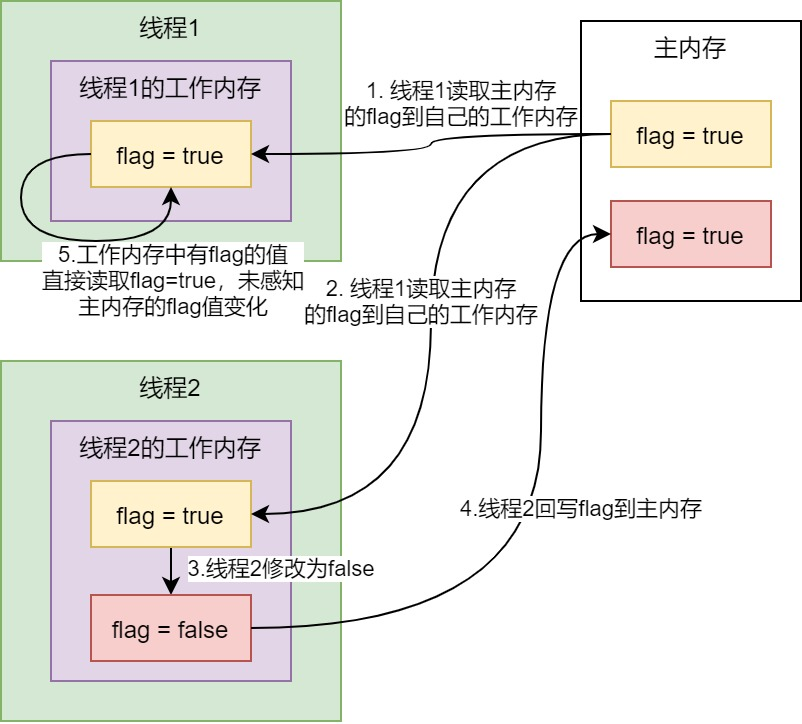

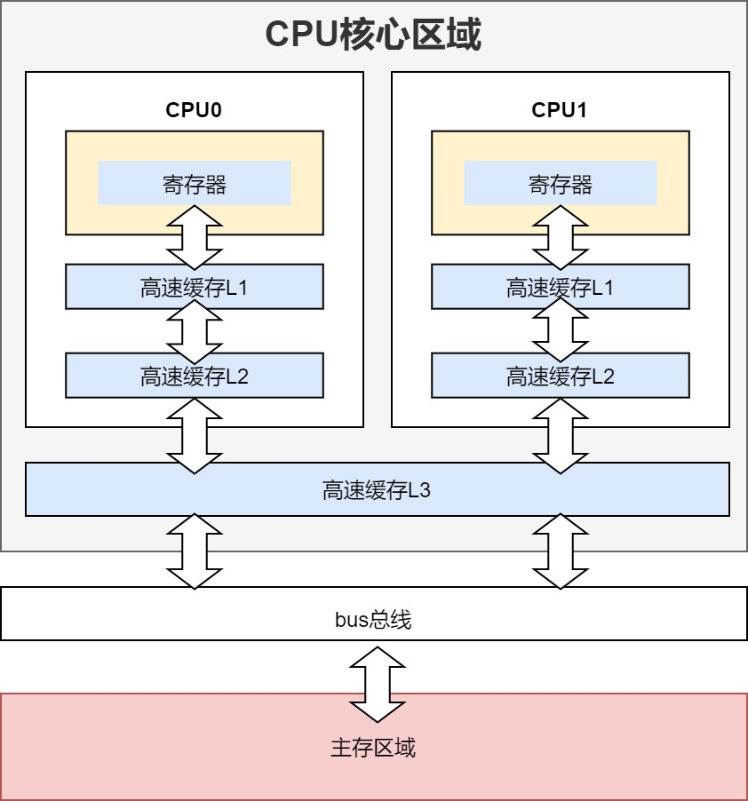

JMM是什么：

- Java为了屏蔽各个CPU以及不同架构带来的差异，同一成JMM内存模型
- JMM是一种抽象的概念，实际上并不存在；JMM与物理硬件之间存在着交叉的关系
- JMM规定线程操作变量时候，需要从主内存中拷贝一份到工作内存中，在工作内存中操作并写回主内存


### 1.8运行时内存区域

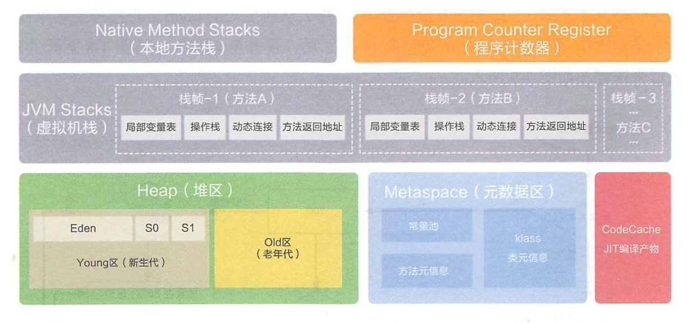

- 线程私有：
  - 程序计数器：任何一个时刻，一个处理器内核只会执行一条指令，为了满足多线程之间的切换，通过程序计数器记录正在执行的虚拟机**字节码指令地址**，**是JVM规范中唯一一个位置不会出现OOM**；
  - 虚拟机栈：描述Java方法执行的内存区域，每个方法从开始调用到结束调用就是栈帧从入栈到出栈的结果；**栈帧**：用于存储局部变量、操作栈、动态链接和方法返回地址等信息：
    - 局部变量表：存放方法参数和方法内部定义的**局部变量**，在编译期确定，在运行期间**不会**改变大小；
    - 操作栈：各种指令的写入和提取，JVM执行引擎是基于操作栈的执行引擎；
    - 动态连接：class文件中存在的符号引用，在类的**加载阶段**或第一次使用的时候转化为了直接应用，叫**静态连接**。在**运行期间**转化为直接引用，叫**动态连接**；
    - 方法返回地址：方法执行后返回的地址；
  - 本地方法栈：调用本地native的方法服务，通过JNI来调用非Java的代码，需要其他语言实现；
- 线程共享：
  - 堆：存放对象实例，可以细分为新生代和老年代（TLAB空间也在此）；
  - 元空间：在JDK1.8后出现，此时移除了**永久代**，增加元空间，保存着类信息的元数据；在JVM的逻辑概念里面可以称为方法区，用于存储已被虚拟机加载**类信息、常量、静态变量和即时编译后的代码**等；方法区是Java虚拟机中规范的定义，永久代是HotSpot虚拟机中的规范。**方法区是规范、元空间和永久代是实现**；

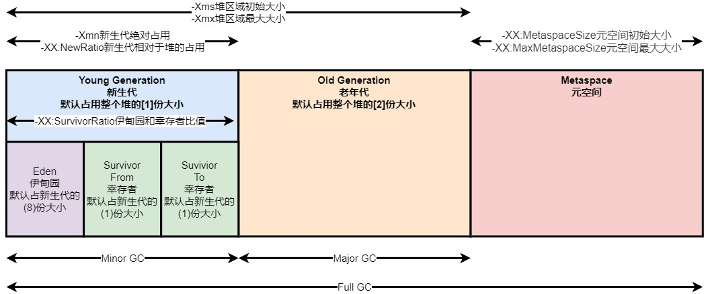

堆区分为几个区域：

- 新生代（Young Generation）：分为Eden和两个Survivor区，新创建的对象分配在Eden区，在执行一次的MinorGC后，如果对象继续存活，则移动到其中一个Survivor区，如果继续存活，则在下一次MinorGC时移动到另一块Survivor区。Eden区和Survivor区的比值为8：1，可以通过-XX:SurvivorRatio调整。一般来说，新生代占整个堆大小的1/4或者1/3比较合适，可以通过-Xmn调整。-XX:NewRatio也是可以调整新生代和老年代的比值，如果设定了-Xmn，则优先使用-Xmn；
- 老年代（Old Generation）：一般使用标记整理算法，主要会发生MajorGC，比较适合标记整理算法（CMS垃圾回收器除外）；
- 永久代（Permanent Generation）：JDK1.7（含）之前存在的区域，JDK1.8后剔除，可以通过设置-XX:PermSize调整；
- 元空间（Metaspace）：JDK1.8（含）存在的区域；

### JVM调优参数

| 选项                                  | 解释                                                                                         |
|:----------------------------------- |:------------------------------------------------------------------------------------------ |
| -Xms                                | 初始堆大小。如：-Xms256m                                                                           |
| -Xmx                                | 最大堆大小。如：-Xmx512m                                                                           |
| -Xmn                                | 新生代大小。通常为 Xmx 的 1/3 或 1/4。新生代 = Eden + 2 个 Survivor 空间。实际可用空间为 = Eden + 1 个 Survivor，即 90% |
| -Xss                                | JDK1.5+ 每个线程堆栈大小为 1M，一般来说如果栈不是很深的话， 1M 是绝对够用了的                                             |
| -XX:NewRatio                        | 新生代与老年代的比例，如 –XX:NewRatio=2，则新生代占整个堆空间的1/3，老年代占2/3                                         |
| -XX:SurvivorRatio                   | 新生代中 Eden 与 Survivor 的比值。默认值为 8。即 Eden 占新生代空间的 8/10，另外两个 Survivor 各占 1/10                  |
| -XX:MetaspaceSize                   | JDK1.8（含）直接内存内存元空间的初始大小                                                                    |
| -XX:MaxMetaspaceSize                | JDK1.8（含）直接内存内存元空间的最大值                                                                     |
| -XX:+HeapDumpOnOutOfMemoryError     | 让虚拟机在发生内存溢出时 Dump 出当前的内存堆转储快照，以便分析用                                                        |
| -XX:ErrorFile                       | Java进程crash时候产生的日志文件                                                                       |
| -Xloggc                             | GC日志路径                                                                                     |
| -XX:+PrintGCDetails                 | 打印GC的详情信息                                                                                  |
| -XX:+PrintGCDateStamps              | 打印GC的时间                                                                                    |
| -Dcom.sun.management.jmxremote.port | jmx端口                                                                                      |
| -XX:PermSize                        | JDK1.7（含）前永久代（方法区）的初始大小，已经弃用                                                               |
| -XX:MaxPermSize                     | JDK1.7（含）前永久代（方法区）的最大值，已经弃用                                                                |

### 调优样例

-Xmx2688M：最大堆大小为2688M
-Xms2688M：最大小大小为2688M
-Xmn1344M：新生代大小为1344M
-Xss512K：线程栈大小512K
-XX:MaxMetaspaceSize=512M：元空间大小为512M
-XX:MetaspaceSize=512M：元空间初始大小512M
-XX:+UseConcMarkSweepGC：使用CMS收集器
-XX:+UseCMSInitiatingOccupancyOnly：与下面配合使用，只使用回收阈值（下面指定的70%），如果不指定JVM仅第一次使用，后续自动调整
-XX:CMSInitiatingOccupancyFraction=70：在内存占用70%的时候开始GC（CMS会有浮动垃圾，提前收集）
-XX:+ExplicitGCInvokesConcurrentAndUnloadsClasses：该参数保证当有系统GC调用时，永久代也被包括进CMS垃圾回收的范围内
-XX:+CMSClassUnloadingEnabled：对永久代进行垃圾回收
-XX:+ParallelRefProcEnabled：并行处理reference，提高处理效率，缩短耗时
-XX:+CMSScavengeBeforeRemark：在cms gc remark之前做一次ygc，减少gc roots扫描的对象数，从而提高remark的效率，默认关闭
-XX:ErrorFile=/tmp/hs_err_pid%p.log：error错误日志
-Xloggc:/tmp/gc.log：gc日志
-XX:+PrintGCDetails：打印GC日志
-XX:+PrintGCDateStamps：打印GC时间戳
-XX:+PrintCommandLineFlags：打印程序使用的JVM参数

### Client模式和Server模式的区别

> 为了提高热点代码的执行效率，在运行时，虚拟机将会把这些代码编译成与本地平台相关的机器码，并进行各种层次的优化，完成这个任务的编译器叫做即时编译器（Just In Time Compiler，即JIT编译器），当程序需要迅速启动和执行的时候，解释器可以先发挥作用，省去编译的时间，立即执行。在程序运行后，随着时间的推移，编译器逐渐发挥作用，把越来越多的代码编译成本地代码之后，可以获取更高的执行效率。

- Server模式：与C2编译器共同运行，更注重编译质量，启动速度慢，但是运行效率高，适合在服务器环境下运行，针对生产环境进行了优化处理；
- Client模式：与C1编译器共同运行，更注重编译速度，启动速度快，更适合在客户端版本下，针对GUI进行了优化处理。

### 内存交互操作概念

> Java内存模型中定义了一下8种内存变量交换的操作，虚拟机必须保证这8种操作都是**原子**的，不可再分的。


- lock：作用于主内存，把一个变量标识为一条线程独占状态；
- unlock：作用于主内存，把一个处于lock状态的变量释放出来，释放后才能被其他线程锁定；
- read：作用于主内存，把一个变量值从主内存传到线程的工作内存中，便于随后的load动作使用；
- load：作用于工作内存，把read操作从主内存中得到的变量放入工作内存的变量副本中；
- use：作用于工作内存，把工作内存中一个变量值传递给执行引擎，每当虚拟机遇到一个需要使用变量值的字节码指令时会执行这个操作；
- assign：作用于工作内存，把一个从执行引擎收到的值赋给工作内存的变量，每当虚拟机遇到一个给变量赋值的字节码指令时执行这个操作；
- store：作用于工作内存，把工作内存中一个变量值传送到主内存中，一边随后的write操作使用；
- write：作用于主内存，把store操作从工作内存中得到的变量的值放入主内存的变量中。

### 内存泄漏和内存溢出

- 内存溢出（out of memory）：程序在申请内存，没有足够的空间
- 内存泄漏（memory leak）：程序申请内存后，无法释放已申请的内存空间

### 线程模型

#### 定义

- 进程（Process）：操作系统的一个运行程序，有独立的地址空间
- 线程(KTL，Kernel Level Thread)：**抽象概念**，Linux内部没有专门为线程定义数据结构和调度的算法，Linux实现线程的方式是**轻量级线程**
- 轻量级进程（LWP，Light Weight Process）：具体概念，是线程的具体实现，是无独立地址空间的进程

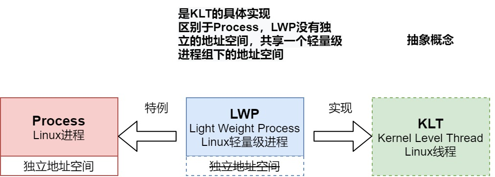

#### 具体实现分类

- 内核线程模型
  
  - 特点：
    
    - JVM的线程UT本质上是LWP的一个实例对象，也就是jvm的线程是轻量级线程的一个具体映射，LWP映射为KLT，在内核中执行
    
    - UT和LWP是**一对一**的
    
    - 是目前主流语言的线程模型，目前高版本的JVM都是用这种模型
  
  - 优点：
    
    - UT阻塞了不影响其他内核KLT的执行，因为有Thread Scheduler进行切换协调
  
  - 缺点：
    
    - 操作线程需要在**用户态**和**内核态**中来回切换，因为本质上都要反映到KTL中，消耗一定的资源
    
    - 受到Linux内核创建的资源限制

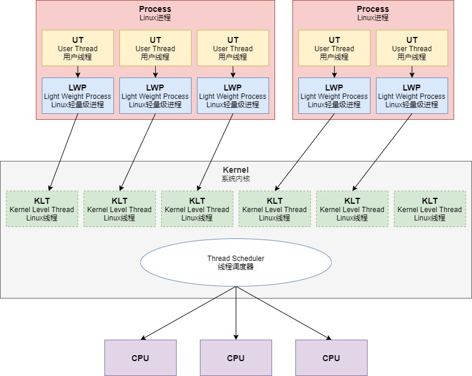

- 用户线程模型
  - 特点：
    - 跨过系统的调度，UT直接调用CPU的资源
    - JVM的早期版本使用这种模型，后面被抛弃了
  - 优点：
    - 提高并发上限，调度都由用户线程自主完成，减少上下文切换开销
  - 缺点：
    - 一个UT阻塞了，系统的其他资源无法利用CPU的资源

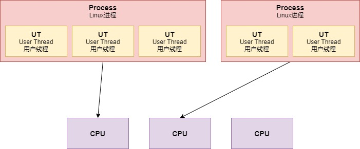

- 混合线程模型
  - 特点：
    - UT和LWP不再是一对一
    - GO语言的实现方式
  - 优点：
    - 操作线程不用在内核中来回切换，减少开销
    - 提高了并发的上限
  - 缺点：
    - 实现很复杂

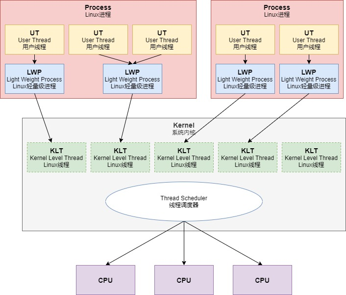

## 类相关

### 类的加载过程

- 加载：指把class字节码文件从各个来源加载入内存中；
- 连接：
  - 验证：保证加载的字节流符合虚拟机规范；
  - 准备：为类的**静态变量**分配内存，并将其初始化为**默认值**
  - 解析：把常量池中的符号引用转为直接引用
- 初始化：为类静态变量进行初始化，赋**初始值**

### 类加载的时机

- 创建类的实例对象（new方式）
- 访问某个类或者接口的静态变量，或者对静态变量的赋值
- 调用类的静态方法
- 反射
- 初始化某个类的子类，父类也会被初始化
- 虚拟机启动时被表明为启动类的类

### 双亲委派机制

如果一个类加载器收到了类加载的请求，它首先不会让自己去尝试加载这个类，而是把这个请求**委派给父类加载器去完成**，每一个层次的类加载器都是如此，因此所有的加载请求最终都应该传送到顶层的启动类加载器中，只有当父加载器反馈自己无法完成这个加载请求（它的搜索范围中没有找到所需的类）时，子加载器才会尝试自己去加载。ClassLoader类比较重要的两个方法：findClass和loadClass，**findClass是指如何找到class，而loadClass则默认实现了整个双亲委派机制**，如果需要打破双亲委派机制，需要重写loadClass方法。Java虚拟机的基本classLoader如下：**BootstrapClassLoader（启动类加载）=> ExtClassLoader（标准扩展类加载器）=> AppClassLoader（系统类加载器）=>CustomClassLoader（用户自定义类加载器）**

```java
protected Class<?> loadClass(String name, boolean resolve)
    throws ClassNotFoundException
{
    synchronized (getClassLoadingLock(name)) {
        // 先查找对应的class文件是否已经被加载过了
        Class<?> c = findLoadedClass(name);
        if (c == null) {
            long t0 = System.nanoTime();
            try {
                if (parent != null) {
                    // 使用父的ClassLoader进行class加载
                    c = parent.loadClass(name, false);
                } else {
                    // 使用顶层BootStrapClassLoader加载
                    c = findBootstrapClassOrNull(name);
                }
            } catch (ClassNotFoundException e) {
                // ClassNotFoundException thrown if class not found
                // from the non-null parent class loader
            }

            if (c == null) {
                long t1 = System.nanoTime();
                // 调用本类中findClass方法进行加载，自定义classLoader时需要重写该方法
                c = findClass(name);

                // this is the defining class loader; record the stats
                sun.misc.PerfCounter.getParentDelegationTime().addTime(t1 - t0);
                sun.misc.PerfCounter.getFindClassTime().addElapsedTimeFrom(t1);
                sun.misc.PerfCounter.getFindClasses().increment();
            }
        }
        if (resolve) {
            resolveClass(c);
        }
        return c;
    }
}

protected Class<?> findClass(String name) throws ClassNotFoundException {
    throw new ClassNotFoundException(name);
}
```

## 对象相关

### 对象创建流程

- **类加载检查**：定位检查指令参数是否能在常量池定位到类符号的引用，检查判断类是否被加载过、解析和初始化过；

- **分配内存**：根据Java堆**是否规整**决定分配方式，分配方式包含两种：
  
  - 指针碰撞：**内存需要绝对规整**，挪动开辟对象所需的区域大小即可；
  - 空闲列表：记录哪部分区域是空闲的。
  
  而Java堆是否规整又由采用的**垃圾收集器是否带压缩整理功能**决定的，并发内存分配为以下规则：
  
  - TLAB：在线程初始化时默认分配空间，JVM在线程中分配内存时先在TLAB（TLAB区域也是在堆上，但**线程专属**）分配，不存在线程的竞争。当分配对象大于TLAB剩余内存时，采用CAS+失败重试的方法创建；
  - CAS+失败重试：虚拟机采用CAS配上失败重试的方式保证更新操作的原子性，该方法是指在传统的堆上进行对象的创建，会导致激烈的竞争；
  
  额外：
  
  - 栈上分配，如果一个对象的作用域不会逃逸到方法之外，那这个对象可以分配到栈上，随着栈帧出栈而销毁；而且不会逃逸的对象所占比例很大，销毁时无需通过垃圾收集器回收，可以减小垃圾收集器的压力负载。如果JVM需要进行类似栈上分配的好处，则需要开启以下两个功能操作：
    - 逃逸分析：在server模式下，启用-XX:+DoEscapeAnalysis，默认开启；
    - 变量替换：启用-XX:+EliminateAllocations，默认打开；

- **初始化零值**：将分配到内存空间都初始化为零值，保证对象实例字段在Java代码中不赋初始值就可以直接使用；

- **设置对象头**：设置对象的元数据信息，如哈希码，GC分代年龄信息等；

- **执行init方法**：按照程序员的意愿代码进行初始化。


### 对象内存布局

- 对象头：
  
  - Mark Word（运行时数据）：如哈希码，GC分代年龄，锁状态标志位；
  
  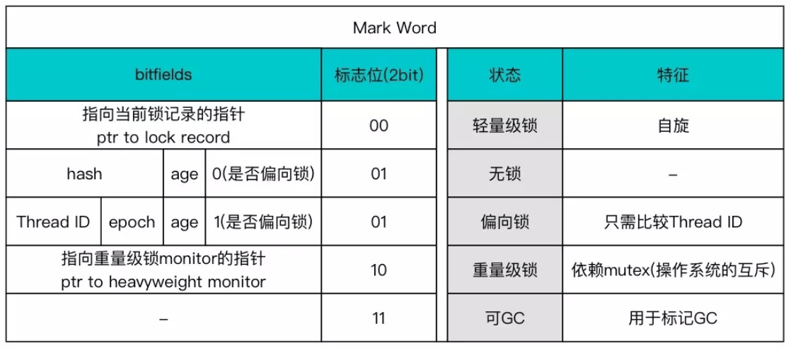
  
  - 类型指针（元数据指针）：指向类元素据的指针，确定对象是哪个类的实例；

- 实例数据：真正存储对象有效信息的部分；

- 对齐填充：起占位符的作用，要求真实地址必须是8字节的整数倍。

### 对象访问定位


- 使用句柄：对象移动时不需要改变reference的指向，只改变句柄实例数据的指针；
- 使用指针：直接访问，速度快，HotSpot虚拟机就是用**直接指针实现**的。

### 对象存活判断

- 引用计数法：对象存有被引用的次数，简单但无法解决**循环引用**的问题；
- 可达性分析：Hotspot使用**枚举根节点**的方式，需要**发生STW**，可以解决循环引用等问题。

### 对象的引用

- 强引用：指代码普遍存在的引用方式，只要强引用存在，则永远不会对其进行垃圾回收；
- 软引用：在系统发生**内存溢出异常**之前对其进行垃圾回收，使用**SoftReference**；
- 弱引用：引用的对象只能生存到**下一次垃圾回收**之前，无论内存是否足够，都进行回收，使用**WeakReference**；
- 虚引用：最弱的引用关系，目的是对象被回收时**收到一个系统通知，跟踪对象垃圾回收的状态**，使用**PhantomReference**，本质上都不能通过get()方法获取实例，因为get()方法实现是return null

```java
public SoftReference(T referent);
public SoftReference(T referent, ReferenceQueue<? super T> q);

public WeakReference(T referent);
public WeakReference(T referent, ReferenceQueue<? super T> q);

public PhantomReference(T referent, ReferenceQueue<? super T> q);
```


注意：在各个Reference中，构造签名里面的T referent均是指：**被引用的对象**，也叫**被回收的对象**；而持有xxxReference的对象指的是**引用对象**；当被引用对象回收后，引用对象仍然持有xxxReference对象，但是无法通过xxxReference.get()方法获取到被引用的对象，下面的样例中：Person是被引用的对象，Registration是引用对象，回收是回收Person实例，而不是Registration，回收后Registration依然能够被获取到

```java
public class WeakReferenceTest {

    @ToString
    @Getter
    private static final class Person {

        private String name;

        public Person(String name) {
            this.name = name;
        }

        @Override
        protected void finalize() {
            System.out.println(this.name + "已被回收（挂了）");
        }

    }

    @ToString
    @Getter
    private static final class Registration extends WeakReference<Person> {

        private String ownerName;

        public Registration(Person referent, ReferenceQueue<? super Person> q) {
            super(referent, q);
            this.ownerName = referent.getName();
        }

    }

    @Getter
    private static final class House {

        private String name;
        private Registration registration;
        private ReferenceQueue<Person> historyOwner;

        public House(Person person) {
            this.historyOwner = new ReferenceQueue<>();
            this.name = person.getName() + "的房子";
            this.registration = new Registration(person, this.historyOwner);
        }

        public Person getPerson() {
            return registration.get();
        }

        public List<Registration> getHistoryRegistration() {
            List<Registration> result = new ArrayList<>();
            Registration poll;
            while ((poll = (Registration) historyOwner.poll()) != null) {
                result.add(poll);
            }
            return result;
        }

    }

    public static void main(String[] args) throws InterruptedException {
        Person person = new Person("张三");
        House house = new House(person);

        System.out.println("房子所属人：" + house.getPerson());
        System.out.println("房子登记信息：" + house.getRegistration());
        printHistoryRegistration(house.getHistoryRegistration());

        // 将指针指向null，让person再无引用
        person = null;
        System.gc();
        Thread.sleep(5000L);

        System.out.println("------- 发生回收后 -------");

        System.out.println("房子所属人：" + house.getPerson());
        System.out.println("房子登记信息：" + house.getRegistration());
        printHistoryRegistration(house.getHistoryRegistration());

    }

    public static void printHistoryRegistration(List<Registration> list) {
        System.out.println("****** 房子历史登记信息begin ******");
        for (Registration registration : list) {
            System.out.println("拥有人姓名：" + registration.getOwnerName());
            System.out.println("拥有人信息：" + registration.get());
        }
        System.out.println("****** 房子历史登记信息end ******");
    }

}
```

```
房子所属人：WeakReferenceTest.Person(name=张三)
房子登记信息：WeakReferenceTest.Registration(ownerName=张三)
****** 房子历史登记信息begin ******
****** 房子历史登记信息end ******
张三已被回收（挂了）
------- 发生回收后 -------
房子所属人：null
房子登记信息：WeakReferenceTest.Registration(ownerName=张三)
****** 房子历史登记信息begin ******
拥有人姓名：张三
拥有人信息：null
****** 房子历史登记信息end ******
```

### Finalize函数

- finalize在对象被回收前触发的函数，只要在此时重新与引用链上的任何对象关联即可逃脱被回收；
- 任何一个对象的finalize方法都只会被系统自动调用一次，如果对象面临下一次回收，finalize方法不会被再次执行；
- 运行代价高昂，不确定性太大，无法保证各个对象的调用顺序，不推荐使用。

## 垃圾回收相关

### 垃圾收集算法

- 标记清除：先标记，然后直接清除；简单快速但会产生内存碎片；


- 复制：划分区域，每次使用其中1块区域，使用完之后把存活的数据复制到另外一块中，Hotspot新生代默认使用，划分为1个Eden和2个Survivor，大小比例为8：1，Survivor空间不足时**使用老年代分配担保**；

 

- 标记整理：先标记，然后把存活对象向空间一端移动，适合**老年代**使用的算法。


### 垃圾收集器

1. 新生代：
   - Serial收集器：单线程、回收时发生STW（暂停所有其他线程直到收集结束）、对于单CPU环境性能最高、简单高效、复制算法、client模式下默认新生代垃圾收集器；
   - ParNew（Parallel）收集器：Serial收集器的**多线程**版本（默认开启和CPU数目相同的线程数）、会发生STW、复制算法；
   - Parallel Scavenge收集器：关注点是**控制吞吐量**（用户运行代码与CPU总消耗时间的比值，运行用户代码时间/(运行用户代码时间+垃圾收集时间)）、复制算法、新生代默认收集器（针对server虚拟机而言），存在-XX:+UseAdaptiveSizePolicy自适应调节策略，配置之后就不需要手工指定其他细节参数，虚拟机会自动调整这些参数。
2. 老年代：
   - Serial Old收集器：Serial的老年代版本，单线程、标记整理算法、老年代默认收集器（针对client虚拟机而言）；
   - Parallel Serial收集器：是Parallel Scavenge老年代算法，吞吐量优先、多线程、标记整理算法；
   - CMS收集器：以**最短回收停顿为目标**，真正意义上的并发收集器。使用**标记清除算法**，对CPU资源非常敏感、**无法清除浮动垃圾（边回收而且边产生的垃圾）**、收集结束会产生大量的**内存碎片**；
3. 共用：
   - G1收集器：**可预测的停顿**；整体使用标记整理算法，局部使用复制算法；把堆划分为**多个独立区域Region**，新生代和老年代**不再是隔离**的，跟踪各个Region中的堆积价值大小，**优先回收价值最大的Region**。
   - ZGC：ZGC在指针上做标记，在访问指针时加入**Load Barrier（读屏障）**，当对象正被GC移动，指针上的颜色就会不对，这个屏障就会先把指针更新为有效地址再返回；因此在访问对象的时候会变慢，但不会为了保持应用与GC一致而粗暴整体的STW

### GC名词解释

- MinorGC：次要的GC，发生在新生代，都会发生STW；
- MajorGC：主要的GC，发生在老年代；
- FullGC：整个堆的GC。

### OOM

- Java堆溢出：创建对象过多，导致内存无法满足对象创建所需的空间，-Xms -Xmx调整堆的大小；
- 虚拟机栈和本地方法栈溢出：请求的栈深大于虚拟机所需最大深度，或扩展栈时无法申请到足够的内存空间，使用-Xss调整栈的内存容量；
- 方法区和运行时常量池溢出（JDK1.8以前）：在方法区和运行时常量池中加载内容过多，例如字符串实例导致内存溢出，使用-XX:PermSize -XX:MaxPermSize调整；
- 本机直接内存溢出（JDK1.8以后）：加载的类信息或者元数据过多，使用-XX:MaxDirectMemorySize调整。

### 命令工具

- jps：查看运行中的java程序，jps -l -v
- jstat：统计Jvm信息，jstat -gc PID [采样间隔毫秒] [采样个数]
  - S0C、S1C、S0U、S1U：Surivior 0/1区容量（capacity）和使用量（Used）
  - EC、EU：Eden区容量和使用量
  - OC、OU：老年代容量和使用量
  - PC、PU：永久代容量和使用量
  - YGC、YGT：年轻代GC次数和耗时
  - FGC、FGCT：Full GC次数和耗时
  - GCT：GC总耗时
- jinfo：查看虚拟机的参数，jinfo PID
- jmap/jhat：dump出堆的数据和数据分析
  - jmap -heap PID，打印堆的信息
  - jmap -histo[:live] PID，打印对象直方图，live为为只打印存活的对象
  - jmap -dump:format=b,file=xxx PID，把整个堆dump出来
- jstack：当前线程执行的快照，jstack -l PID
- VisualVM：上面工具的集合，一般用此工具，省力省心。

## JVM操作样例

### 如何合理设置线程池大小

- 根据当前的执行任务是**CPU密集型**还是**IO密集型**：如果是CPU密集型应用，则线程池大小设置为CPU数量 + 1，如果是IO密集型应用，则线程池大小设置为2 * CPU数量 + 1，该设置偏理论方式；
- 根据CPU的等待时间进行计算：最佳线程数目 = (线程等待时间 / 线程CPU时间 + 1) * CPU数量，由于线程等待时间和线程CPU时间很难确定，该公式很难进行实际使用；
- 动态设置线程池数量的大小，美团技术团队使用JDK原生的threadpool，其可以调用setMaximumPoolSize和setCorePoolSize动态设置大小，并且实现自定义的ResizableCapacityLinkedBlockingQueue动态设置队列大小

### 如何解决内存溢出问题

- 先找出进程对应的pid
- 用命令jmap -histo:live pid可以看到存活的对象列表以及占用的大小
- 用命令jmap -dump:live,format=b,file=test.bin pid可以dump出整个内存，可以用jvisualvm看到所有的对象详情

### 如何查看GC的情况

jstat -gccapacity pid

输出结果说明如下表（C代表capacity，U代表USED）

| 字段名 | 说明（单位KB）       |
| ------ | -------------------- |
| NGCMN  | 新生代最小大小       |
| NGCMX  | 新生代最大大小       |
| NGC    | 当前新生代的大小     |
| S0C    | 第一个Survivor的大小 |
| S1C    | 第二个Survivor的大小 |
| EC     | Eden区的大小         |
| OGCMN  | 老年代最小大小       |
| OGCMX  | 老年代最大大小       |
| OGC    | 当前老年代的大小     |
| OC     | 当前老年代的大小     |
| MCMN   | 元空间的最小大小     |
| MCMX   | 元空间的最大大小     |
| MC     | 当前元空间的大小     |
| CCSMN  | 最小压缩类空间大小   |
| CCSMX  | 最大压缩类空间大小   |
| CCSC   | 当前压缩类空间大小   |
| YGC    | 年轻代GC次数         |
| FGC    | Full GC的次数        |

### 如何查看与定位CPU100%的问题

```java
public static void main(String[] args) throws InterruptedException {
    MyWhile.doWhile();
}

private static final class MyWhile {
    static void doWhile() {
        while (true) {
        }
    }
}
```

- 首先CPU100%**不一定存在问题**，需要观察本机器执行的任务是否是CPU密集型任务，若是，则完全有可能出现100%CPU的问题；
- 登录到机器上，使用top命令查看对应的进程列表，按下P（大写）键，按照进程CPU使用率排序，记录下对应的PID，此处PID为1743；

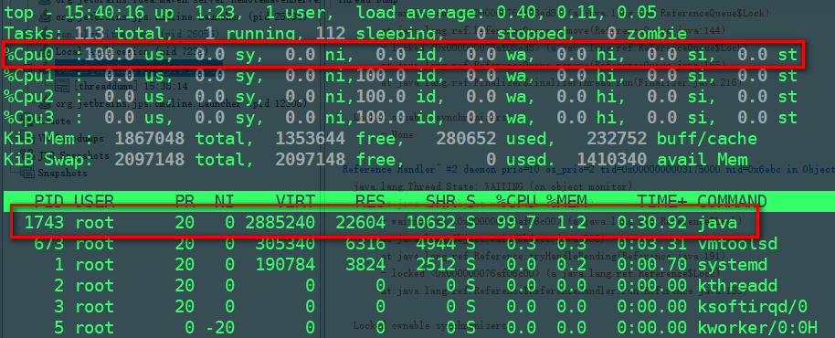

- 根据PID查询出消耗CPU最高的线程ID，使用命令top -Hp 刚才找到的PID，按下P（大写）键，按照线程查看CPU使用率排序，记录下对应的PID，此时记录的PID为十进制，需要转化为十六进制，此处PID为1744，对应的十六进制为6d0；

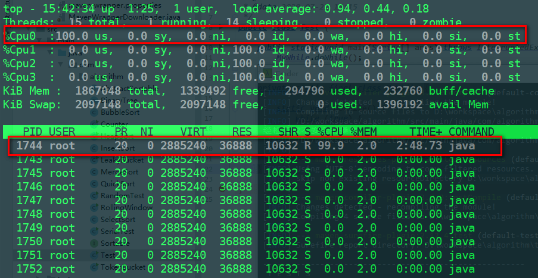

- 使用jstack -l 刚才找到的进程PID > tmp.stack，导出对应的线程信息；

- 使用vim查看tmp.stack，查找对应的十六进制的PID，查看其执行的内容与状态。

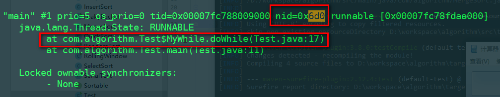

如果查看到对应线程为GC线程，那么极有可能是**频繁的GC**导致CPU100%的，那么需要使用jstat来观察对应的GC运行信息（jstat -gc PID [监视频率毫秒]），倘若频繁发生GC，那么需要进一步通过jmap分析内存对象占用信息，观察是否有内存泄漏的问题存在

### 如何定位死锁的问题

执行以下代码：

```java
public static void main(String[] args) throws InterruptedException {
    Lock l1 = new ReentrantLock();
    Lock l2 = new ReentrantLock();

    new Thread(() -> {
        l1.lock();
        System.out.println("线程1获取锁1完成");
        try {
            Thread.sleep(500L);
            l2.lock();
            System.out.println("线程1获取锁2完成");
        } catch (InterruptedException e) {
            e.printStackTrace();
        } finally {
            l2.unlock();
            l1.unlock();
        }
    }).start();

    new Thread(() -> {
        l2.lock();
        System.out.println("线程2获取锁2完成");
        try {
            Thread.sleep(500L);
            l1.lock();
            System.out.println("线程2获取锁1完成");
        } catch (InterruptedException e) {
            e.printStackTrace();
        } finally {
            l1.unlock();
            l2.unlock();
        }
    }).start();
}
```

直接执行jstack -l PID，可以自动检测到死锁的问题：

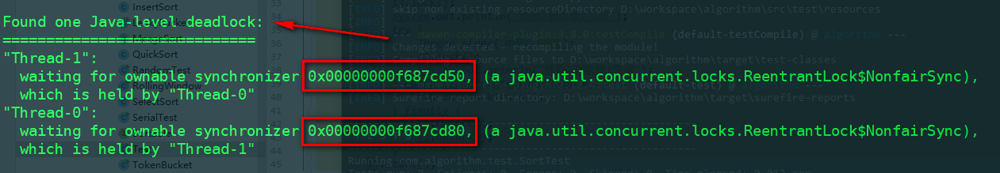

### 使用Jvisualvm查看JVM状态

- 推荐安装插件：
  
  - Visual GC
  - VisualVM-JConsole
  - VisualVM-MBeans
  - Btrace Workbench
  - Threads Inspector

- 在程序启动时增加几个命令参数以启动JMX链接，此时可以通过Jvisualvm的JMX方式连接
  
  - -Dcom.sun.management.jmxremote.authenticate=false
  - -Dcom.sun.management.jmxremote.ssl=false
  - -Dcom.sun.management.jmxremote.port=12345

- 若想通过Visual GC监测GC的情况，可以通过在程序中启动Jstatd进行监控，方法是：
  
  - 在java_home的bin目录下创建jstatd.all.policy文件，其中/usr/local/java/lib/tools.jar可以按照需求替换为${JAVA_HOME}/lib/tools.jar，前提是已经设置过JAVA_HOME环境变量
  
  ```
  grant codebase "file:/usr/local/java/lib/tools.jar" {
     permission java.security.AllPermission;
  };
  ```
  
  - 通过命令启动./jstatd -J-Djava.security.policy=jstatd.all.policy -J-Djava.rmi.server.hostname=xxx.xxx.xxx.xxx -p xxxx -J-Djava.rmi.server.logCalls=true

## 亲自遇到的问题

问题表现：升级了mysql8.0之后，程序cpu微微升高，内存占用率比较高


表现是：

- 内存里面有过多的ZipEntry的实例，却都无引用的
- Druid的loadClass()方法吃了非常多的CPU资源

用了jmap dump出内存对象，用jstack查看线程的占用时间，发现就是druid的内部问题

详见：https://blog.csdn.net/qq_40378034/article/details/117851207
