## 家庭组网

### 家庭网络总览

- 改造前背景：
  - 单条光线入户到弱电箱，入户宽带速率为300M，光猫放在弱电箱，光猫无Wifi功能
  - 弱电箱有3条预埋的网线，分别到电视柜、主卧、次卧
  - 竞斗云路由器作为光猫的下级路由，放在弱电箱中，连接电视柜，主卧，次卧，并且发送Wifi信号
  - 电视柜中有一个IPTV机顶盒，与光猫的TV口相连接
  - 电视柜中有switch，小爱音箱，距离Wifi信号源比较远，不好连接
- 缺点：
  - 光猫本身性能非常差，导致网速跑不满
  - Wifi放在弱电箱中，导致信号在主卧中收不到
  - 家里有公网是IP，但是光猫重启后公网IP地址会发生变化
- 需求点：
  - 由于本人是程序员，需要经常使用各种组件，需要一个**独立的虚拟环境使用**，最好有docker等容器
  - 尽量减少光猫的指责，光猫最好**只做信号调制**使用
  - Wifi不能放在弱电箱，最好放在客厅电视柜等开放区域，**实现全屋覆盖**
  - 能在次卧中是现实**全屋的设备管理**，例如我想设置光猫时，不用再额外接入网线或者移动电脑到光猫处
  - 从外网中访问家里的各种设备
  - 能实现**科学上网**

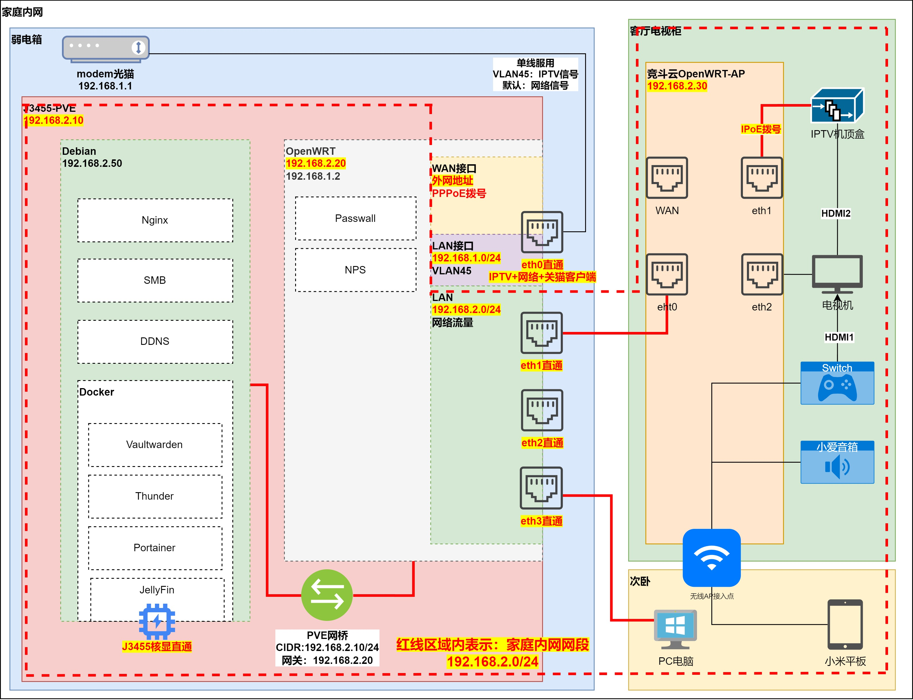

### 光猫设置

- 运营商：中国电信
- 套餐：300M宽带+1主2副+IPTV=129元/月 + 10元/月=139元/月
- 光猫modem：EPON天翼网关（无Wi-Fi）
- 设备型号：ZXHN F410GV9
- 地址：192.168.1.1:80或者192.168.1.1:8080
- 用户：默认在光猫背面的账号与密码均在光猫背后，如果需要真正的管理员账号需要向运营商获取，如果重置了光猫，会导致密码重置
- 先决条件：
  - 让运营商提供IPv4公网地址，IP地址为动态
  - 知道宽带的PPPoE的拨号账户名+密码
  - 知道IPTV的IPoE的用户名+密码

### 光猫桥接+路由拨号=优化性能

配置：

- 把光猫配置为**桥接模式**，因为光猫性能很差，光猫既**拨号又当路由会浪费性能**，光猫设置为桥接模式+软路由拨号会获得更好的资源分配
  - 打开**网络**
  - 在**连接名称**中选用**3_INTERNET_B_VID_**
  - 在LAN端口绑定中启用网口1

- 在OpenWRT中修改**WAN接口为PPPoE**，填入拨号的用户名+密码
- 在OpenWRT中添加接口**MODEM**，此步为非必须步骤，但是如果不做后续没办法从内网设置光猫，这个操作是为了使用**单线复用功能**，注意下面步骤中一定要取消勾选默认网关+设置大的跃点数，不然会导致上不了外网等问题
  - 协议：**DHCP客户端**
  - **取消勾选默认网关**
  - **跃点数尽量调大**，例如为：100

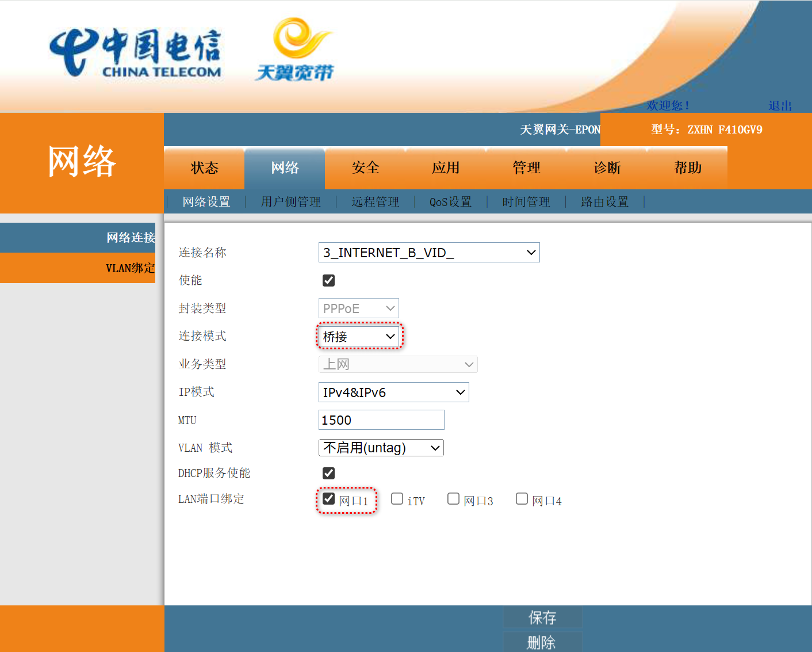

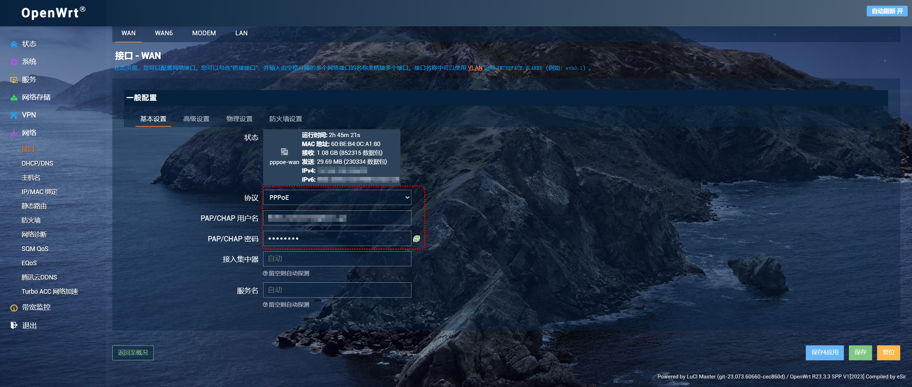

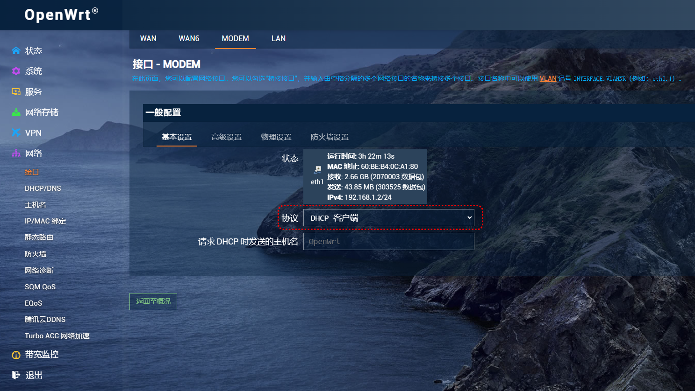

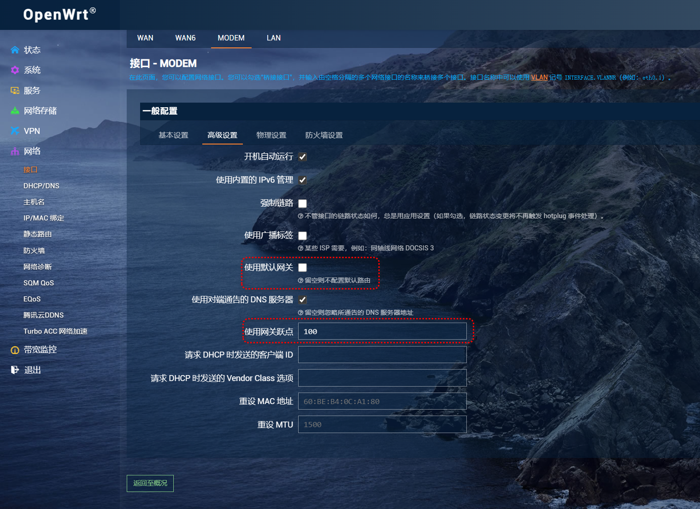

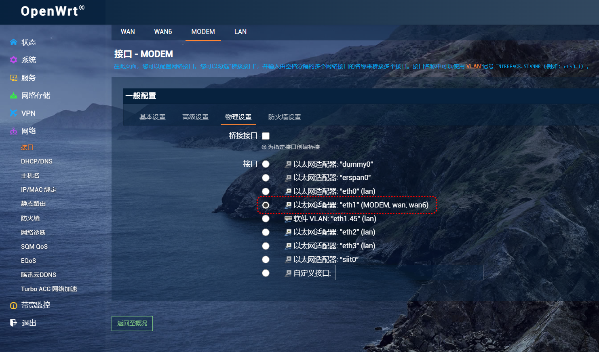

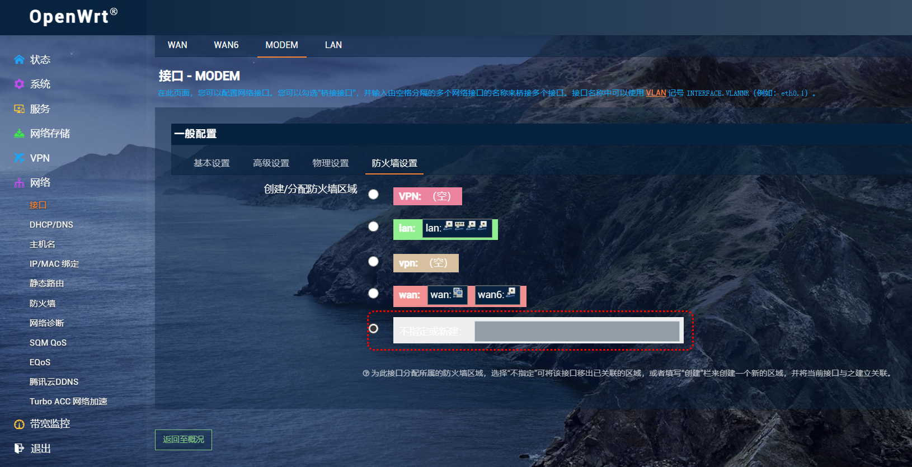

### 设置单线复用IPTV

配置：

- 在光猫中
  - 选择网络，连接名称下拉选择**2_Other_B_VID_45**，不同的运营商地域可能不一样
  - 勾选LAN端口绑定，绑定**网口1**
  - 打开网络中的VLAN绑定
  - 选择空白栏的选择方框，在下面**用户侧端口勾选网口1**，**用户侧VLAN自己随意填写一个值X**，注意可以和上面的VlanID=45可以不一样的，我这里为了方便就直接填写45，**绑定WAN连接名称选择2_Other_B_VID_45**
- 在OpenWRT的接口中
  - **选择LAN接口**，在接口中填写WAN口.X，X为上面的自己选的值，本人网络中WAN口对应eth1，因此填写eth1.45
- 在IPTV界面中
  - 在**网络设置，IPoE中，密码为10000，调整IPoE网络拨号为IPv4/IPv6的方式**

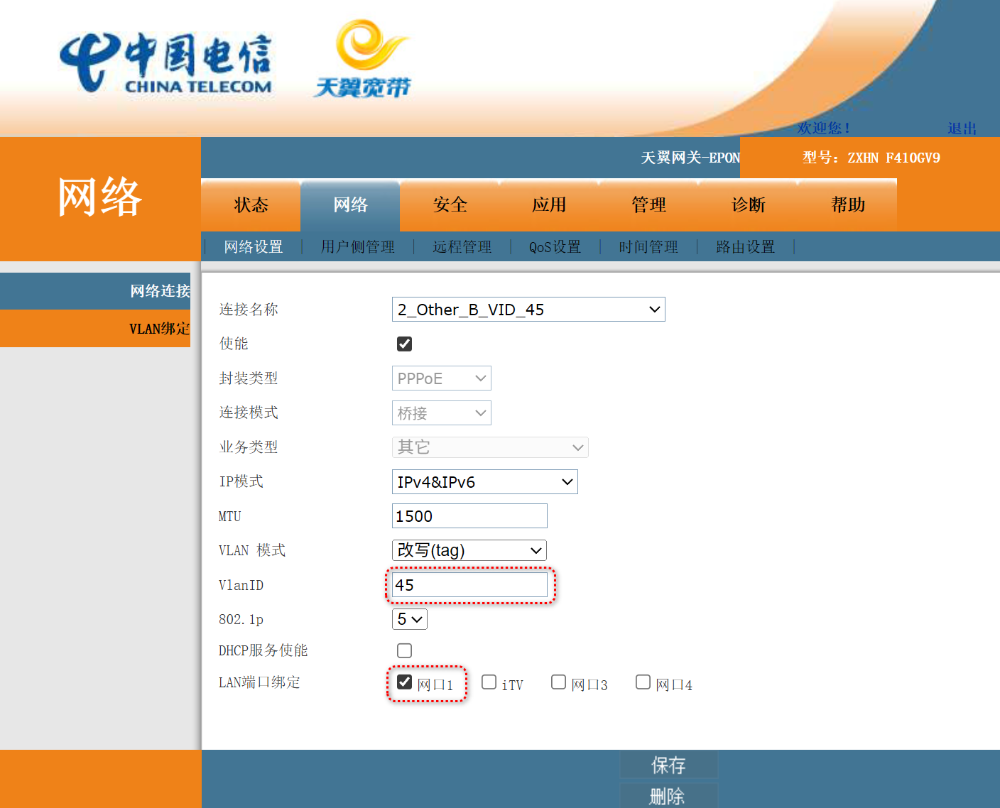

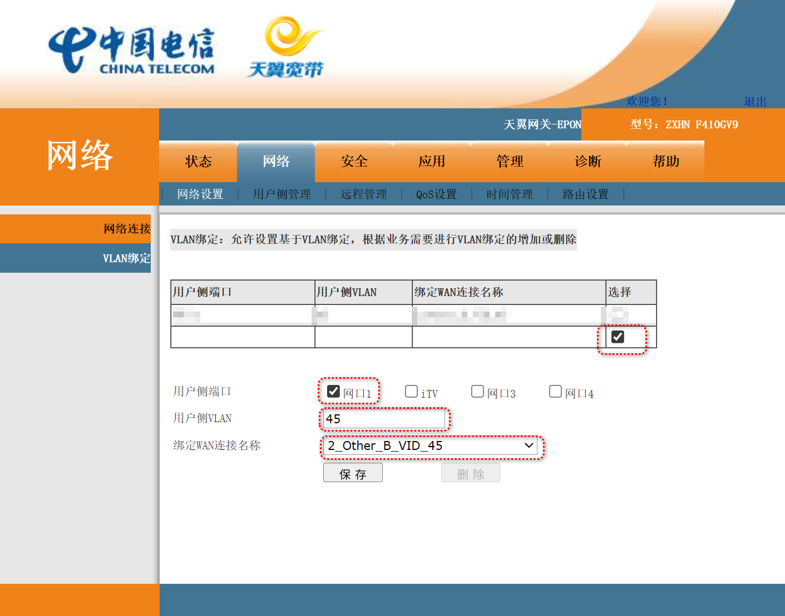

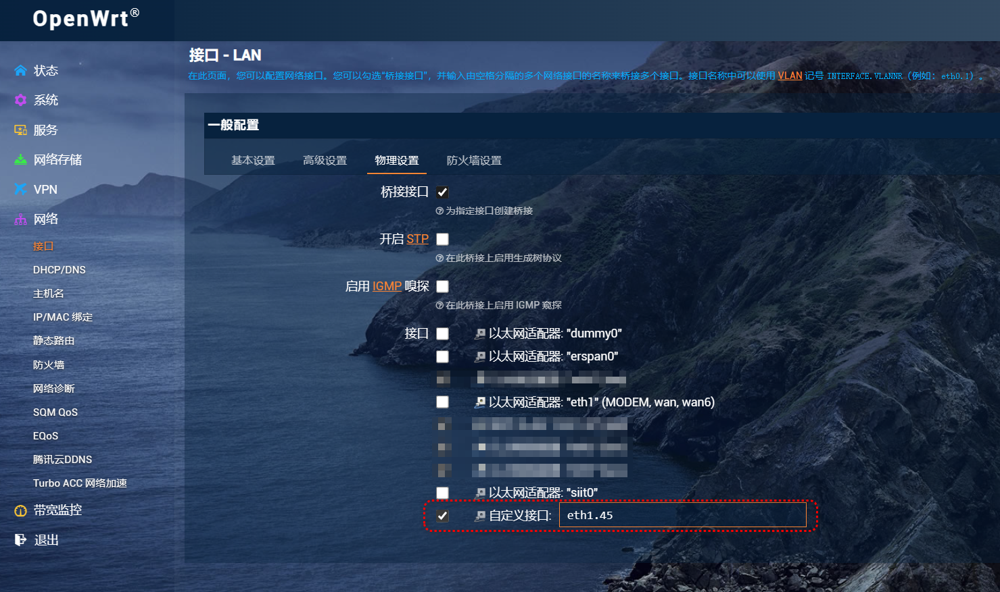

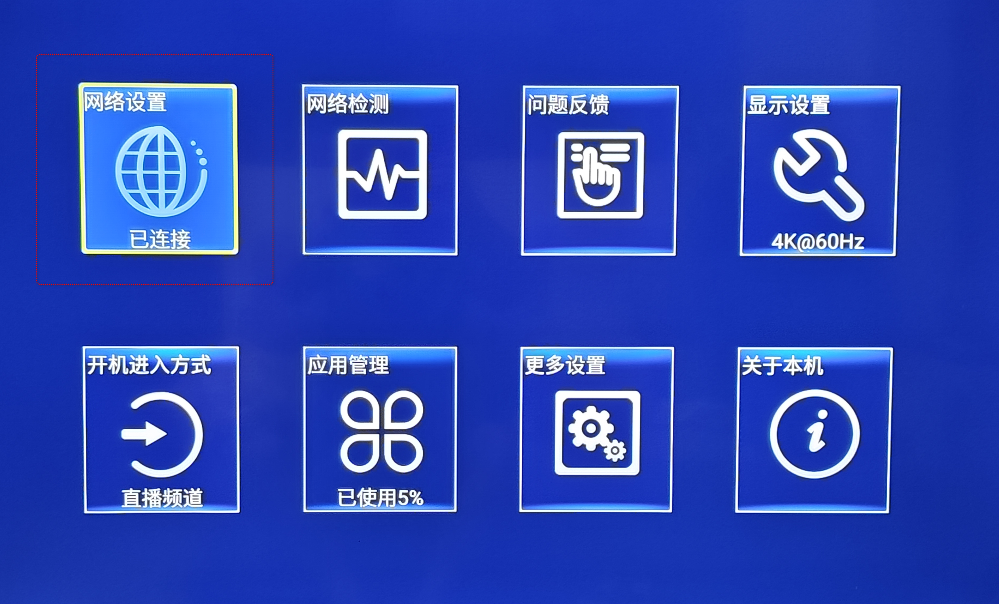

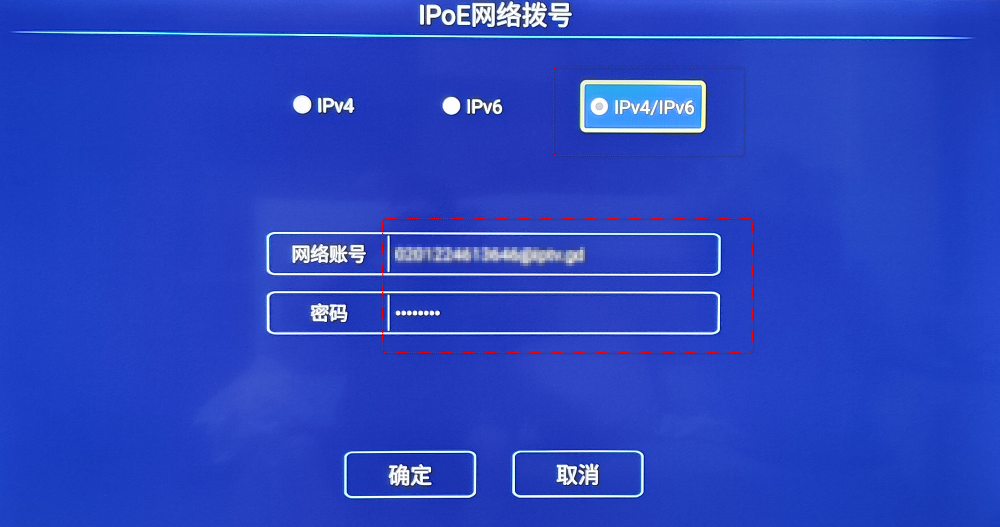
