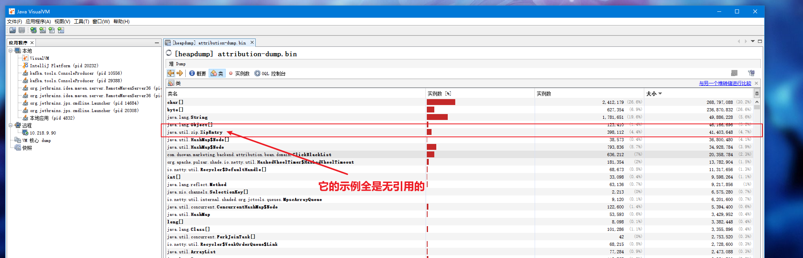
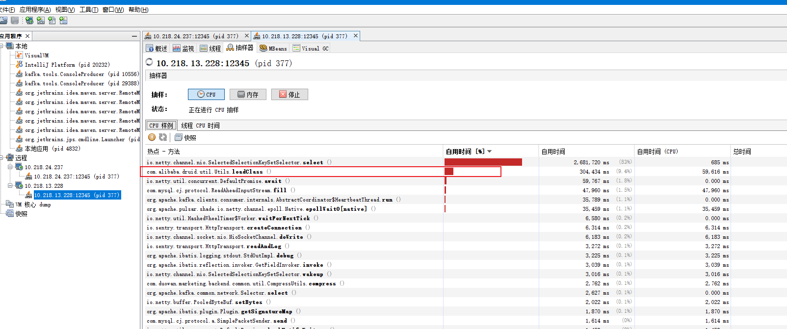
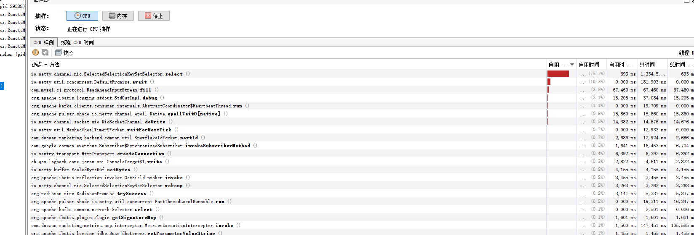

## JDK各个版本新特性

- 1.8
  
  - lambda表达式
  - Stream API
  - Interface默认方法
  - 新时间日期API
  - HashMap结构优化，新增红黑树和resize时的代码优化，ConcurrentHashMap采用CAS算法，不再使用分段锁，而且也引入了红黑树
  - **移除了永久代，增加直接内存区域**

- 1.7
  
  - switch可以使用String判断
  - 泛型实例化类型自动推断
  - 新的整数字面表达式方式：0b前缀和_连接符
  - try-with-resources：任何实现了java.lang.AutoCloseable接口或者实现了java.io.Closeable，可以保证在结束时候关闭
  - 可以捕获多个异常类型：使用|可以把相同异常处理逻辑集中到一个catch中

- 1.6
  
  - 可以使用JAXB来实现对象与XML之间的映射转换
  - 新增STAX的XML处理API
  - 新增Compiler API
  - 轻量级的Http Server
  - 脚本语言的支持

## 你遇到什么比较难忘的坑

- Spring里面，service层自调用本类方法导致@Transactional注解不生效；

- 遇到同事在使用分布式锁时，事务没有在分布式锁内提交，导致仍然出现脏数据的问题；

- Mysql join查询时，参与join字段的字符集编码不同，导致性能严重下降；

- 使用静态常量的Runtime Exception导致异常堆栈信息打印不正确；

- 使用Hystrix线程隔离导致在上下文中获取不到当前用户；

- 使用缓存时，需要先更新数据库，再删除缓存；

- mysql一般存储采用utf8mb4（4个字节），而不是utf8（3个字节）；

- 在spring里面使用编程式事务（TransactionDefinition）时，需要指定setTimeout和isolationLevel，因为没有显式地提交事务（代码中忘记写commit语句），就事务一直在等待，但是事务默认的setTimeout为-1，因此导致事务一直在等待的状态；

- 做压力测试时，系统级错误导致JVM虚拟机崩溃报错；

- 经验不足的时候，不知道spring是区分父子容器的，在spring mvc容器中扫描了所有类，不报错；但在spring中扫描所有类，就会报找不到controller异常。正常的做法是spring mvc容器扫描controller注解，而spring扫描其他的类；

- 做Flink的时候，Flink无限重启导致连接Redis的连接池占满；

- 做渠道的重构，遇到一个疑似内存泄露的现象：

  

  

  

  - 内存里面有过多的ZipEntry的实例，却都无引用的；
  - Druid的loadClass()方法吃了非常多的CPU资源。
  - 原因是druid的版本+Mysql8.0驱动导致的问题，详情可见解决方案：https://blog.csdn.net/qq_40378034/article/details/117851207

## 分布式数据库和缓存双写一致性问题

### 先更新数据库，再更新缓存

- A线程更新数据库；
- B线程更新数据库；
- B线程更新缓存；
- 线程A更新缓存。

### 先删缓存，再更新数据库

- A线程进行写，删除缓存；
- B线程查询缓存不存在，去数据库查询得到旧值；
- B线程把旧值写入缓存；
- A线程将新值写入数据库。

### 先更新数据库，再删缓存（推荐默认使用方案）

- 缓存刚好失效；
- A线程查询数据库，得到旧值；
- B线程将新值写入数据库；
- B线程删除缓存；
- A线程将查询到的旧值写入缓存。

## 使用过的高级场景

### 布隆过滤器

**一千万**的手机号，需要进行数据过滤，使用hash表方式存储需要消耗2（char占用两个byte） * 11（手机号码为11位） * 10000000（一千万手机号） = 220000000（byte） = **209.8（mb）**

使用布隆过滤器，设定参数误判率：**3%**，一共使用了72984408位进行存储，一共消耗内存为72984408（占用的位数） / 8 / 1024 / 1024 = **8.7（mb）**，数据压缩了24倍。

### Redis中的bitset

记录用户的每天登录情况，每日创建一个登录一个bitset用于保存当天所有的用户登录情况，使用用户自增的id作为对应的key，**一千万用户量**每日仅仅使用**1.19mb**的内存，如果几天都登录，则直接把bitset与操作即可。每日进行跑批处理，删除前30天在redis中的登录记录，建立下一天的登录记录表，用户进行登录时通过异步的方式使redis对应的标记位值1。

## 看过什么网站和有用的书籍

- Stackoverflow：https://stackoverflow.com/
- Github：https://github.com/
- Java Code Example：https://www.programcreek.com/java-api-examples/index.php
- 并发编程网：http://ifeve.com/
- 软件架构设计
- Java高并发程序设计
- 深入理解JVM虚拟机
- Head First Parttern Design

## 如何给下属分配安排任务

1. 确定目标：将产品模糊的原型划分为技术层面的明确的目标
2. 分解功能：把产品的业务功能划分功能模块以及技术层面的功能模块
3. 规划优先级：根据不同的技术功能模块的重要程度以及价值程度分别划分为P0-P3的优先级
4. 拆解任务：细分每个功能模块的技术实现，调整到合理的颗粒度
5. 预估时间：根据每个技术实现预估对应的实现时间
6. 设置里程碑和检查点：设置未来的checkpoint以及deadline
7. 分配任务：根据重要程度以及每个技术人员的意愿把具体任务分配给不同的开发人员

## 一些面试的相关的内容

- https://osjobs.net/topk/all/
- https://heapdump.cn/article/3606364