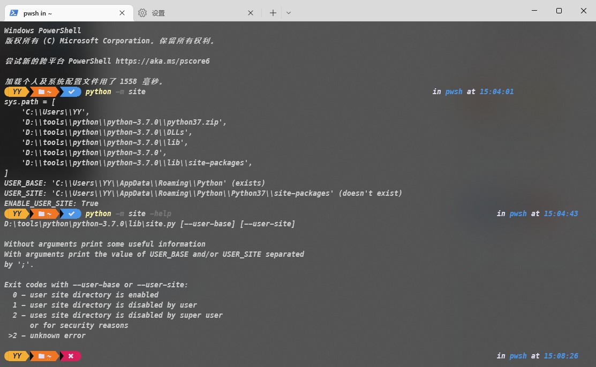
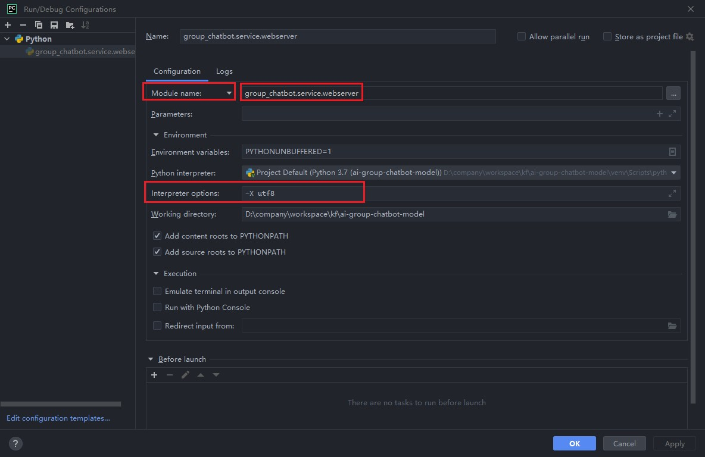

## 安装与环境搭建

- 先下载对应的安装包：[下载地址](https://www.python.org/downloads/windows/)

- 对应安装，然后在环境变量Path中添加安装路径

- 修改pip默认包的下载路径
  
  - 使用以下命令获取默认安装路径：
    
    ```bash
    python -m site
    ```
  
  - 展示若如下：
    
    
  
  - 则需要更换pip的安装包路径
  
  - 修改**D:\tools\python\python-3.7.0\lib\site.py**
    
    ```textile
    # USER_SITE = None
    # USER_BASE = None
    USER_SITE = "D:\\tools\\python\\site-packages"
    USER_BASE = "D:\\tools\\python\\Scripts"
    ```

- 更改pip镜像源
  
  ```bash
  pip config set global.index-url https://pypi.tuna.tsinghua.edu.cn/simple
  ```

- venv虚拟环境
  
  - 安装venv虚拟环境

    ```bash
    python3 -m venv venv
    ```

  - 激活虚拟环境

    ```bash
    cd .\venv\Scripts
    activate
    ```
  
  - 退出虚拟环境

    ```bash
    cd .\venv\Scripts
    deactivate
    ```
  
  - 删除venv虚拟环境：直接删除对应的venv文件夹即可

- pipreqs使用
  
  - 安装pipreqs库
    
    ```bash
    pip install pipreqs
    ```
  
  - 生成对应的**requirements.txt**文件
    
    ```bash
    pipreqs ./ --encoding=utf8 --force
    ```
  
  - 输出时会扫描对应用到的包，只有依赖的包才会进入requirements.txt文件中

  - 如果需要从**requirements.txt**中安装内容

    ```bash
    pip install -r .\requirements.txt
    ```

- pycharm启动参数调整
  
  - 如果是使用pythom -m xxx启动应用，则需要在Configuration中调整为Module name启动
  
  - windows下需要添加-X utf8启动，否则会出现读取文件失败的情况
  
  
