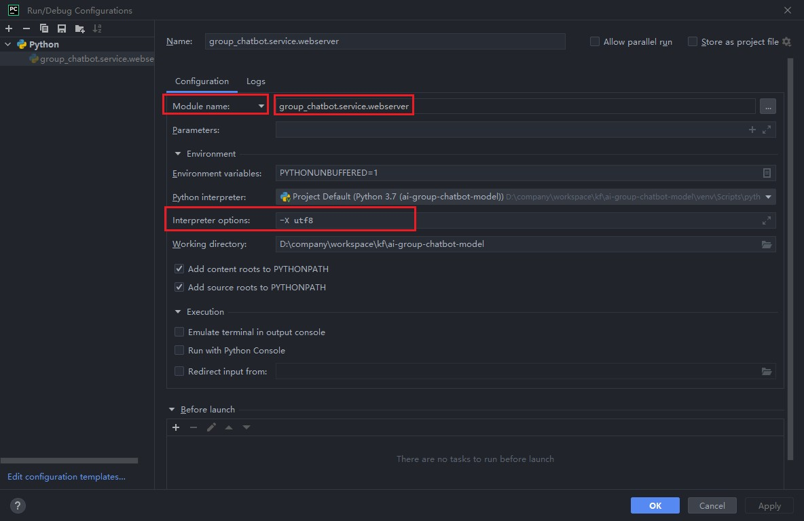

# Python

## 安装与环境搭建

- 先下载对应的安装包：[下载地址](https://www.python.org/downloads/windows/)
- 对应安装，Windows installer(64-bit)，安装时请选取加入环境变量Path，安装后会自动在Path中添加`D:\Python\Python3.9.10\Scripts\`和`D:\Python\Python3.9.10\`
- 新建目录`D:\Python\Package\site-packages`，用来存放pip安装的包
- 在`C:\Users\用户名\AppData\Roaming\pip`中新建pip.ini

  ```ini
  [global]
  target = D:\Python\Package\site-packages
  index-url = https://pypi.tuna.tsinghua.edu.cn/simple
  ```

- venv虚拟环境
  - 安装venv虚拟环境
  
    ```bash
    python3 -m venv venv
    ```

  - 激活虚拟环境

    ```bash
    cd .\venv\Scripts
    activate
    ```

  - 退出虚拟环境
  
    ```bash
    cd .\venv\Scripts
    deactivate
    ```

  - 删除venv虚拟环境：直接删除对应的venv文件夹即可
- pipreqs使用
  - 安装pipreqs库

    ```bash
    pip install pipreqs
    ```

  - 生成对应的**requirements.txt**文件

    ```bash
    pipreqs ./ --encoding=utf8 --force
    ```

  - 输出时会扫描对应用到的包，只有依赖的包才会进入requirements.txt文件中
  - 如果需要从**requirements.txt**中安装内容

    ```bash
    pip install -r .\requirements.txt
    ```

- pycharm启动参数调整
  - 如果是使用pythom -m xxx启动应用，则需要在Configuration中调整为Module name启动
  - windows下需要添加-X utf8启动，否则会出现读取文件失败的情况
  
