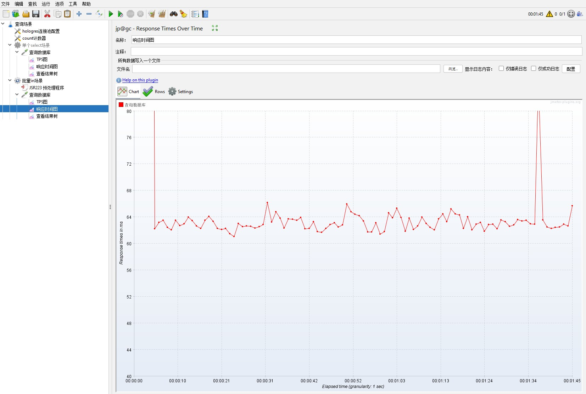

## 性能测试

### Jmeter测试（推荐）

#### 测试准备

- 去官网中下载对应的最新版本包：[Jmeter官网](https://jmeter.apache.org/)
- 下载安装后，推荐安装必备插件
  - 安装Plugins manager：[下载地址](https://jmeter-plugins.org/install/Install/)
  - 把plugins-manager.jar放在Jmeter目录的lib/ext文件夹中
  - 再次启动Jmeter，发现在选项中多了Plugins manager选项，打开并安装下列的插件
    - 3 Basic Graphs
    - PerfMon Metrics Collector
    - jpgc - Standard Set
  - 安装完成后记得重启Jmeter
- 可以参考更加完善的文章：[Jmeter 学习路线 - 小菠萝测试笔记 - 博客园](https://www.cnblogs.com/poloyy/p/15257716.html)
- 下载[linux的各个指标监控工具nmon](https://nmon.sourceforge.io/pmwiki.php)
- 下载[nmon Analyser分析工具](https://nmon.sourceforge.io/pmwiki.php?n=Site.Nmon-Analyser)


#### 测试指标和记录

- 对于被压测对象的环境，需要用nmon记录：
  - CPU使用率
  - 内存使用量
  - 网络IO
- 对于负载侧记录的指标：
  - 响应时间（RT：Response Time）
  - 每一个请求的平均响应时间（ART：Average Transaction Reponse Time）
  - 吞吐量
    - QPS
    - TPS
  - 并发用户数
  - 错误率


#### 场景设计

- 基准测试：测试机器的基准性能，为后续修改配置做性能的参考
- 正式测试：
  - 单一场景：指单一的场景的请求
  - 混合场景：指混合场景的请求
  - 阶梯增加vuser
- 稳定性测试：7*24小时平稳运行


#### 简要说明

- 新建测试的文件夹，保存测试计划场景（后缀为jmx）
- 主要的布局描述如下图所示
- 可以添加线程组，线程组下面添加的Request表示对应线程下所执行的任务，任务下还可以添加相应的测量结果和测试结果图

#### 注意事项

- 如果jmeter不存在包，则需要额外导入包（添加目录或jar包到ClassPath或直接把jar包放在lib下）
- 如果把测试脚本放到远程中，则需要把jar包也一并放入


### LoadRunner测试流程（收费不推荐）

1. 在Windows Server中安装并且配置LoadRunner；
2. 调整Windows Server系统和Linux系统参数；
3. 编写脚本，脚本可以使用Java或者C编写（C较Java而言会好一些，C的资源会马上释放，而JVM有垃圾回收机制，会对负载生成有一定的影响）；
4. 选择场景并运行压力测试，使用nmon采集对应的磁盘IO、内存使用率、CPU占用率等系统运行情况，使用jvisualvm采集JVM虚拟机的运行参数；
5. 使用nmon analyser导出系统级参数报表。

#### 参数调优

- Linux文件最大打开数量（句柄数）：

```
vim /etc/security/limits.conf
* soft nofile 65535
* hard nofile 65535

vim /etc/security/limits.d/20-nproc.conf
* soft nproc unlimited
```

- Windows Server参数调优：

```
减小HKEY_LOCAL_MACHINE\SYSTEM\CurrentControlSet\Services\Tcpip\Parameters\TcpTimedWaitDelay对应的值
```
