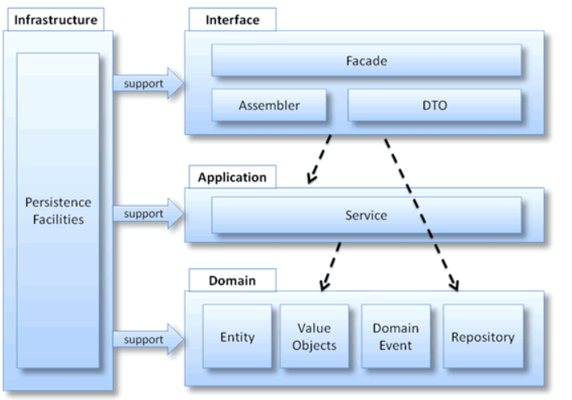
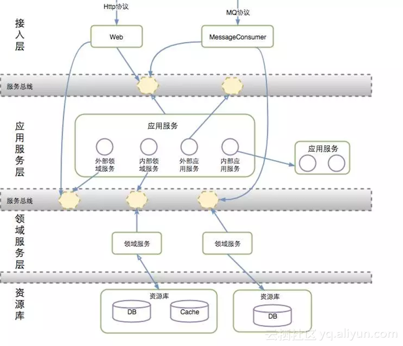
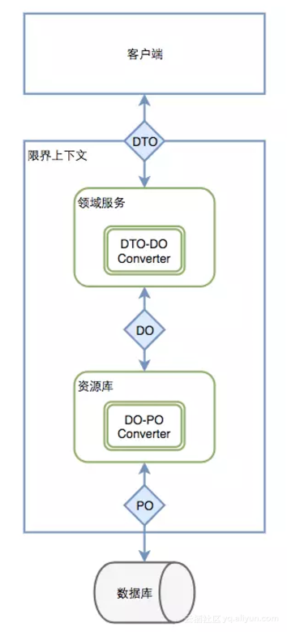

## DDD领域驱动模型

项目结构

- interfaces：用户表示层，最顶层；负责向用户显示信息和解释用户命令，请求应用层以获取用户所需要展现的数据，发送命令给应用层要求其执行某个用户命令；
  - facade：门面，为远程客户端提供粗粒度的调用接口，将一个用户请求委派给一个或多个Service进行处理；
  - DTO：数据传输对象，是与外部通讯的载体，是一个纯粹的POJO，内部不应该包含任何的业务逻辑；
  - assembler：装配器，实现DTO与领域对象之间的相互转换，与DTO同时出现；
- application：应用层