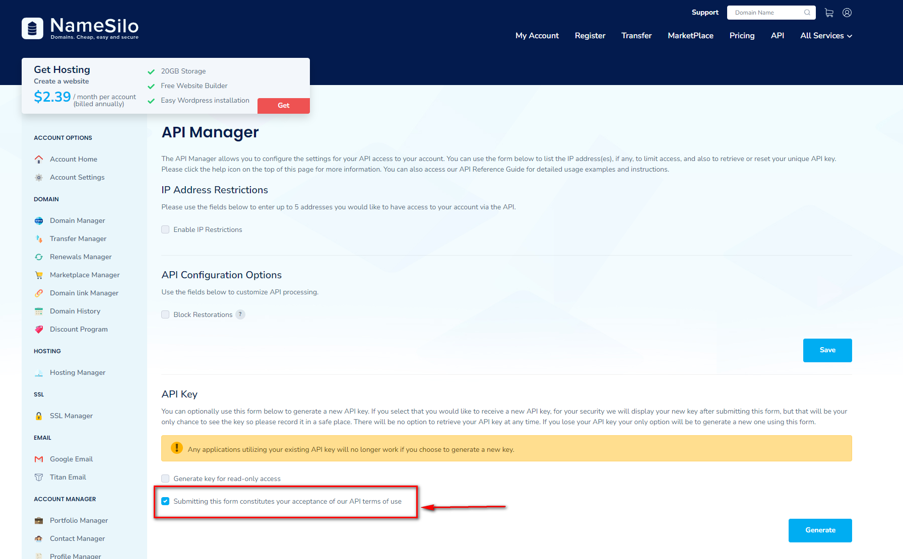

## ACME.sh

### 介绍

- 一个自动申请域名与自动续签的linux脚本
- [官网](https://github.com/acmesh-official/acme.sh)
- [中文说明](https://github.com/acmesh-official/acme.sh/wiki/%E8%AF%B4%E6%98%8E)

### 托管平台（Namesilo为例）申请API密钥

- [NameSilo API托管地址](https://www.namesilo.com/account/api-manager)
- 记录下申请的key



### 安装

```bash
export Namesilo_Key="上面步骤申请的key"
curl https://get.acme.sh | sh -s email=你的邮箱地址
acme.sh --install-cronjob
```

其中1，2行可以替换为修改/root/.acme.sh/account.conf

```bash
Namesilo_Key='上面步骤申请的key'
ACCOUNT_EMAIL='你的邮箱地址'
```

### 申请证书

注意，[ZeroSSL.com CA](https://github.com/acmesh-official/acme.sh/wiki/ZeroSSL.com-CA)现在貌似生成不了泛域名的证书，这里用letsencrypt作为默认的CA生成

```bash
acme.sh --set-default-ca --server letsencrypt
acme.sh --issue --dnssleep 1800 -d minchiang.top -d '*.minchiang.top' --dns dns_namesilo --log --debug 2 --force
```

### 安装证书

```bash
acme.sh --install-cert -d minchiang.top \
--key-file       /etc/nginx/ssl/minchiang.top/key.pem  \
--fullchain-file /etc/nginx/ssl/minchiang.top/cert.pem \
--reloadcmd     "/etc/init.d/nginx force-reload"

acme.sh --install-cert -d '*.minchiang.top' \
--key-file       /etc/nginx/ssl/*.minchiang.top/key.pem  \
--fullchain-file /etc/nginx/ssl/*.minchiang.top/cert.pem \
--reloadcmd     "/etc/init.d/nginx force-reload"
```

### 后续维护

- 强制续约：
  
  ```bash
  acme.sh --renew -d *.minchiang.info --force
  ```

- 查看证书列表：
  
  ```bash
  acme.sh --list 
  ```

- 查看是否已经注册到crontab中
  
  ```bash
  crontab -l
  ```


## Cloudflare

### 使用cloudflare的dns

- 登录[官网](https://dash.cloudflare.com/)
- 点击进入dns
- 记录cloudflare名称服务器
  - greg.ns.cloudflare.com
  - molly.ns.cloudflare.com
- 点击进入你的[域名服务器](https://www.namesilo.com/)
- 点击设置新的名称服务器
- 把其改为上述cloudflare的名称服务器


## Git
### 搭建简易的git服务器

- 安装git：`sudo apt-get install git`
- 创建git用户：`sudo adduser git`
- 修改git用户只能用于git：修改`/etc/passwd`，把`git:x:1000:1000::/home/git:/bin/bash`改为`git:x:1000:1000::/home/git:/usr/bin/git-shell`
- 初始化仓库：`sudo git init --bare test.git`
- 修改仓库权限：`sudo chown -R git:git test.git`
- 添加公钥：打开本地生成的ssh的公钥key，地址一般为`C:\Users\{你的用户}\.ssh\{你的公钥名字}.pub`，登录到服务中，在`/home/git/.ssh/authorized_keys`中添加里面的内容即可


### 使用git的ssh协议，改变端口后如何进行连接

- 由原来的：git@域名/项目地址，改为**ssh://**git@域名:**新的端口**/项目地址


### Git命令行指南
- Git快速配置

  - 配置用户名和明码

    ```
    git config –global user.name 'xxxxx'
    git config –global user.email 'xxx@xx.xxx'
    ```

  - 生成密钥，并上传到你的github的[ssh key中](https://github.com/settings/keys)

    ```
    ssh-keygen -t rsa -C 'xxx@xx.xxx'
    ```

  - 改变ssh通道的代理设置，修改配置文件：`C:\Users\你的用户\.ssh\config`

    ```
    Host *
        HostKeyAlgorithms +ssh-rsa
        PubkeyAcceptedKeyTypes +ssh-rsa
    
    Host github.com
        User git										# ssh用户名	
        Hostname ssh.github.com							# 这里是把github.com域名映射为ssh.github.com
        PreferredAuthentications publickey				# 使用公钥私钥认证
        IdentityFile ~/.ssh/id_rsa						# 私钥位置
        Port 443										# 把原生的22端口映射为443端口
        ProxyCommand connect -S 127.0.0.1:10808 %h %p	# 本地代理，-S表示走socks5协议，如果使用http协议则使用-H,
        # ProxyCommand connect -H 127.0.0.1:10809 %h %p # 这里使用的是http协议代理，与上面2选1
    ```

  - 设置http协议的代理，在命令行中输入

    ```
    # 使用socks5代理
    git config --global http.https://github.com.proxy socks5://127.0.0.1:10808
    # 使用http代理
    git config --global http.https://github.com.proxy http://127.0.0.1:10809
    ```

- 版本库初始化：git init

- 加入到暂存区： git add
  - 交互模式：-i
  - 筛选文件夹或者文件：后面加入目录或者正则表达式

- 提交修改：git commit -m "注释内容"

- 查看某个提交记录：git show

- 查看提交记录历史：git log
  - 单行查看：--pretty=oneline
  - 以图标方式查看：--graph
  - 仅查看某个文件的提交记录：后面添加指定的文件

- 对比差异：git diff
  - 默认情况比较的是**工作区**和**暂存区**之间的差异

- 回滚到某个版本：git reset
  - 回滚到上个版本：HEAD^
  - 回滚到上上个版本：HEAD^^
  - 回滚到某个版本：HEAD~xxx
  - 回滚版本库，暂存区和工作区：--hard，会造成内容的丢失
  - 回滚版本库和暂存区（默认）**：--mixed，把修改返回到工作区且不暂存
  - 回滚版本库：--soft，把修改返回到工作区，并暂存

- 回滚某个提交：git revert

- 撤销修改：git restore
  - 默认情况仅撤销工作区中的修改
  - 撤销暂存区中的修改，并放回到工作区中：--staged

- 查看分支：git branch
  - 新建分支：后面带上新建的分支名称
  - 删除分支（已经完成代码合并操作）：-d
  - 删除分支（未进行代码合并操作）： -D

- 检出分支：git checkout
  - 新建并且检出分支：-b
  - 有回滚项目文件的功能，把文件快速回滚到之前的状态：-- fileName

- 合并分支：git merge
  - 先在checkout被merge的分支，再执行merge命令，把需要的分支合并到当前分支

- 摘取单个提交：git check-pick

- 贮存现场：git stash
  - 列出贮存列表：list
  - 恢复贮存现场（不删除贮存内容）：apply
  - 恢复贮存现场（删除贮存内容）：pop
  - 删除贮存现场：drop

- 打标签：git tag
  - 默认为查看所有标签
  - 指定标签信息：-m
  - 删除标签：-d

- Git和SVN的区别
  - Git是分布式的：每个开发人员都是中心版本库的一个克隆
  - Git按内容元数据方式存储，而SVN是按文件存储：.svn和.git比较差异非常大，.git目录下有中心版本库的所有东西，例如标签、分支和版本记录等；
  - Git的分支和SVN的分支不同：Git分支是同一个文件夹的不同表现方式，而SVN是在不同的文件夹下；
  - Git没有一个全局的版本号，而SVN有；
  - Git的内容完整性要优于SVN：Git的内容存储使用SHA-1哈希算法，确保内容的完整性。


## IDEA快速工具

### 快捷键

- 查看调用关系：Ctrl + Alt + h
- 格式化代码：Ctrl + Alt + l
- 优化导入的包：Ctrl + Alt + o
- 快速重命名：Shift + F6
- 删除当前行：Ctrl + y
- 跳入父类：Ctrl + u
- 查看实现类：Ctrl + Alt + b
- 前进后退：Ctrl + Alt + 左右

### 破解工具

- 去[https://3.jetbra.in/](https://3.jetbra.in/)中下载最新的jetbra.zip
- 打开**idea64.exe.vmoptions**，在最后添加：-javaagent:C:\xxx\jetbra\ja-netfilter.jar=jetbrains
- 点击页面中的工具的密码（当然是过期共用的啦，不配合jetbra.zip是无法使用的）
- 黏贴到激活Activation code栏目中，即可完成破解

### 代码模板

settings -> Editor -> Color Schema -> File and Code Templates

- Enum模板
  
  ```java
  #if (${PACKAGE_NAME} && ${PACKAGE_NAME} != "")package ${PACKAGE_NAME};#end  
  
  import java.util.Arrays;  
  import java.util.Collections;  
  import java.util.Map;  
  import java.util.function.Function;  
  import java.util.stream.Collectors;  
  
  #parse("File Header.java")  
  public enum ${NAME} {
      /**  
      * 未知  
      */  
      UNKNOWN(0),
  
      ;
  
      private static final Map<Integer, ${NAME}> ALL = Collections.unmodifiableMap(Arrays.stream(${NAME}.class.getEnumConstants()).collect(Collectors.toMap(value -> value.id, Function.identity())));
  
      /**  
      * 转换  
      *  
      * @param id id  
      * @return 对应类别  
      */  
      public static ${NAME} from(int id) {
          return ALL.get(id);
      }  
  
      /**  
      * 唯一标志  
      */  
      public final int id;  
  
      ${NAME}(int id) {
          this.id = id;  
      }
  }
  ```

- Factory模板

  ```
  #if (${PACKAGE_NAME} && ${PACKAGE_NAME} != "")package ${PACKAGE_NAME};#end  
  
  #parse("File Header.java")  
  public class ${NAME}Factory {  
  
      public ${NAME}Factory() {
      }
  
      /**  
      * 创建牌组合  
      *  
      * @return 工厂创建对象  
      */  
      public ${NAME} create() {
          return null;
      }
  
  }
  ```

- Singleton模板

  ```java
  #if (${PACKAGE_NAME} && ${PACKAGE_NAME} != "")package ${PACKAGE_NAME};#end  
  #parse("File Header.java")  
  public class ${NAME} {  
      private ${NAME}() {
      }
  
      /**  
      * 获取单例对象  
      *  
      * @return 实例对象  
      */  
      public static ${NAME} getInstance() {
      return ${NAME}Holder.INSTANCE;
      }  
  
      private static final class ${NAME}Holder {
  
      private static final ${NAME} INSTANCE = new ${NAME}();
  
      }
  }
  ```

- 标准头

  ```java
  /**   
  * @author MinChiang  
   * @version 1.0.0  
   * @date ${YEAR}-${MONTH}-${DAY} ${TIME}   
  */
  ```

  

### 插件

- Alibaba Java Coding Guidelines（阿里规范）
- GenerateSerialVersionUID（生成UUID）
- Grep Console（支持控制台打印颜色）
- GsonFormatPlus（json -> 实体对象）
- MapStruct Support（MapStruct的支持）
- Maven Helper（对Maven依赖的问题的解决）
- MyBatisX（快速生成MyBatis plus的工具）
- One Dark theme（黑暗配色）
- Rainbow Brackets（彩色的括号）
- RestfulToolkit（快速查找Controller）
- String Manipulation（各种命名风格的格式切换）
- Translation（翻译）
- Protocol Buffer Editor（PB文件支持）
- SequenceDiagram（快速生成时序图）


## Xshell

配色方案，保存下面文本为Solarized Dark.xcs

打开xshell -> 工具 -> 配色方案 -> 导入

```
[Solarized Dark]
text=00ff40
cyan(bold)=93a1a1
text(bold)=839496
magenta=dd3682
green=859900
green(bold)=586e75
background=042028
cyan=2aa198
red(bold)=cb4b16
yellow=b58900
magenta(bold)=6c71c4
yellow(bold)=657b83
red=dc322f
white=eee8d5
blue(bold)=839496
white(bold)=fdf6e3
black=002b36
blue=268bd2
black(bold)=073642
[Names]
name0=Solarized Dark
count=1
```

