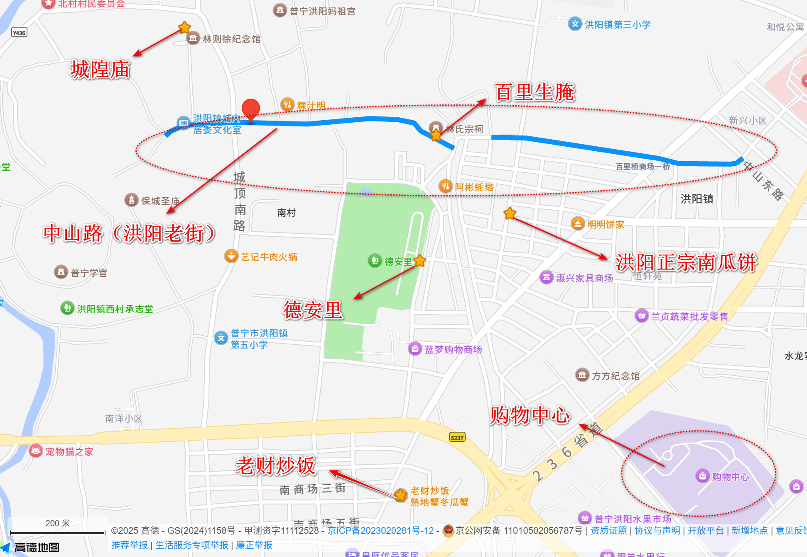

## 普宁&潮州

### 普宁

#### 景点

- 流沙人民公园
- 万泰新天地
- 龙华寺
- 莲花山
- 华溪村
- 
- 德安里村
- 普宁城隍庙

#### 住

- 金叶酒店

#### 吃

- 平湖海鲜捞面：11:00-03:00
- 英歌魂（二中店）：11:00-23:00
- 彬彬蚝烙：12:00-01:00
- 阿甘冰室：13:00-22:00
- 
- 夜来香深夜豆浆：19:00-09:00
- 炎记肠粉：20:30-14:00
- 乞丐豆干：13:00-24:00
- 
- 三牛牛肉火锅：10:00-02:00
- 集财牛肉：16:00-02:00
- 惜亩蟹汤：11:30-01:00
- 
- 老财炒饭（熟地蟹汤）：11:00-14:00，16:00-01:00

#### 行程安排

### 潮州

#### 景点

- 西马路
- 开元寺
- 牌坊街
- 广济楼
- 韩文公祠
- 开元寺泰佛殿
- 潮州西湖
- 牌坊街

#### 吃

- 花姨水果汁
- 老魏记芝麻茶
- 吴进平小食店
- 老四麦粿
- 顺伯反沙屋
- 镇前街腐乳鸡翅
- 雷记粿条肠粉
- 阿彬牛肉火锅
- 阿荣砂锅粥
- 非遗·十八曲鱼饺
- 铭记鱼生
- 刘卜卤鹅（中山路店）
- 一糖初见
- 囍潮砂锅粥
- 凉亭坊酒料
- 韩湘宴
- 茶色天香
- 官塘鹏翔牛肉火锅（南门总店）
- 邱记正宗沙姜鸡
- 超一尚刺身鱼生

#### 住

- 潮州市潮里韩舍（潮州古城牌坊街店）
- 潮舍·听花堂（潮州古城牌坊街店）
- 金顿国际酒店（潮州古城牌坊街店）
- 外滩臻品公寓

### 链接：

- [📍潮州｜2天1夜逛吃详细攻略👏 - Have | 小红书 - 你的生活兴趣社区](https://www.xiaohongshu.com/discovery/item/687b63a7000000001d00c8aa?source=webshare&xhsshare=pc_web&xsec_token=ABgOCdJPJ7j3murXR2h3NpcOpsLF3_24xzpKFf8a3HpwE=&xsec_source=pc_share)
- [潮州一日游|Citywalk路线（特种兵版)](https://www.xiaohongshu.com/discovery/item/688c70c3000000000403f34d?source=webshare&xhsshare=pc_web&xsec_token=ABhjWUugL0vrZhokhpIiWNw6z1te-2XP7kNWEYfenBCNM=&xsec_source=pc_share)
- [潮汕周边游🌿Ⅱ「普宁」自驾游玩攻略实测 - 阿瓜的旅行攻略小助手 ](https://www.xiaohongshu.com/discovery/item/670a4c51000000001b03d10f?source=webshare&xhsshare=pc_web&xsec_token=ABh7A6ownrEDHMxNzrMLA_oPX-C9l0Dk56G1o-cnrliQg=&xsec_source=pc_share)

### 行程

- 预计总行程是2夜2天，预计需要准备2套外衣+1套睡衣
- 周五下班吃完饭从天河出发，预计19:30 - 20:00左右
- 第一晚目的地：**金叶酒店**，**雅致大床房、有停车场、无早餐，¥279**；预计到达时间**23:15**；由于车里油不算特别充足，建议在路径找个加油站加一波油然后休息一下，预计耽误30分钟左右的时间。如果晚上比较饿，那么直接导航去**夜来香深夜豆浆**和**炎记肠粉**吃宵夜，直接在那里吃或者打包到酒店吃都行
- 第二天早上10点起床，去附近的小卖部买饮料+零食，11:00后（因为最早的一家是早上11点开门）通过**步行方式**去**平湖海鲜捞面**，**英歌魂（二中店）**，**彬彬蚝烙**觅食，如果时间赶的话可以直接打包回到酒店，在车上吃，预计12:30前能完成觅食
- 12:30导航到**莲花山公园停车场**，开车预计5公里左右，大约13:00到达，从莲花山步行逛到龙华寺，预计时间约2小时，逛到大约15:00
- 15:00导航到**三牛牛肉火锅、集财牛肉**，附近有一个**赵华路-道路停车位**，预计吃饭时间1.5小时，到16:30左右结束
- 17:30-18:00导航到**德里安停车场**，逛**普宁城隍庙+德里安村**，附近有老财炒饭，后面自由活动