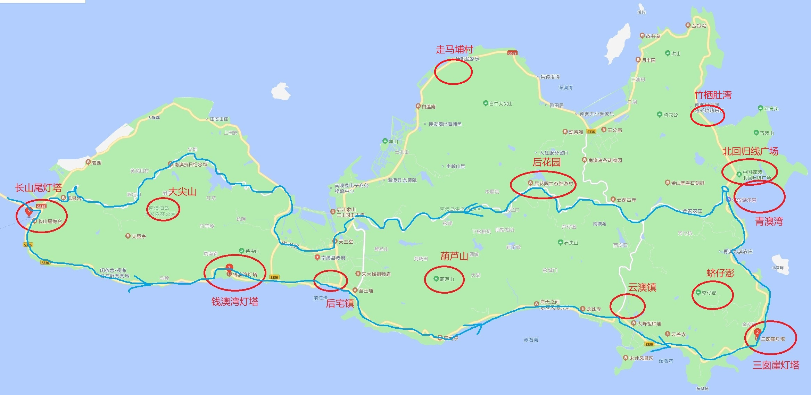
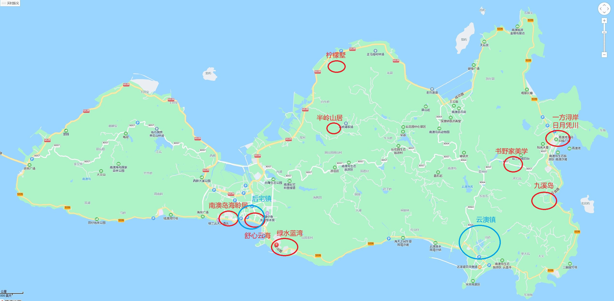

## 游玩景点

- 南澳大桥，过路费96（往返），全长9公里

- 南澳大桥进去后优先走**南海岸线（逆时针环岛）**

- 葫芦山的最美日落，19号风车位置，需要在17：30分前到达，这个和我们自西向东违背，需要考虑去不去

- **青澳湾**晚上可以看到**蓝眼泪**

- 南澳海岛国家森林公园的**大尖山**是岛的最高峰，车停在半山腰，步行走15分钟（目测我们要爬半个小时）楼梯上去，上面可以俯瞰整个南澳岛

- **蛴仔澎**风车场，看风车的

- 早上可以在青澳湾看日出，或者去看**竹栖肚湾**看更加

- **走马埔村**打卡最孤独的网红树

- **北回归线广场**

- 三个灯塔必备打卡，由驾车方向决定
  
  - **长山尾灯塔**（一进南澳岛就到）
  
  - **钱澳湾灯塔**，南海岸线中部
  
  - **三囱涯灯塔**，南澳东部，最漂亮的灯塔)

## 吃住

- 住宿主要集中在**青澳湾**，但是吃的比较贵，不推荐在青澳湾吃

- 青澳湾有几个甜品店可以的，**然记糖水铺**，**捷信牛奶甜品世家**

- 当地人集中在**后宅镇**和**云澳镇**，在云澳自己买海鲜加工，因为自己人做生意

- 青澳湾住公寓就百来块，如果住民宿比较贵，按照自西向东游正常逻辑都是选择住青澳湾的公寓或者在**九溪岛，日月凭川，书野家美学，一方浔岸**这几个民宿选了

- **许大姐的菜**，听说是挺OK的

- 南澳岛打卡**果汁冰公司**（青澳湾店）

## 其他

- **杏花吴记**牛肉火锅

- **成川治茶（汕头万象店）**

- **桂园白粥**

- **汕头市小公园**打卡

- **正井上茶**

## 携带的东西

- 伞

- 风扇

- 藿香正气水

- 防晒霜

## 参考攻略链接

- [南澳岛本岛秘境 - 马蜂窝](http://www.mafengwo.cn/gonglve/ziyouxing/380704.html)

- [吐血整理🏖️汕头南澳岛9家网红民宿集锦 - 国内度假游的文章 - 知乎](https://zhuanlan.zhihu.com/p/486077729)

- [南澳岛最真实的攻略你要收好咯～](https://www.bilibili.com/video/BV1s94y1o7do/?spm_id_from=333.788.recommend_more_video.0&vd_source=db4bf58eed30feceb40e5512b36e1dc8)

- [送给第一次来南澳岛的你，南澳岛最佳玩法，赶紧收藏](https://www.bilibili.com/video/BV1sU4y1J7US?spm_id_from=333.337.search-card.all.click&vd_source=db4bf58eed30feceb40e5512b36e1dc8)
