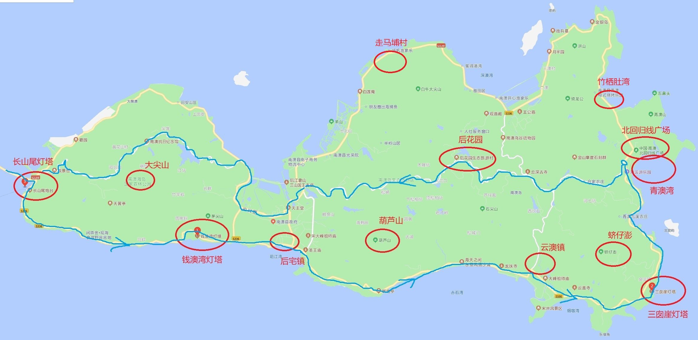
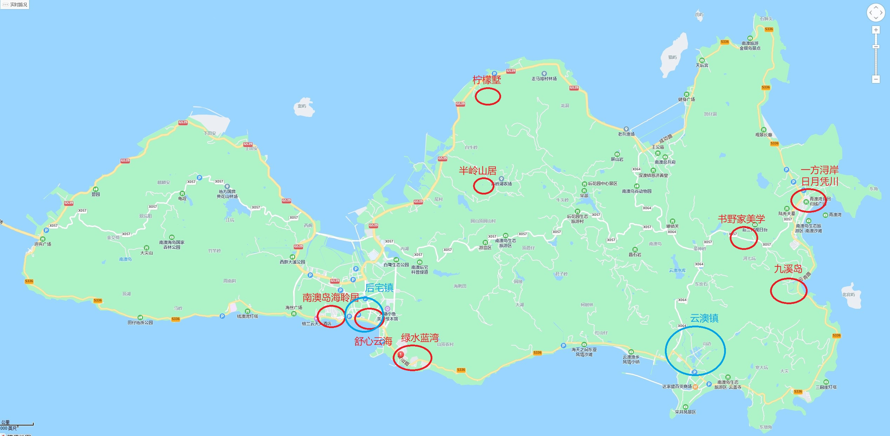

# 汕尾

第一天（周日）：

- 长沙炮台
- **能记牛肉火锅（园林西街店）：4.7  **
- **老高原味纯果汁（四马路路店）：4.8**
- 凤仪台妈祖
- 下午回去**寓尚·海景美宿**民宿入住，休息
- 傍晚去金町湾逛逛，打卡**风帆礼堂·T5金町湾**
- 晚上：**大胆食剔骨鸡火锅（保利金町湾分店）**
- 西沙滩公园
- 二马路（吃的备选）
  - 幸福大排档：4.0
  - 吉祥拍档：3.9
  - 品清阿荣牛腩店：4.4
  - 平记粥店：4.3
  - 鲍鱼海鲜粿条汤：3.9
  - 山珍鲜牛肉火锅（保利金町湾第四分店）：4.3
  - 林舜杰薄饼：3.9

第二天（周一）：

- 早餐：**源记菜粿**
- 浮日湾，海上公路
- 浮日号、风车岛
- 浮日湾旅游风景区
- LOOKING FLOAT
- 后澳玻璃海
- 中午吃：**潮牛鲜牛肉火锅**
- 南海观世音旅游景区
- 海上古堡
- 石群岛
- 海边路
- **栖海美宿（汕尾红少海湾店）**
- **巧姐大排档**，让酒店老板推荐当地的美食
- 晚上逛逛海边

第三天（周二）：

- 长山尾灯塔
- 钱澳湾灯塔
- 田仔地质公园
- 南澳岛打卡果汁冰公司(龙滨路店)
- 咖啡与海
- 贝沙湾创意园
- 中午吃：锋味十足海鲜小炒
- 青澳湾
- 北回归线标志自然之门
- 
- 然记糖水铺
- 大四喜海鲜烧烤
- 成伯反沙店
- 裕禧记海鲜·蒸汽火锅餐厅
- 捷信牛奶甜品世家
- 南街牛肉火锅
- 

汕尾：
景点:海上公路一-风车岛一一后澳玻璃海一一海上古堡一一石群岛一一海边路。
吃:二马路美食街
住:金町湾附近
汕头
景点:汕头小公园一一邮政总局一一开埠文化陈列馆一一汕头旅社。
住:小公园或者万象城附近。
吃:龙眼南路美食街、杏花吴记牛肉火锅
南澳岛
潮州
吃:西马路
景点:开元寺一一牌坊街一一广济楼一-广济桥一一镇海楼。
返程广州。

## 游玩景点

- 南澳大桥，过路费96（往返），全长9公里
- 南澳大桥进去后优先走**南海岸线（逆时针环岛）**
- 葫芦山的最美日落，19号风车位置，需要在17：30分前到达，这个和我们自西向东违背，需要考虑去不去
- **青澳湾**晚上可以看到**蓝眼泪**
- 南澳海岛国家森林公园的**大尖山**是岛的最高峰，车停在半山腰，步行走15分钟（目测我们要爬半个小时）楼梯上去，上面可以俯瞰整个南澳岛
- **蛴仔澎**风车场，看风车的
- 早上可以在青澳湾看日出，或者去看**竹栖肚湾**看更加
- **走马埔村**打卡最孤独的网红树
- **北回归线广场**
- 三个灯塔必备打卡，由驾车方向决定
  - **长山尾灯塔**（一进南澳岛就到）
  - **钱澳湾灯塔**，南海岸线中部
  - **三囱涯灯塔**，南澳东部，最漂亮的灯塔)

## 吃住

- 住宿主要集中在**青澳湾**，但是吃的比较贵，不推荐在青澳湾吃
- 青澳湾有几个甜品店可以的，**然记糖水铺**，**捷信牛奶甜品世家**
- 当地人集中在**后宅镇**和**云澳镇**，在云澳自己买海鲜加工，因为自己人做生意
- 青澳湾住公寓就百来块，如果住民宿比较贵，按照自西向东游正常逻辑都是选择住青澳湾的公寓或者在**九溪岛，日月凭川，书野家美学，一方浔岸**这几个民宿选了
- **许大姐的菜**，听说是挺OK的
- 南澳岛打卡**果汁冰公司**（青澳湾店）

## 其他

- **杏花吴记**牛肉火锅
- **成川治茶（汕头万象店）**
- **桂园白粥**
- **汕头市小公园**打卡
- **正井上茶**

## 携带的东西

- 伞
- 风扇
- 藿香正气水
- 防晒霜

## 参考攻略链接

- [南澳岛本岛秘境 - 马蜂窝](http://www.mafengwo.cn/gonglve/ziyouxing/380704.html)
- [吐血整理🏖️汕头南澳岛9家网红民宿集锦 - 国内度假游的文章 - 知乎](https://zhuanlan.zhihu.com/p/486077729)
- [南澳岛最真实的攻略你要收好咯～](https://www.bilibili.com/video/BV1s94y1o7do/?spm_id_from=333.788.recommend_more_video.0&vd_source=db4bf58eed30feceb40e5512b36e1dc8)
- [送给第一次来南澳岛的你，南澳岛最佳玩法，赶紧收藏](https://www.bilibili.com/video/BV1sU4y1J7US?spm_id_from=333.337.search-card.all.click&vd_source=db4bf58eed30feceb40e5512b36e1dc8)
